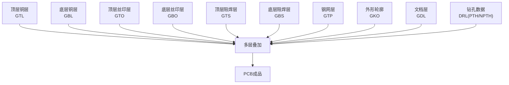
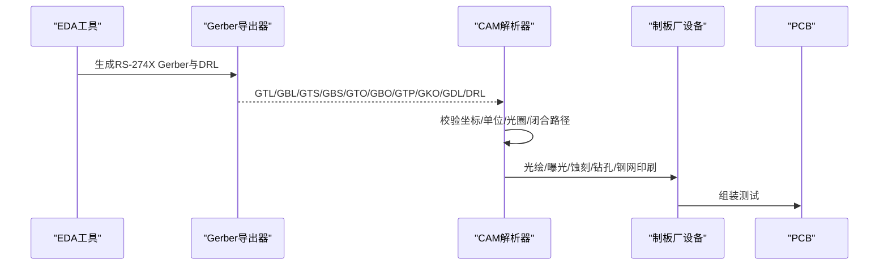
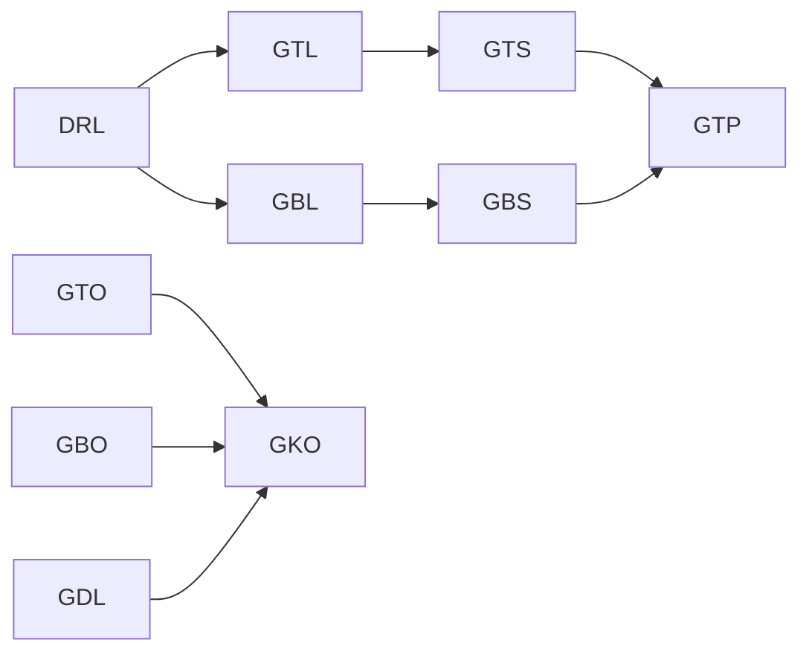

# Gerber文件规范

<cite>
**本文档引用的文件**
- [Gerber_TopLayer.GTL](file://gerber_unpacked/Gerber_TopLayer.GTL)
- [Gerber_BottomLayer.GBL](file://gerber_unpacked/Gerber_BottomLayer.GBL)
- [Gerber_TopSilkscreenLayer.GTO](file://gerber_unpacked/Gerber_TopSilkscreenLayer.GTO)
- [Gerber_BottomSilkscreenLayer.GBO](file://gerber_unpacked/Gerber_BottomSilkscreenLayer.GBO)
- [Gerber_TopSolderMaskLayer.GTS](file://gerber_unpacked/Gerber_TopSolderMaskLayer.GTS)
- [Gerber_BottomSolderMaskLayer.GBS](file://gerber_unpacked/Gerber_BottomSolderMaskLayer.GBS)
- [Gerber_DocumentLayer.GDL](file://gerber_unpacked/Gerber_DocumentLayer.GDL)
- [Gerber_BoardOutlineLayer.GKO](file://gerber_unpacked/Gerber_BoardOutlineLayer.GKO)
- [Gerber_TopPasteMaskLayer.GTP](file://gerber_unpacked/Gerber_TopPasteMaskLayer.GTP)
- [Drill_NPTH_Through.DRL](file://gerber_unpacked/Drill_NPTH_Through.DRL)
- [Drill_PTH_Through.DRL](file://gerber_unpacked/Drill_PTH_Through.DRL)
- [PCB下单必读.txt](file://gerber_unpacked/PCB下单必读.txt)
</cite>

## 目录
1. [简介](#简介)
2. [项目结构](#项目结构)
3. [核心组件](#核心组件)
4. [架构总览](#架构总览)
5. [详细组件分析](#详细组件分析)
6. [依赖关系分析](#依赖关系分析)
7. [性能与制造考量](#性能与制造考量)
8. [故障排查指南](#故障排查指南)
9. [结论](#结论)
10. [附录](#附录)

## 简介
本规范基于RS-274X（扩展Gerber）标准，结合本项目导出的实际Gerber与钻孔数据，系统化说明各层文件的用途、坐标系与单位、光圈（Aperture）定义与使用方式、以及制造要求与公差建议。文档同时提供验证方法与常见格式错误的定位与修复建议，帮助设计者、工艺工程师与制板厂高效协作。

## 项目结构
本项目包含完整的PCB制造输出：顶层/底层铜、上下丝印、上下阻焊、钢网（Top Paste）、外形轮廓、文档层以及钻孔文件（PTH/NPTH）。所有Gerber文件均声明了坐标系统、尺寸单位、精度与生成信息，便于统一解析与加工。

图表来源
- [Gerber_TopLayer.GTL:1-15](file://gerber_unpacked/Gerber_TopLayer.GTL#L1-L15)
- [Gerber_BottomLayer.GBL:1-15](file://gerber_unpacked/Gerber_BottomLayer.GBL#L1-L15)
- [Gerber_TopSilkscreenLayer.GTO:1-18](file://gerber_unpacked/Gerber_TopSilkscreenLayer.GTO#L1-L18)
- [Gerber_BottomSilkscreenLayer.GBO:1-15](file://gerber_unpacked/Gerber_BottomSilkscreenLayer.GBO#L1-L15)
- [Gerber_TopSolderMaskLayer.GTS:1-18](file://gerber_unpacked/Gerber_TopSolderMaskLayer.GTS#L1-L18)
- [Gerber_BottomSolderMaskLayer.GBS:1-18](file://gerber_unpacked/Gerber_BottomSolderMaskLayer.GBS#L1-L18)
- [Gerber_TopPasteMaskLayer.GTP:1-17](file://gerber_unpacked/Gerber_TopPasteMaskLayer.GTP#L1-L17)
- [Gerber_BoardOutlineLayer.GKO:1-15](file://gerber_unpacked/Gerber_BoardOutlineLayer.GKO#L1-L15)
- [Gerber_DocumentLayer.GDL:1-19](file://gerber_unpacked/Gerber_DocumentLayer.GDL#L1-L19)
- [Drill_NPTH_Through.DRL:1-16](file://gerber_unpacked/Drill_NPTH_Through.DRL#L1-L16)
- [Drill_PTH_Through.DRL:1-27](file://gerber_unpacked/Drill_PTH_Through.DRL#L1-L27)

章节来源
- [Gerber_TopLayer.GTL:1-15](file://gerber_unpacked/Gerber_TopLayer.GTL#L1-L15)
- [Gerber_BottomLayer.GBL:1-15](file://gerber_unpacked/Gerber_BottomLayer.GBL#L1-L15)
- [Gerber_TopSilkscreenLayer.GTO:1-18](file://gerber_unpacked/Gerber_TopSilkscreenLayer.GTO#L1-L18)
- [Gerber_BottomSilkscreenLayer.GBO:1-15](file://gerber_unpacked/Gerber_BottomSilkscreenLayer.GBO#L1-L15)
- [Gerber_TopSolderMaskLayer.GTS:1-18](file://gerber_unpacked/Gerber_TopSolderMaskLayer.GTS#L1-L18)
- [Gerber_BottomSolderMaskLayer.GBS:1-18](file://gerber_unpacked/Gerber_BottomSolderMaskLayer.GBS#L1-L18)
- [Gerber_TopPasteMaskLayer.GTP:1-17](file://gerber_unpacked/Gerber_TopPasteMaskLayer.GTP#L1-L17)
- [Gerber_BoardOutlineLayer.GKO:1-15](file://gerber_unpacked/Gerber_BoardOutlineLayer.GKO#L1-L15)
- [Gerber_DocumentLayer.GDL:1-19](file://gerber_unpacked/Gerber_DocumentLayer.GDL#L1-L19)
- [Drill_NPTH_Through.DRL:1-16](file://gerber_unpacked/Drill_NPTH_Through.DRL#L1-L16)
- [Drill_PTH_Through.DRL:1-27](file://gerber_unpacked/Drill_PTH_Through.DRL#L1-L27)

## 核心组件
- 顶层铜层（GTL）：承载顶层走线与焊盘，用于电气连接与信号传输。
- 底层铜层（GBL）：承载底层走线与焊盘，完成回路布线。
- 顶层丝印层（GTO）：标注元件位号、极性、版本等标识信息。
- 底层丝印层（GBO）：底部标识信息，通常较少使用。
- 顶层阻焊层（GTS）：覆盖非焊接区域，防止短路并保护铜面。
- 底层阻焊层（GBS）：同GTS，但作用于底层。
- 钢网层（GTP）：定义锡膏印刷区域，控制SMT贴装质量。
- 外形轮廓（GKO）：定义PCB切割外形与倒角。
- 文档层（GDL）：辅助图形、定位标记或注释。
- 钻孔数据（DRL）：PTH（镀通孔）与NPTH（非金属化孔）的孔径与位置。

章节来源
- [Gerber_TopLayer.GTL:1-15](file://gerber_unpacked/Gerber_TopLayer.GTL#L1-L15)
- [Gerber_BottomLayer.GBL:1-15](file://gerber_unpacked/Gerber_BottomLayer.GBL#L1-L15)
- [Gerber_TopSilkscreenLayer.GTO:1-18](file://gerber_unpacked/Gerber_TopSilkscreenLayer.GTO#L1-L18)
- [Gerber_BottomSilkscreenLayer.GBO:1-15](file://gerber_unpacked/Gerber_BottomSilkscreenLayer.GBO#L1-L15)
- [Gerber_TopSolderMaskLayer.GTS:1-18](file://gerber_unpacked/Gerber_TopSolderMaskLayer.GTS#L1-L18)
- [Gerber_BottomSolderMaskLayer.GBS:1-18](file://gerber_unpacked/Gerber_BottomSolderMaskLayer.GBS#L1-L18)
- [Gerber_TopPasteMaskLayer.GTP:1-17](file://gerber_unpacked/Gerber_TopPasteMaskLayer.GTP#L1-L17)
- [Gerber_BoardOutlineLayer.GKO:1-15](file://gerber_unpacked/Gerber_BoardOutlineLayer.GKO#L1-L15)
- [Gerber_DocumentLayer.GDL:1-19](file://gerber_unpacked/Gerber_DocumentLayer.GDL#L1-L19)
- [Drill_NPTH_Through.DRL:1-16](file://gerber_unpacked/Drill_NPTH_Through.DRL#L1-L16)
- [Drill_PTH_Through.DRL:1-27](file://gerber_unpacked/Drill_PTH_Through.DRL#L1-L27)

## 架构总览
下图展示了从Gerber到成品的数据流与各层之间的装配关系。

图表来源
- [Gerber_TopLayer.GTL:1-15](file://gerber_unpacked/Gerber_TopLayer.GTL#L1-L15)
- [Gerber_BottomLayer.GBL:1-15](file://gerber_unpacked/Gerber_BottomLayer.GBL#L1-L15)
- [Gerber_TopSolderMaskLayer.GTS:1-18](file://gerber_unpacked/Gerber_TopSolderMaskLayer.GTS#L1-L18)
- [Gerber_BottomSolderMaskLayer.GBS:1-18](file://gerber_unpacked/Gerber_BottomSolderMaskLayer.GBS#L1-L18)
- [Gerber_TopSilkscreenLayer.GTO:1-18](file://gerber_unpacked/Gerber_TopSilkscreenLayer.GTO#L1-L18)
- [Gerber_BottomSilkscreenLayer.GBO:1-15](file://gerber_unpacked/Gerber_BottomSilkscreenLayer.GBO#L1-L15)
- [Gerber_TopPasteMaskLayer.GTP:1-17](file://gerber_unpacked/Gerber_TopPasteMaskLayer.GTP#L1-L17)
- [Gerber_BoardOutlineLayer.GKO:1-15](file://gerber_unpacked/Gerber_BoardOutlineLayer.GKO#L1-L15)
- [Gerber_DocumentLayer.GDL:1-19](file://gerber_unpacked/Gerber_DocumentLayer.GDL#L1-L19)
- [Drill_PTH_Through.DRL:1-27](file://gerber_unpacked/Drill_PTH_Through.DRL#L1-L27)
- [Drill_NPTH_Through.DRL:1-16](file://gerber_unpacked/Drill_NPTH_Through.DRL#L1-L16)

## 详细组件分析

### 坐标系系统与尺寸单位
- 坐标模式：绝对坐标（Absolute），所有坐标均以固定原点为基准。
- 数值格式：省略前导零（Leading zeros omitted），整数位4位、小数位5位。
- 单位：毫米（mm）。
- 旋转/镜像：未启用旋转与镜像。
- 这些设置在每个Gerber头部均有明确声明，确保不同CAM系统一致解析。

章节来源
- [Gerber_TopLayer.GTL:1-15](file://gerber_unpacked/Gerber_TopLayer.GTL#L1-L15)
- [Gerber_BottomLayer.GBL:1-15](file://gerber_unpacked/Gerber_BottomLayer.GBL#L1-L15)
- [Gerber_TopSilkscreenLayer.GTO:1-18](file://gerber_unpacked/Gerber_TopSilkscreenLayer.GTO#L1-L18)
- [Gerber_BottomSilkscreenLayer.GBO:1-15](file://gerber_unpacked/Gerber_BottomSilkscreenLayer.GBO#L1-L15)
- [Gerber_TopSolderMaskLayer.GTS:1-18](file://gerber_unpacked/Gerber_TopSolderMaskLayer.GTS#L1-L18)
- [Gerber_BottomSolderMaskLayer.GBS:1-18](file://gerber_unpacked/Gerber_BottomSolderMaskLayer.GBS#L1-L18)
- [Gerber_TopPasteMaskLayer.GTP:1-17](file://gerber_unpacked/Gerber_TopPasteMaskLayer.GTP#L1-L17)
- [Gerber_BoardOutlineLayer.GKO:1-15](file://gerber_unpacked/Gerber_BoardOutlineLayer.GKO#L1-L15)
- [Gerber_DocumentLayer.GDL:1-19](file://gerber_unpacked/Gerber_DocumentLayer.GDL#L1-L19)

### 常用指令与语法要点
- 坐标移动与绘制：
  - G01：直线插补（线性移动/绘制）
  - G02/G03：顺时针/逆时针圆弧插补
  - G36/G37：多边形开始/结束（填充）
- 绘图模式切换：
  - D01：绘制（开启激光/曝光）
  - D02：移动（抬起激光/不曝光）
  - D03：闪光（Flash，在当前坐标以选定光圈曝光一个焊盘/图形）
- 宏与自定义形状：
  - %AM...%：定义宏（如RoundRect）
  - %ADDxx...%：定义光圈（圆形C、矩形R、椭圆O、自定义形状）
- 光圈选择：
  - G54Dxx：选择光圈Dxx（G54为旧式Gerber的可选前缀，RS-274X中可省略直接写Dxx）
  - 丝印层字符以矢量笔画方式绘制（G01/G02/G03配合D01）

章节来源
- [Gerber_TopLayer.GTL:41-46](file://gerber_unpacked/Gerber_TopLayer.GTL#L41-L46)
- [Gerber_TopSilkscreenLayer.GTO:21-23](file://gerber_unpacked/Gerber_TopSilkscreenLayer.GTO#L21-L23)
- [Gerber_TopSolderMaskLayer.GTS:13-18](file://gerber_unpacked/Gerber_TopSolderMaskLayer.GTS#L13-L18)
- [Gerber_TopPasteMaskLayer.GTP:13-17](file://gerber_unpacked/Gerber_TopPasteMaskLayer.GTP#L13-L17)
- [Gerber_DocumentLayer.GDL:22-34](file://gerber_unpacked/Gerber_DocumentLayer.GDL#L22-L34)

### 各层文件职责与制造要点

#### 顶层铜层（GTL）
- 作用：顶层走线、焊盘、过孔、铺铜区域。
- 关键内容：
  - 光圈定义：多种圆形、矩形、异形光圈，对应不同焊盘与走线宽度。
  - 多边形填充：G36/G37包裹的区域表示大面积铺铜。
- 制造注意：
  - 最小线宽/间距需满足制板能力；避免锐角与悬空。
  - 大铜面需考虑应力与翘曲，必要时开槽或分割。

章节来源
- [Gerber_TopLayer.GTL:11-46](file://gerber_unpacked/Gerber_TopLayer.GTL#L11-L46)

#### 底层铜层（GBL）
- 作用：底层走线、焊盘、过孔、铺铜区域。
- 关键内容：与GTL类似，包含大量走线与多边形填充。
- 制造注意：与GTL相同，关注最小特征尺寸与电气安全间距。

章节来源
- [Gerber_BottomLayer.GBL:11-36](file://gerber_unpacked/Gerber_BottomLayer.GBL#L11-L36)

#### 顶层丝印层（GTO）
- 作用：元件位号、极性、版本、品牌等标识。
- 关键内容：
  - 文本矢量绘制：字符已转换为矢量笔画，通过G01/G02/G03组合形成（不依赖字体）。
  - 无铜面积（Copper Areas: 0），仅矢量图形。
- 制造注意：
  - 最小字高/线宽需满足丝印分辨率；避免过小导致模糊。
  - 文字不应覆盖焊盘或阻焊开窗。

章节来源
- [Gerber_TopSilkscreenLayer.GTO:10-23](file://gerber_unpacked/Gerber_TopSilkscreenLayer.GTO#L10-L23)

#### 底层丝印层（GBO）
- 作用：底部标识，常用于工厂内部信息或用户提示。
- 关键内容：少量矢量文本，结构简单。
- 制造注意：同GTO，注意可读性与清晰度。

章节来源
- [Gerber_BottomSilkscreenLayer.GBO:10-15](file://gerber_unpacked/Gerber_BottomSilkscreenLayer.GBO#L10-L15)

#### 顶层阻焊层（GTS）
- 作用：覆盖非焊接区域，露出焊盘供焊接。
- 关键内容：
  - 宏定义：RoundRect宏用于复杂阻焊开窗。
  - 光圈：圆形、矩形、圆角矩形等，配合D03绘制开窗。
- 制造注意：
  - 阻焊桥（Solder Bridge）需足够宽，避免连锡。
  - 阻焊偏移需合理，保证焊盘完全露出且不过度暴露。

章节来源
- [Gerber_TopSolderMaskLayer.GTS:13-18](file://gerber_unpacked/Gerber_TopSolderMaskLayer.GTS#L13-L18)

#### 底层阻焊层（GBS）
- 作用：同GTS，但作用于底层。
- 关键内容：与GTS一致的宏与光圈定义。
- 制造注意：同GTS，关注最小阻焊桥与开窗精度。

章节来源
- [Gerber_BottomSolderMaskLayer.GBS:13-18](file://gerber_unpacked/Gerber_BottomSolderMaskLayer.GBS#L13-L18)

#### 钢网层（GTP）
- 作用：定义锡膏印刷区域，直接影响SMT焊接质量。
- 关键内容：
  - 多边形填充：精确描述每个焊盘的锡膏区域。
  - 焊盘区域：与GTS/GBO中的焊盘一一对应。
- 制造注意：
  - 钢网厚度与开口比例需根据器件封装与工艺能力确定。
  - 细间距器件需防锡珠与连锡策略（如梯形开口、内缩）。

章节来源
- [Gerber_TopPasteMaskLayer.GTP:13-17](file://gerber_unpacked/Gerber_TopPasteMaskLayer.GTP#L13-L17)

#### 外形轮廓（GKO）
- 作用：定义PCB切割外形与倒角。
- 关键内容：
  - 矩形与圆弧组合：G01/G02/G03构建外框。
  - 单一矢量轮廓，无填充。
- 制造注意：
  - 轮廓必须闭合；避免尖角与重叠路径。
  - 倒角半径需满足铣刀能力。

章节来源
- [Gerber_BoardOutlineLayer.GKO:18-29](file://gerber_unpacked/Gerber_BoardOutlineLayer.GKO#L18-L29)

#### 文档层（GDL）
- 作用：辅助图形、定位标记、注释等。
- 关键内容：
  - 多边形与圆形：G36/G37与G03绘制几何图形。
  - 无电气功能，仅供工艺参考。
- 制造注意：
  - 避免与电气层冲突；保持清晰可辨识。

章节来源
- [Gerber_DocumentLayer.GDL:22-34](file://gerber_unpacked/Gerber_DocumentLayer.GDL#L22-L34)

#### 钻孔数据（DRL）
- PTH（镀通孔）：
  - 定义多种孔径（T01-T09），并在指定坐标执行钻孔。
  - 支持环形钻孔（G85）等高级指令。
- NPTH（非金属化孔）：
  - 定义非导电孔的孔径与位置。
- 制造注意：
  - 孔径与孔距需满足钻头最小直径与最小边距。
  - 孔壁粗糙度与孔铜厚度需符合IPC规范。

章节来源
- [Drill_PTH_Through.DRL:1-27](file://gerber_unpacked/Drill_PTH_Through.DRL#L1-L27)
- [Drill_NPTH_Through.DRL:1-16](file://gerber_unpacked/Drill_NPTH_Through.DRL#L1-L16)

### 光圈（Aperture）使用与最佳实践
- 圆形（C）：用于圆形焊盘与过孔。
- 矩形（R）：用于矩形焊盘、长条形走线或特殊形状。
- 椭圆/异形（O/自定义）：用于非标准焊盘或连接器引脚。
- 宏（AM）：将复杂形状参数化，提高复用性（如RoundRect）。
- 最佳实践：
  - 尽量复用已定义的光圈，减少冗余。
  - 对高频/大电流走线，适当加宽并检查热效应。
  - 对细间距器件，确认最小光圈尺寸与CAM解析能力。

章节来源
- [Gerber_TopLayer.GTL:13-39](file://gerber_unpacked/Gerber_TopLayer.GTL#L13-L39)
- [Gerber_BottomLayer.GBL:13-31](file://gerber_unpacked/Gerber_BottomLayer.GBL#L13-L31)
- [Gerber_TopSolderMaskLayer.GTS:13-35](file://gerber_unpacked/Gerber_TopSolderMaskLayer.GTS#L13-L35)
- [Gerber_TopPasteMaskLayer.GTP:13-17](file://gerber_unpacked/Gerber_TopPasteMaskLayer.GTP#L13-L17)

### 制造要求与公差建议
- 最小线宽/间距：依据制板厂能力（典型6mil/6mil或更优），需在设计阶段确认。
- 阻焊桥：建议≥0.15mm，避免连锡。
- 丝印字高：建议≥0.8mm，线宽≥0.2mm，确保可读性。
- 钢网开口：根据封装与工艺能力调整，细间距器件采用内缩或梯形开口。
- 钻孔：最小孔径与孔边距需满足钻头能力；PTH孔铜厚度需符合IPC-A-600。
- 外形：轮廓闭合，倒角半径≥铣刀半径；避免尖锐拐角。

章节来源
- [Gerber_TopSolderMaskLayer.GTS:13-35](file://gerber_unpacked/Gerber_TopSolderMaskLayer.GTS#L13-L35)
- [Gerber_TopSilkscreenLayer.GTO:10-23](file://gerber_unpacked/Gerber_TopSilkscreenLayer.GTO#L10-L23)
- [Gerber_TopPasteMaskLayer.GTP:13-17](file://gerber_unpacked/Gerber_TopPasteMaskLayer.GTP#L13-L17)
- [Gerber_BoardOutlineLayer.GKO:18-29](file://gerber_unpacked/Gerber_BoardOutlineLayer.GKO#L18-L29)
- [Drill_PTH_Through.DRL:1-27](file://gerber_unpacked/Drill_PTH_Through.DRL#L1-L27)
- [Drill_NPTH_Through.DRL:1-16](file://gerber_unpacked/Drill_NPTH_Through.DRL#L1-L16)

## 依赖关系分析
- 层间依赖：
  - 铜层（GTL/GBL）与阻焊层（GTS/GBS）需严格对齐，避免阻焊覆盖焊盘或漏露。
  - 钢网（GTP）与焊盘（GTL/GBL）需匹配，确保锡膏量合适。
  - 丝印（GTO/GBO）不得覆盖焊盘或关键标识。
  - 外形（GKO）决定最终切割边界，需与所有层坐标一致。
  - 钻孔（DRL）与焊盘/过孔位置需一致，孔径与数量正确。
- 数据一致性：
  - 所有层共享同一坐标系与单位，确保叠加无误。
  - 光圈与宏定义需在各自层内完整，避免解析失败。

图表来源
- [Gerber_TopLayer.GTL:1-15](file://gerber_unpacked/Gerber_TopLayer.GTL#L1-L15)
- [Gerber_BottomLayer.GBL:1-15](file://gerber_unpacked/Gerber_BottomLayer.GBL#L1-L15)
- [Gerber_TopSolderMaskLayer.GTS:1-18](file://gerber_unpacked/Gerber_TopSolderMaskLayer.GTS#L1-L18)
- [Gerber_BottomSolderMaskLayer.GBS:1-18](file://gerber_unpacked/Gerber_BottomSolderMaskLayer.GBS#L1-L18)
- [Gerber_TopPasteMaskLayer.GTP:1-17](file://gerber_unpacked/Gerber_TopPasteMaskLayer.GTP#L1-L17)
- [Gerber_TopSilkscreenLayer.GTO:1-18](file://gerber_unpacked/Gerber_TopSilkscreenLayer.GTO#L1-L18)
- [Gerber_BottomSilkscreenLayer.GBO:1-15](file://gerber_unpacked/Gerber_BottomSilkscreenLayer.GBO#L1-L15)
- [Gerber_BoardOutlineLayer.GKO:1-15](file://gerber_unpacked/Gerber_BoardOutlineLayer.GKO#L1-L15)
- [Gerber_DocumentLayer.GDL:1-19](file://gerber_unpacked/Gerber_DocumentLayer.GDL#L1-L19)
- [Drill_PTH_Through.DRL:1-27](file://gerber_unpacked/Drill_PTH_Through.DRL#L1-L27)
- [Drill_NPTH_Through.DRL:1-16](file://gerber_unpacked/Drill_NPTH_Through.DRL#L1-L16)

章节来源
- [Gerber_TopLayer.GTL:1-15](file://gerber_unpacked/Gerber_TopLayer.GTL#L1-L15)
- [Gerber_BottomLayer.GBL:1-15](file://gerber_unpacked/Gerber_BottomLayer.GBL#L1-L15)
- [Gerber_TopSolderMaskLayer.GTS:1-18](file://gerber_unpacked/Gerber_TopSolderMaskLayer.GTS#L1-L18)
- [Gerber_BottomSolderMaskLayer.GBS:1-18](file://gerber_unpacked/Gerber_BottomSolderMaskLayer.GBS#L1-L18)
- [Gerber_TopPasteMaskLayer.GTP:1-17](file://gerber_unpacked/Gerber_TopPasteMaskLayer.GTP#L1-L17)
- [Gerber_TopSilkscreenLayer.GTO:1-18](file://gerber_unpacked/Gerber_TopSilkscreenLayer.GTO#L1-L18)
- [Gerber_BottomSilkscreenLayer.GBO:1-15](file://gerber_unpacked/Gerber_BottomSilkscreenLayer.GBO#L1-L15)
- [Gerber_BoardOutlineLayer.GKO:1-15](file://gerber_unpacked/Gerber_BoardOutlineLayer.GKO#L1-L15)
- [Gerber_DocumentLayer.GDL:1-19](file://gerber_unpacked/Gerber_DocumentLayer.GDL#L1-L19)
- [Drill_PTH_Through.DRL:1-27](file://gerber_unpacked/Drill_PTH_Through.DRL#L1-L27)
- [Drill_NPTH_Through.DRL:1-16](file://gerber_unpacked/Drill_NPTH_Through.DRL#L1-L16)

## 性能与制造考量
- 数据量优化：
  - 合理使用多边形填充（G36/G37）减少重复线段。
  - 复用光圈与宏，降低文件体积。
- 解析效率：
  - 保持坐标格式一致（绝对、4+5位、mm），避免混合模式。
  - 避免不必要的D02/D03频繁切换。
- 制造良率：
  - 控制最小特征尺寸与间距，避免CAM解析误差放大。
  - 阻焊桥与钢网开口需按工艺能力优化，减少连锡与缺件。

[本节为通用指导，无需特定文件引用]

## 故障排查指南
- 常见问题与解决：
  - 坐标不一致：检查各层是否均为绝对坐标与相同单位（mm），确认原点一致。
  - 光圈缺失：确保每层使用的%ADDxx已在该层定义，避免解析失败。
  - 路径未闭合：GKO轮廓必须闭合；多边形需G36/G37配对。
  - 文本不可见：确认G54字体选择与矢量路径正确，避免过小字高。
  - 阻焊覆盖焊盘：核对GTS/GBS与GTL/GBL的对齐，调整阻焊偏移。
  - 钢网错配：核对GTP与焊盘位置与尺寸，调整开口比例。
  - 钻孔错位：核对DRL坐标与焊盘/过孔位置，确认孔径与数量。
- 验证方法：
  - 使用CAM软件进行层叠预览，检查电气与非电气层对齐。
  - 运行Gerber规则检查（最小线宽/间距、闭合路径、光圈定义）。
  - 对比DRL与焊盘/过孔清单，确保孔位与孔径一致。

章节来源
- [Gerber_TopLayer.GTL:11-46](file://gerber_unpacked/Gerber_TopLayer.GTL#L11-L46)
- [Gerber_BottomLayer.GBL:11-36](file://gerber_unpacked/Gerber_BottomLayer.GBL#L11-L36)
- [Gerber_TopSilkscreenLayer.GTO:21-23](file://gerber_unpacked/Gerber_TopSilkscreenLayer.GTO#L21-L23)
- [Gerber_TopSolderMaskLayer.GTS:13-35](file://gerber_unpacked/Gerber_TopSolderMaskLayer.GTS#L13-L35)
- [Gerber_TopPasteMaskLayer.GTP:13-17](file://gerber_unpacked/Gerber_TopPasteMaskLayer.GTP#L13-L17)
- [Gerber_BoardOutlineLayer.GKO:18-29](file://gerber_unpacked/Gerber_BoardOutlineLayer.GKO#L18-L29)
- [Gerber_DocumentLayer.GDL:22-34](file://gerber_unpacked/Gerber_DocumentLayer.GDL#L22-L34)
- [Drill_PTH_Through.DRL:1-27](file://gerber_unpacked/Drill_PTH_Through.DRL#L1-L27)
- [Drill_NPTH_Through.DRL:1-16](file://gerber_unpacked/Drill_NPTH_Through.DRL#L1-L16)

## 结论
本规范基于实际Gerber与钻孔数据，系统阐述了RS-274X标准的坐标系、单位、指令与光圈使用，明确了各层文件的制造职责与公差建议。通过统一的坐标与单位、合理的层间对齐与严格的规则检查，可有效提升制造良率与交付质量。建议在设计与CAM阶段严格执行本规范，确保从设计到制造的无缝衔接。

[本节为总结性内容，无需特定文件引用]

## 附录
- PCB下单指引：请参考官方文档链接获取下单流程与注意事项。

章节来源
- [PCB下单必读.txt:1-4](file://gerber_unpacked/PCB下单必读.txt#L1-L4)

## 相关文档
- [制造文件](制造文件.md)（制造文件总述）
- [钻孔文件规范](钻孔文件规范.md)（钻孔数据格式）
- [板框文件](板框文件.md)（GKO 层详解）
- [制造指导](制造指导.md)（工艺指导）