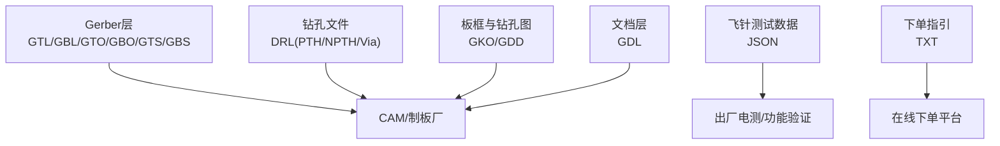
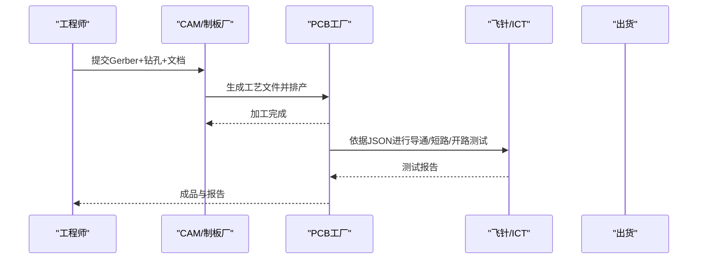
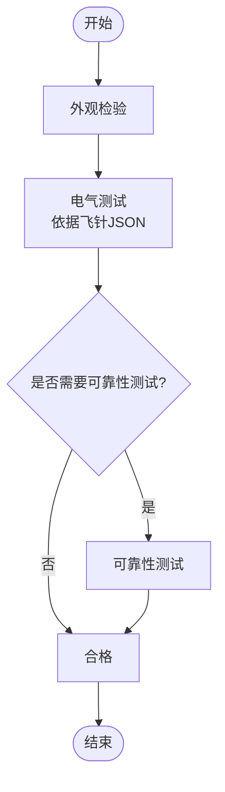
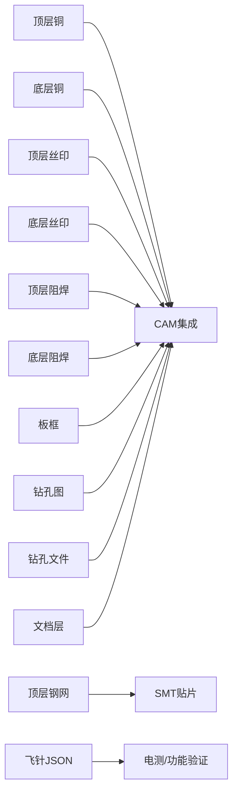

# 制造指导

<cite>
**本文引用的文件**
- [PCB下单必读.txt](file://gerber_unpacked/PCB下单必读.txt)
- [FlyingProbeTesting_PCB1_2026-08-09.json](file://flying_probe_unpacked/FlyingProbeTesting_PCB1_2026-08-09.json)
- [Gerber_BoardOutlineLayer.GKO](file://gerber_unpacked/Gerber_BoardOutlineLayer.GKO)
- [Gerber_TopLayer.GTL](file://gerber_unpacked/Gerber_TopLayer.GTL)
- [Gerber_BottomLayer.GBL](file://gerber_unpacked/Gerber_BottomLayer.GBL)
- [Gerber_TopSilkscreenLayer.GTO](file://gerber_unpacked/Gerber_TopSilkscreenLayer.GTO)
- [Gerber_BottomSilkscreenLayer.GBO](file://gerber_unpacked/Gerber_BottomSilkscreenLayer.GBO)
- [Gerber_TopSolderMaskLayer.GTS](file://gerber_unpacked/Gerber_TopSolderMaskLayer.GTS)
- [Gerber_BottomSolderMaskLayer.GBS](file://gerber_unpacked/Gerber_BottomSolderMaskLayer.GBS)
- [Gerber_TopPasteMaskLayer.GTP](file://gerber_unpacked/Gerber_TopPasteMaskLayer.GTP)
- [Drill_NPTH_Through.DRL](file://gerber_unpacked/Drill_NPTH_Through.DRL)
- [Drill_PTH_Through.DRL](file://gerber_unpacked/Drill_PTH_Through.DRL)
- [Drill_PTH_Through_Via.DRL](file://gerber_unpacked/Drill_PTH_Through_Via.DRL)
- [Gerber_DrillDrawingLayer.GDD](file://gerber_unpacked/Gerber_DrillDrawingLayer.GDD)
- [Gerber_DocumentLayer.GDL](file://gerber_unpacked/Gerber_DocumentLayer.GDL)
</cite>

## 目录
1. [简介](#简介)
2. [项目结构](#项目结构)
3. [核心组件](#核心组件)
4. [架构总览](#架构总览)
5. [详细组件分析](#详细组件分析)
6. [依赖关系分析](#依赖关系分析)
7. [性能与可制造性考虑](#性能与可制造性考虑)
8. [故障排查指南](#故障排查指南)
9. [结论](#结论)
10. [附录](#附录)

## 简介
本制造指导面向PCB制造商与工程对接，基于当前工程提供的Gerber、钻孔及飞针测试数据，给出完整的下单流程、技术规格书准备要点、订单信息填写规范，以及制造工艺要求（板材、表面处理、阻抗控制、多层板对位精度）、质量控制标准（外观检验、电气测试、可靠性测试）和常见问题预防与解决方案。同时提供与不同PCB制造商的技术对接要点与最佳实践，确保从设计到量产的顺畅交付。

## 项目结构
本项目包含以下关键交付物：
- Gerber层文件：顶层铜、底层铜、丝印、阻焊、钢网、板框、钻孔图、文档层等
- 钻孔文件：PTH/NPTH通孔与过孔钻孔清单
- 飞针测试数据：元件坐标与引脚网络映射，用于生产后导通/短路/开路检测
- 下单指引：指向在线下单教程的说明文件

图表来源
- [Gerber_TopLayer.GTL](file://gerber_unpacked/Gerber_TopLayer.GTL)
- [Gerber_BottomLayer.GBL](file://gerber_unpacked/Gerber_BottomLayer.GBL)
- [Gerber_TopSilkscreenLayer.GTO](file://gerber_unpacked/Gerber_TopSilkscreenLayer.GTO)
- [Gerber_BottomSilkscreenLayer.GBO](file://gerber_unpacked/Gerber_BottomSilkscreenLayer.GBO)
- [Gerber_TopSolderMaskLayer.GTS](file://gerber_unpacked/Gerber_TopSolderMaskLayer.GTS)
- [Gerber_BottomSolderMaskLayer.GBS](file://gerber_unpacked/Gerber_BottomSolderMaskLayer.GBS)
- [Gerber_BoardOutlineLayer.GKO](file://gerber_unpacked/Gerber_BoardOutlineLayer.GKO)
- [Gerber_DrillDrawingLayer.GDD](file://gerber_unpacked/Gerber_DrillDrawingLayer.GDD)
- [Drill_PTH_Through.DRL](file://gerber_unpacked/Drill_PTH_Through.DRL)
- [Drill_NPTH_Through.DRL](file://gerber_unpacked/Drill_NPTH_Through.DRL)
- [Drill_PTH_Through_Via.DRL](file://gerber_unpacked/Drill_PTH_Through_Via.DRL)
- [Gerber_DocumentLayer.GDL](file://gerber_unpacked/Gerber_DocumentLayer.GDL)
- [PCB下单必读.txt](file://gerber_unpacked/PCB下单必读.txt)

章节来源
- [PCB下单必读.txt:1-4](file://gerber_unpacked/PCB下单必读.txt#L1-L4)

## 核心组件
- Gerber层集合：定义铜、丝印、阻焊、钢网与外形轮廓，是制板的核心输入
- 钻孔文件：定义PTH/NPTH孔径与位置，影响孔壁质量与装配可靠性
- 文档层与钻孔图：辅助CAM解析与工艺确认
- 飞针测试数据：提供元件与引脚的网络映射，便于生产后进行导通/短路/开路测试

章节来源
- [Gerber_TopLayer.GTL](file://gerber_unpacked/Gerber_TopLayer.GTL)
- [Gerber_BottomLayer.GBL](file://gerber_unpacked/Gerber_BottomLayer.GBL)
- [Gerber_TopSilkscreenLayer.GTO](file://gerber_unpacked/Gerber_TopSilkscreenLayer.GTO)
- [Gerber_BottomSilkscreenLayer.GBO](file://gerber_unpacked/Gerber_BottomSilkscreenLayer.GBO)
- [Gerber_TopSolderMaskLayer.GTS](file://gerber_unpacked/Gerber_TopSolderMaskLayer.GTS)
- [Gerber_BottomSolderMaskLayer.GBS](file://gerber_unpacked/Gerber_BottomSolderMaskLayer.GBS)
- [Gerber_BoardOutlineLayer.GKO](file://gerber_unpacked/Gerber_BoardOutlineLayer.GKO)
- [Gerber_DrillDrawingLayer.GDD](file://gerber_unpacked/Gerber_DrillDrawingLayer.GDD)
- [Drill_PTH_Through.DRL](file://gerber_unpacked/Drill_PTH_Through.DRL)
- [Drill_NPTH_Through.DRL](file://gerber_unpacked/Drill_NPTH_Through.DRL)
- [Drill_PTH_Through_Via.DRL](file://gerber_unpacked/Drill_PTH_Through_Via.DRL)
- [Gerber_DocumentLayer.GDL](file://gerber_unpacked/Gerber_DocumentLayer.GDL)
- [FlyingProbeTesting_PCB1_2026-08-09.json](file://flying_probe_unpacked/FlyingProbeTesting_PCB1_2026-08-09.json)

## 架构总览
下图展示了从设计输出到制造与测试的整体流程，强调各文件的职责与交互关系。

图表来源
- [Gerber_TopLayer.GTL](file://gerber_unpacked/Gerber_TopLayer.GTL)
- [Gerber_BottomLayer.GBL](file://gerber_unpacked/Gerber_BottomLayer.GBL)
- [Gerber_TopSilkscreenLayer.GTO](file://gerber_unpacked/Gerber_TopSilkscreenLayer.GTO)
- [Gerber_BottomSilkscreenLayer.GBO](file://gerber_unpacked/Gerber_BottomSilkscreenLayer.GBO)
- [Gerber_TopSolderMaskLayer.GTS](file://gerber_unpacked/Gerber_TopSolderMaskLayer.GTS)
- [Gerber_BottomSolderMaskLayer.GBS](file://gerber_unpacked/Gerber_BottomSolderMaskLayer.GBS)
- [Gerber_BoardOutlineLayer.GKO](file://gerber_unpacked/Gerber_BoardOutlineLayer.GKO)
- [Gerber_DrillDrawingLayer.GDD](file://gerber_unpacked/Gerber_DrillDrawingLayer.GDD)
- [Drill_PTH_Through.DRL](file://gerber_unpacked/Drill_PTH_Through.DRL)
- [Drill_NPTH_Through.DRL](file://gerber_unpacked/Drill_NPTH_Through.DRL)
- [Drill_PTH_Through_Via.DRL](file://gerber_unpacked/Drill_PTH_Through_Via.DRL)
- [Gerber_DocumentLayer.GDL](file://gerber_unpacked/Gerber_DocumentLayer.GDL)
- [FlyingProbeTesting_PCB1_2026-08-09.json](file://flying_probe_unpacked/FlyingProbeTesting_PCB1_2026-08-09.json)

## 详细组件分析

### Gerber文件打包与命名规范
- 必须包含：顶层/底层铜、顶层/底层丝印、顶层/底层阻焊、钢网（Top Paste）、板框、钻孔图、文档层
- 建议统一单位与坐标系：保持与CAM一致（mil/mm），避免旋转或镜像错误
- 文件命名清晰：按层名区分，便于自动识别与归档
- 钻孔文件：分别提供PTH/NPTH与过孔钻孔，确保孔径与数量准确

章节来源
- [Gerber_TopLayer.GTL](file://gerber_unpacked/Gerber_TopLayer.GTL)
- [Gerber_BottomLayer.GBL](file://gerber_unpacked/Gerber_BottomLayer.GBL)
- [Gerber_TopSilkscreenLayer.GTO](file://gerber_unpacked/Gerber_TopSilkscreenLayer.GTO)
- [Gerber_BottomSilkscreenLayer.GBO](file://gerber_unpacked/Gerber_BottomSilkscreenLayer.GBO)
- [Gerber_TopSolderMaskLayer.GTS](file://gerber_unpacked/Gerber_TopSolderMaskLayer.GTS)
- [Gerber_BottomSolderMaskLayer.GBS](file://gerber_unpacked/Gerber_BottomSolderMaskLayer.GBS)
- [Gerber_TopPasteMaskLayer.GTP](file://gerber_unpacked/Gerber_TopPasteMaskLayer.GTP)
- [Gerber_BoardOutlineLayer.GKO](file://gerber_unpacked/Gerber_BoardOutlineLayer.GKO)
- [Gerber_DrillDrawingLayer.GDD](file://gerber_unpacked/Gerber_DrillDrawingLayer.GDD)
- [Drill_PTH_Through.DRL](file://gerber_unpacked/Drill_PTH_Through.DRL)
- [Drill_NPTH_Through.DRL](file://gerber_unpacked/Drill_NPTH_Through.DRL)
- [Drill_PTH_Through_Via.DRL](file://gerber_unpacked/Drill_PTH_Through_Via.DRL)

### 技术规格书准备要点
- 板材选择：根据应用环境选择FR-4或其他材料；高频/高功率需评估介电常数与损耗角
- 层数与叠构：明确层数、铜厚、介质厚度与叠构顺序
- 表面处理：ENIG、HASL、OSP等，结合焊接性与可焊性要求
- 阻抗控制：高速信号线宽度/间距/介质厚度与目标阻抗值
- 最小线宽/线距：依据制造商能力与可靠性要求设定
- 孔特性：PTH/NPTH孔径、孔壁粗糙度、盲埋孔需求
- 阻焊与丝印：颜色、覆盖范围、字符清晰度
- 板边与外形：尺寸公差、倒角、铣边要求
- 特殊工艺：金手指、局部镀金、塞孔、填孔、背钻等

章节来源
- [Gerber_DocumentLayer.GDL](file://gerber_unpacked/Gerber_DocumentLayer.GDL)
- [Gerber_DrillDrawingLayer.GDD](file://gerber_unpacked/Gerber_DrillDrawingLayer.GDD)

### 订单信息填写
- 基本信息：项目名称、版本号、数量、交期
- 工艺参数：层数、铜厚、板厚、表面处理、阻抗要求
- 特殊要求：阻焊颜色、丝印内容、板边处理、包装方式
- 测试要求：飞针/ICT测试项、验收标准
- 参考链接：下单教程见“PCB下单必读”

章节来源
- [PCB下单必读.txt:1-4](file://gerber_unpacked/PCB下单必读.txt#L1-L4)

### 制造工艺要求
- 板材选择：常规用FR-4；高频/高温/高可靠性场景选用更高Tg或低损耗材料
- 表面处理工艺：ENIG适合细间距与无铅焊接；HASL成本低但平整度有限；OSP环保且薄膜保护
- 阻抗控制：通过调整线宽、间距、介质厚度与叠构实现目标阻抗；必要时做阻抗样板
- 多层板对位精度：控制层间对准误差，保证孔位与图形重合度；使用定位孔与光学标记

章节来源
- [Gerber_TopLayer.GTL](file://gerber_unpacked/Gerber_TopLayer.GTL)
- [Gerber_BottomLayer.GBL](file://gerber_unpacked/Gerber_BottomLayer.GBL)
- [Gerber_DrillDrawingLayer.GDD](file://gerber_unpacked/Gerber_DrillDrawingLayer.GDD)

### 质量控制标准
- 外观检验：铜面清洁、无划伤、无残铜；丝印清晰；阻焊无气泡、无剥落；孔壁无毛刺
- 电气测试：导通/短路/开路测试，依据飞针JSON中的元件与引脚映射执行
- 可靠性测试：热冲击、温湿度循环、插拔寿命、盐雾等（按产品要求）

图表来源
- [FlyingProbeTesting_PCB1_2026-08-09.json](file://flying_probe_unpacked/FlyingProbeTesting_PCB1_2026-08-09.json)

### 常见制造问题与解决方案
- 阻焊桥接：优化钢网开孔与锡膏量；检查丝印与阻焊间隙
- 孔壁粗糙或断线：调整蚀刻参数；改善钻孔参数与退刀路径
- 阻抗偏差：复核叠构与线宽计算；制作阻抗样板并校准
- 多层对位不良：增加定位孔与光学标记；控制曝光与压合工艺
- 虚焊/冷焊：表面处理选择合适；预热与回流曲线优化

章节来源
- [Gerber_TopSolderMaskLayer.GTS](file://gerber_unpacked/Gerber_TopSolderMaskLayer.GTS)
- [Gerber_BottomSolderMaskLayer.GBS](file://gerber_unpacked/Gerber_BottomSolderMaskLayer.GBS)
- [Gerber_TopPasteMaskLayer.GTP](file://gerber_unpacked/Gerber_TopPasteMaskLayer.GTP)
- [Gerber_DrillDrawingLayer.GDD](file://gerber_unpacked/Gerber_DrillDrawingLayer.GDD)

### 与不同PCB制造商的技术对接要点与最佳实践
- 前期沟通：明确层数、铜厚、板厚、表面处理、阻抗、最小线宽/线距、孔特性
- 文件校验：提供Gerber与钻孔文件，并要求厂商进行CAM解析与DFM反馈
- 打样与试产：先小批量验证工艺与测试覆盖率，再扩大量产
- 测试策略：依据飞针JSON制定测试点与覆盖率目标；必要时补充ICT或功能测试
- 变更管理：任何设计或工艺变更需重新评审与验证，保留版本记录

章节来源
- [Gerber_TopLayer.GTL](file://gerber_unpacked/Gerber_TopLayer.GTL)
- [Gerber_BottomLayer.GBL](file://gerber_unpacked/Gerber_BottomLayer.GBL)
- [Gerber_TopSilkscreenLayer.GTO](file://gerber_unpacked/Gerber_TopSilkscreenLayer.GTO)
- [Gerber_BottomSilkscreenLayer.GBO](file://gerber_unpacked/Gerber_BottomSilkscreenLayer.GBO)
- [Gerber_TopSolderMaskLayer.GTS](file://gerber_unpacked/Gerber_TopSolderMaskLayer.GTS)
- [Gerber_BottomSolderMaskLayer.GBS](file://gerber_unpacked/Gerber_BottomSolderMaskLayer.GBS)
- [Gerber_TopPasteMaskLayer.GTP](file://gerber_unpacked/Gerber_TopPasteMaskLayer.GTP)
- [Gerber_BoardOutlineLayer.GKO](file://gerber_unpacked/Gerber_BoardOutlineLayer.GKO)
- [Gerber_DrillDrawingLayer.GDD](file://gerber_unpacked/Gerber_DrillDrawingLayer.GDD)
- [Drill_PTH_Through.DRL](file://gerber_unpacked/Drill_PTH_Through.DRL)
- [Drill_NPTH_Through.DRL](file://gerber_unpacked/Drill_NPTH_Through.DRL)
- [Drill_PTH_Through_Via.DRL](file://gerber_unpacked/Drill_PTH_Through_Via.DRL)
- [Gerber_DocumentLayer.GDL](file://gerber_unpacked/Gerber_DocumentLayer.GDL)
- [FlyingProbeTesting_PCB1_2026-08-09.json](file://flying_probe_unpacked/FlyingProbeTesting_PCB1_2026-08-09.json)

## 依赖关系分析
- Gerber层之间相互独立但共同构成完整PCB图形；钻孔文件与层图形在CAM中叠加以生成最终加工路径
- 文档层与钻孔图为CAM与质检提供辅助信息
- 飞针测试数据依赖Gerber与原理图/布局信息，确保测试点与网络映射正确

图表来源
- [Gerber_TopLayer.GTL](file://gerber_unpacked/Gerber_TopLayer.GTL)
- [Gerber_BottomLayer.GBL](file://gerber_unpacked/Gerber_BottomLayer.GBL)
- [Gerber_TopSilkscreenLayer.GTO](file://gerber_unpacked/Gerber_TopSilkscreenLayer.GTO)
- [Gerber_BottomSilkscreenLayer.GBO](file://gerber_unpacked/Gerber_BottomSilkscreenLayer.GBO)
- [Gerber_TopSolderMaskLayer.GTS](file://gerber_unpacked/Gerber_TopSolderMaskLayer.GTS)
- [Gerber_BottomSolderMaskLayer.GBS](file://gerber_unpacked/Gerber_BottomSolderMaskLayer.GBS)
- [Gerber_TopPasteMaskLayer.GTP](file://gerber_unpacked/Gerber_TopPasteMaskLayer.GTP)
- [Gerber_BoardOutlineLayer.GKO](file://gerber_unpacked/Gerber_BoardOutlineLayer.GKO)
- [Gerber_DrillDrawingLayer.GDD](file://gerber_unpacked/Gerber_DrillDrawingLayer.GDD)
- [Drill_PTH_Through.DRL](file://gerber_unpacked/Drill_PTH_Through.DRL)
- [Drill_NPTH_Through.DRL](file://gerber_unpacked/Drill_NPTH_Through.DRL)
- [Drill_PTH_Through_Via.DRL](file://gerber_unpacked/Drill_PTH_Through_Via.DRL)
- [Gerber_DocumentLayer.GDL](file://gerber_unpacked/Gerber_DocumentLayer.GDL)
- [FlyingProbeTesting_PCB1_2026-08-09.json](file://flying_probe_unpacked/FlyingProbeTesting_PCB1_2026-08-09.json)

## 性能与可制造性考虑
- 线宽/线距：遵循制造商能力与可靠性要求，避免过小导致良率下降
- 阻焊与钢网：合理开孔与厚度，减少桥接与少锡风险
- 孔特性：PTH/NPTH孔径与孔壁质量直接影响装配与可靠性
- 阻抗与信号完整性：通过叠构与走线优化满足高速信号要求
- 可测试性：依据飞针JSON规划测试点，提高覆盖率与效率

[本节为通用指导，不直接分析具体文件]

## 故障排查指南
- 外观缺陷：检查阻焊与丝印层是否完整；核对板框与外形
- 电气异常：依据飞针JSON核对网络映射与测试点；复测导通/短路/开路
- 焊接问题：调整钢网与回流曲线；检查表面处理与预热温度
- 阻抗不符：复核叠构与线宽计算；制作阻抗样板并校准

章节来源
- [Gerber_TopSolderMaskLayer.GTS](file://gerber_unpacked/Gerber_TopSolderMaskLayer.GTS)
- [Gerber_BottomSolderMaskLayer.GBS](file://gerber_unpacked/Gerber_BottomSolderMaskLayer.GBS)
- [Gerber_TopPasteMaskLayer.GTP](file://gerber_unpacked/Gerber_TopPasteMaskLayer.GTP)
- [Gerber_DrillDrawingLayer.GDD](file://gerber_unpacked/Gerber_DrillDrawingLayer.GDD)
- [FlyingProbeTesting_PCB1_2026-08-09.json](file://flying_probe_unpacked/FlyingProbeTesting_PCB1_2026-08-09.json)

## 结论
通过规范的Gerber打包、完善的技术规格书、准确的订单信息与严格的制造工艺与质量控制，可有效提升PCB良率与可靠性。结合飞针测试数据，建立完善的电测与可靠性验证流程，并与制造商保持良好沟通与变更管理，是实现高质量交付的关键。

[本节为总结，不直接分析具体文件]

## 附录
- 下单教程参考：参见“PCB下单必读”中的链接
- 文件清单：详见项目结构中的Gerber、钻孔与文档层
- 测试数据：飞针JSON提供元件与引脚的网络映射，用于生产后电测

章节来源
- [PCB下单必读.txt:1-4](file://gerber_unpacked/PCB下单必读.txt#L1-L4)
- [FlyingProbeTesting_PCB1_2026-08-09.json](file://flying_probe_unpacked/FlyingProbeTesting_PCB1_2026-08-09.json)

## 相关文档
- [制造文件](制造文件.md)（制造文件总述）
- [Gerber文件规范](Gerber文件规范.md)（Gerber 层定义）
- [测试配置文件](测试配置文件.md)（飞针测试配置）
- [测试与质量保证](../测试与质量保证.md)（生产测试流程）