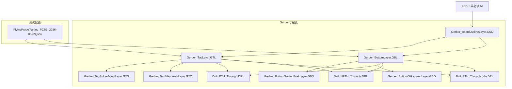
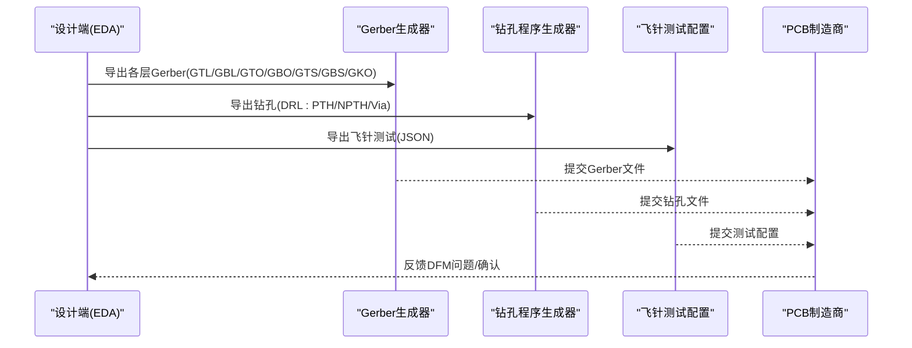
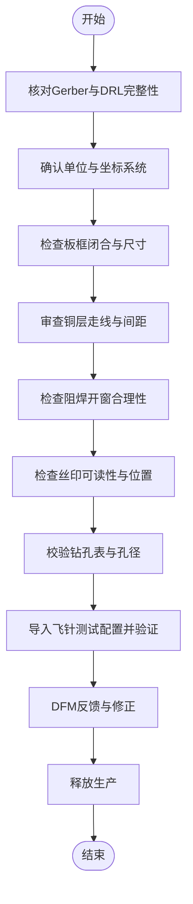
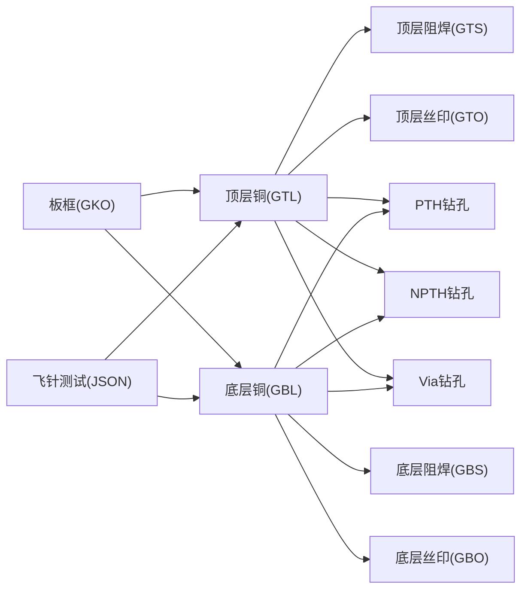

# 制造文件

<cite>
**本文引用的文件**
- [PCB下单必读.txt](file://gerber_unpacked/PCB下单必读.txt)
- [Gerber_BoardOutlineLayer.GKO](file://gerber_unpacked/Gerber_BoardOutlineLayer.GKO)
- [Gerber_TopLayer.GTL](file://gerber_unpacked/Gerber_TopLayer.GTL)
- [Gerber_BottomLayer.GBL](file://gerber_unpacked/Gerber_BottomLayer.GBL)
- [Gerber_TopSilkscreenLayer.GTO](file://gerber_unpacked/Gerber_TopSilkscreenLayer.GTO)
- [Gerber_BottomSilkscreenLayer.GBO](file://gerber_unpacked/Gerber_BottomSilkscreenLayer.GBO)
- [Gerber_TopSolderMaskLayer.GTS](file://gerber_unpacked/Gerber_TopSolderMaskLayer.GTS)
- [Gerber_BottomSolderMaskLayer.GBS](file://gerber_unpacked/Gerber_BottomSolderMaskLayer.GBS)
- [Drill_PTH_Through.DRL](file://gerber_unpacked/Drill_PTH_Through.DRL)
- [Drill_NPTH_Through.DRL](file://gerber_unpacked/Drill_NPTH_Through.DRL)
- [Drill_PTH_Through_Via.DRL](file://gerber_unpacked/Drill_PTH_Through_Via.DRL)
- [FlyingProbeTesting_PCB1_2026-08-09.json](file://flying_probe_unpacked/FlyingProbeTesting_PCB1_2026-08-09.json)
</cite>

## 目录
1. [简介](#简介)
2. [项目结构](#项目结构)
3. [核心组件](#核心组件)
4. [架构总览](#架构总览)
5. [详细组件分析](#详细组件分析)
6. [依赖关系分析](#依赖关系分析)
7. [性能与工艺注意事项](#性能与工艺注意事项)
8. [故障排查指南](#故障排查指南)
9. [结论](#结论)
10. [附录](#附录)

## 简介
本制造文件包为一款双面板PCB的完整生产资料，包含：
- Gerber层文件（顶层铜、底层铜、丝印、阻焊、板框等）
- 钻孔文件（通孔PTH、非通孔NPTH、过孔Via）
- 飞针测试配置文件（JSON）
- 下单指引说明

该文档面向PCB制造商与质量工程师，系统说明各层作用、坐标系与单位、钻孔格式要求、飞针测试配置结构，以及制造流程与质量标准建议。

## 项目结构
- gerber_unpacked：Gerber与钻孔数据及板框
- flying_probe_unpacked：飞针测试点与网络信息
- IPC_PCB1_75mm_Brushed_FC_V1_2026-08-09.356a：源工程文件（用于追溯设计）

图表来源
- [Gerber_BoardOutlineLayer.GKO:1-33](file://gerber_unpacked/Gerber_BoardOutlineLayer.GKO#L1-L33)
- [Gerber_TopLayer.GTL:1-10](file://gerber_unpacked/Gerber_TopLayer.GTL#L1-L10)
- [Gerber_BottomLayer.GBL:1-11](file://gerber_unpacked/Gerber_BottomLayer.GBL#L1-L11)
- [Gerber_TopSilkscreenLayer.GTO:1-18](file://gerber_unpacked/Gerber_TopSilkscreenLayer.GTO#L1-L18)
- [Gerber_BottomSilkscreenLayer.GBO:1-15](file://gerber_unpacked/Gerber_BottomSilkscreenLayer.GBO#L1-L15)
- [Gerber_TopSolderMaskLayer.GTS:1-35](file://gerber_unpacked/Gerber_TopSolderMaskLayer.GTS#L1-L35)
- [Gerber_BottomSolderMaskLayer.GBS:1-28](file://gerber_unpacked/Gerber_BottomSolderMaskLayer.GBS#L1-L28)
- [Drill_PTH_Through.DRL:1-28](file://gerber_unpacked/Drill_PTH_Through.DRL#L1-L28)
- [Drill_NPTH_Through.DRL:1-16](file://gerber_unpacked/Drill_NPTH_Through.DRL#L1-L16)
- [Drill_PTH_Through_Via.DRL:1-14](file://gerber_unpacked/Drill_PTH_Through_Via.DRL#L1-L14)
- [FlyingProbeTesting_PCB1_2026-08-09.json:1-6](file://flying_probe_unpacked/FlyingProbeTesting_PCB1_2026-08-09.json#L1-L6)
- [PCB下单必读.txt:1-4](file://gerber_unpacked/PCB下单必读.txt#L1-L4)

章节来源
- [PCB下单必读.txt:1-4](file://gerber_unpacked/PCB下单必读.txt#L1-L4)

## 核心组件
- 板框层（GKO）：定义PCB外形轮廓，供铣削使用
- 顶层铜（GTL）：顶层走线与焊盘
- 底层铜（GBL）：底层走线与焊盘
- 顶层丝印（GTO）：顶层字符与图形
- 底层丝印（GBO）：底层字符与图形
- 顶层阻焊（GTS）：顶层阻焊开窗
- 底层阻焊（GBS）：底层阻焊开窗
- PTH钻孔（DRL）：带金属化通孔
- NPTH钻孔（DRL）：无金属化孔
- Via钻孔（DRL）：仅过孔钻孔
- 飞针测试配置（JSON）：测试点坐标、网络与引脚信息

章节来源
- [Gerber_BoardOutlineLayer.GKO:1-33](file://gerber_unpacked/Gerber_BoardOutlineLayer.GKO#L1-L33)
- [Gerber_TopLayer.GTL:1-10](file://gerber_unpacked/Gerber_TopLayer.GTL#L1-L10)
- [Gerber_BottomLayer.GBL:1-11](file://gerber_unpacked/Gerber_BottomLayer.GBL#L1-L11)
- [Gerber_TopSilkscreenLayer.GTO:1-18](file://gerber_unpacked/Gerber_TopSilkscreenLayer.GTO#L1-L18)
- [Gerber_BottomSilkscreenLayer.GBO:1-15](file://gerber_unpacked/Gerber_BottomSilkscreenLayer.GBO#L1-L15)
- [Gerber_TopSolderMaskLayer.GTS:1-35](file://gerber_unpacked/Gerber_TopSolderMaskLayer.GTS#L1-L35)
- [Gerber_BottomSolderMaskLayer.GBS:1-28](file://gerber_unpacked/Gerber_BottomSolderMaskLayer.GBS#L1-L28)
- [Drill_PTH_Through.DRL:1-28](file://gerber_unpacked/Drill_PTH_Through.DRL#L1-L28)
- [Drill_NPTH_Through.DRL:1-16](file://gerber_unpacked/Drill_NPTH_Through.DRL#L1-L16)
- [Drill_PTH_Through_Via.DRL:1-14](file://gerber_unpacked/Drill_PTH_Through_Via.DRL#L1-L14)
- [FlyingProbeTesting_PCB1_2026-08-09.json:1-6](file://flying_probe_unpacked/FlyingProbeTesting_PCB1_2026-08-09.json#L1-L6)

## 架构总览
从设计到制造的典型数据流如下：

图表来源
- [Gerber_TopLayer.GTL:1-10](file://gerber_unpacked/Gerber_TopLayer.GTL#L1-L10)
- [Gerber_BottomLayer.GBL:1-11](file://gerber_unpacked/Gerber_BottomLayer.GBL#L1-L11)
- [Gerber_TopSilkscreenLayer.GTO:1-18](file://gerber_unpacked/Gerber_TopSilkscreenLayer.GTO#L1-L18)
- [Gerber_BottomSilkscreenLayer.GBO:1-15](file://gerber_unpacked/Gerber_BottomSilkscreenLayer.GBO#L1-L15)
- [Gerber_TopSolderMaskLayer.GTS:1-35](file://gerber_unpacked/Gerber_TopSolderMaskLayer.GTS#L1-L35)
- [Gerber_BottomSolderMaskLayer.GBS:1-28](file://gerber_unpacked/Gerber_BottomSolderMaskLayer.GBS#L1-L28)
- [Gerber_BoardOutlineLayer.GKO:1-33](file://gerber_unpacked/Gerber_BoardOutlineLayer.GKO#L1-L33)
- [Drill_PTH_Through.DRL:1-28](file://gerber_unpacked/Drill_PTH_Through.DRL#L1-L28)
- [Drill_NPTH_Through.DRL:1-16](file://gerber_unpacked/Drill_NPTH_Through.DRL#L1-L16)
- [Drill_PTH_Through_Via.DRL:1-14](file://gerber_unpacked/Drill_PTH_Through_Via.DRL#L1-L14)
- [FlyingProbeTesting_PCB1_2026-08-09.json:1-6](file://flying_probe_unpacked/FlyingProbeTesting_PCB1_2026-08-09.json#L1-L6)

## 详细组件分析

### 坐标系与尺寸单位
- 所有Gerber文件头部均声明“Dimensions in millimeters”，即单位为毫米
- 坐标格式为绝对坐标，整数位4位、小数位5位（Leading zeros omitted, absolute positions, 4 integers and 5 decimals）
- 常用命令：
  - %FSLAX45Y45*%：设置X/Y坐标精度为4.5位
  - %MOMM*%：单位设置为毫米
  - G90：绝对坐标模式
  - G75：多象限圆弧插补模式（部分文件使用，允许圆弧跨越象限边界）

章节来源
- [Gerber_TopLayer.GTL:1-12](file://gerber_unpacked/Gerber_TopLayer.GTL#L1-L12)
- [Gerber_BottomLayer.GBL:1-12](file://gerber_unpacked/Gerber_BottomLayer.GBL#L1-L12)
- [Gerber_TopSilkscreenLayer.GTO:1-18](file://gerber_unpacked/Gerber_TopSilkscreenLayer.GTO#L1-L18)
- [Gerber_BottomSilkscreenLayer.GBO:1-15](file://gerber_unpacked/Gerber_BottomSilkscreenLayer.GBO#L1-L15)
- [Gerber_TopSolderMaskLayer.GTS:1-13](file://gerber_unpacked/Gerber_TopSolderMaskLayer.GTS#L1-L13)
- [Gerber_BottomSolderMaskLayer.GBS:1-13](file://gerber_unpacked/Gerber_BottomSolderMaskLayer.GBS#L1-L13)
- [Gerber_BoardOutlineLayer.GKO:1-14](file://gerber_unpacked/Gerber_BoardOutlineLayer.GKO#L1-L14)
- [Drill_PTH_Through.DRL:5-7](file://gerber_unpacked/Drill_PTH_Through.DRL#L5-L7)
- [Drill_NPTH_Through.DRL:5-7](file://gerber_unpacked/Drill_NPTH_Through.DRL#L5-L7)
- [Drill_PTH_Through_Via.DRL:5-7](file://gerber_unpacked/Drill_PTH_Through_Via.DRL#L5-L7)

### 板框层（GKO）
- 用途：定义PCB外形轮廓，供数控铣床切割
- 内容：矩形轮廓与圆角路径，使用G01/G02/G03绘制
- 注意：确保轮廓闭合且无交叉；避免在轮廓上放置其他层图形

章节来源
- [Gerber_BoardOutlineLayer.GKO:1-33](file://gerber_unpacked/Gerber_BoardOutlineLayer.GKO#L1-L33)

### 顶层铜（GTL）与底层铜（GBL）
- 用途：承载电路走线、焊盘、铺铜区域
- 关键信息：
  - 顶层铜面积数：135个区域
  - 底层铜面积数：70个区域
  - 使用ADD命令定义不同形状与尺寸的图形基元（圆形、矩形、异形）
- 建议：
  - 最小线宽/间距满足制造商能力
  - 大面积铺铜需考虑热变形与阻抗控制
  - 电源/地平面尽量连续并合理分割

章节来源
- [Gerber_TopLayer.GTL:1-10](file://gerber_unpacked/Gerber_TopLayer.GTL#L1-L10)
- [Gerber_BottomLayer.GBL:1-11](file://gerber_unpacked/Gerber_BottomLayer.GBL#L1-L11)

### 丝印层（GTO/GBO）
- 用途：元件标识、极性标记、版本信息等
- 特点：
  - 顶层丝印包含多段文本与图形
  - 底层丝印较简略
- 建议：
  - 字符高度与间距符合可读性要求
  - 避免覆盖焊盘或过近走线

章节来源
- [Gerber_TopSilkscreenLayer.GTO:1-18](file://gerber_unpacked/Gerber_TopSilkscreenLayer.GTO#L1-L18)
- [Gerber_BottomSilkscreenLayer.GBO:1-15](file://gerber_unpacked/Gerber_BottomSilkscreenLayer.GBO#L1-L15)

### 阻焊层（GTS/GBS）
- 用途：保护铜面不被氧化，仅在需要焊接处开窗
- 特点：
  - 顶层/底层阻焊分别定义开窗位置
  - 使用RoundRect等自定义图形适配不同焊盘
- 建议：
  - 阻焊桥宽度满足防短路要求
  - 大焊盘适当扩大开窗以利于焊接

章节来源
- [Gerber_TopSolderMaskLayer.GTS:1-35](file://gerber_unpacked/Gerber_TopSolderMaskLayer.GTS#L1-L35)
- [Gerber_BottomSolderMaskLayer.GBS:1-28](file://gerber_unpacked/Gerber_BottomSolderMaskLayer.GBS#L1-L28)

### 钻孔文件（DRL）
- 通用格式：
  - M48：初始化
  - METRIC,LZ：公制、前导零省略
  - TxxCxxx：定义刀具号与直径
  - G90：绝对坐标
  - X...Y...：钻孔坐标
  - G85：椭圆孔（部分PTH文件出现）
  - M30：结束
- 三类钻孔：
  - PTH通孔（Drill_PTH_Through.DRL）：带金属化，用于插件与跨层连接
  - NPTH非通孔（Drill_NPTH_Through.DRL）：无金属化，用于定位、散热或机械固定
  - Via过孔（Drill_PTH_Through_Via.DRL）：仅过孔钻孔，通常较小
- 建议：
  - 孔径公差按IPC-6012/IPC-2221控制
  - 最小孔径与孔边距满足工艺能力
  - 椭圆孔方向与强度要求需评估

章节来源
- [Drill_PTH_Through.DRL:1-28](file://gerber_unpacked/Drill_PTH_Through.DRL#L1-L28)
- [Drill_NPTH_Through.DRL:1-16](file://gerber_unpacked/Drill_NPTH_Through.DRL#L1-L16)
- [Drill_PTH_Through_Via.DRL:1-14](file://gerber_unpacked/Drill_PTH_Through_Via.DRL#L1-L14)

### 飞针测试配置（JSON）
- 结构与字段：
  - lengthUnit：长度单位（mil）
  - remark：备注（如“fly_line”）
  - components：组件列表，字段包括组件编号、名称、层、X/Y坐标、角度
  - pins：引脚/焊盘列表，字段包括引脚号、名称、X/Y坐标、层、类型（SMD/DIP）、网络名、网络类型、焊盘形状、尺寸、孔径、角度等
- 用途：
  - 指导飞针测试仪对关键节点进行连通性与短路检测
  - 提供测试点坐标与网络映射，便于自动编程
- 建议：
  - 确保测试点避开阻焊遮挡或丝印干扰
  - 对高密度区域增加测试点以提高覆盖率
  - 与Gerber坐标系统一（注意单位换算）

章节来源
- [FlyingProbeTesting_PCB1_2026-08-09.json:1-6](file://flying_probe_unpacked/FlyingProbeTesting_PCB1_2026-08-09.json#L1-L6)
- [FlyingProbeTesting_PCB1_2026-08-09.json:4-6](file://flying_probe_unpacked/FlyingProbeTesting_PCB1_2026-08-09.json#L4-L6)
- [FlyingProbeTesting_PCB1_2026-08-09.json:206-208](file://flying_probe_unpacked/FlyingProbeTesting_PCB1_2026-08-09.json#L206-L208)

### 制造流程图（概念）

[此图为概念流程，不直接对应具体源码文件]

## 依赖关系分析
- 板框（GKO）是所有层的基础参考，影响后续加工定位
- 铜层（GTL/GBL）决定电气连接，需与阻焊（GTS/GBS）配合保证可焊性
- 丝印（GTO/GBO）不影响电气但影响装配与售后识别
- 钻孔（DRL）必须与铜层和阻焊层严格对齐，尤其是PTH与Via
- 飞针测试配置（JSON）依赖Gerber坐标与网络信息，确保测试点准确

图表来源
- [Gerber_BoardOutlineLayer.GKO:1-33](file://gerber_unpacked/Gerber_BoardOutlineLayer.GKO#L1-L33)
- [Gerber_TopLayer.GTL:1-10](file://gerber_unpacked/Gerber_TopLayer.GTL#L1-L10)
- [Gerber_BottomLayer.GBL:1-11](file://gerber_unpacked/Gerber_BottomLayer.GBL#L1-L11)
- [Gerber_TopSolderMaskLayer.GTS:1-35](file://gerber_unpacked/Gerber_TopSolderMaskLayer.GTS#L1-L35)
- [Gerber_BottomSolderMaskLayer.GBS:1-28](file://gerber_unpacked/Gerber_BottomSolderMaskLayer.GBS#L1-L28)
- [Gerber_TopSilkscreenLayer.GTO:1-18](file://gerber_unpacked/Gerber_TopSilkscreenLayer.GTO#L1-L18)
- [Gerber_BottomSilkscreenLayer.GBO:1-15](file://gerber_unpacked/Gerber_BottomSilkscreenLayer.GBO#L1-L15)
- [Drill_PTH_Through.DRL:1-28](file://gerber_unpacked/Drill_PTH_Through.DRL#L1-L28)
- [Drill_NPTH_Through.DRL:1-16](file://gerber_unpacked/Drill_NPTH_Through.DRL#L1-L16)
- [Drill_PTH_Through_Via.DRL:1-14](file://gerber_unpacked/Drill_PTH_Through_Via.DRL#L1-L14)
- [FlyingProbeTesting_PCB1_2026-08-09.json:1-6](file://flying_probe_unpacked/FlyingProbeTesting_PCB1_2026-08-09.json#L1-L6)

## 性能与工艺注意事项
- 最小线宽/间距：依据制造商能力与信号完整性要求设定
- 孔径与孔边距：遵循IPC标准与设备能力，避免偏钻与断刀
- 阻焊桥：防止相邻焊盘连锡，提高SMT良率
- 板框倒角：减少应力集中，便于装配
- 飞针测试：提升覆盖率，降低批量风险

[本节为通用指导，不直接引用具体文件]

## 故障排查指南
- 坐标不一致：确认Gerber与DRL均为毫米单位且绝对坐标模式
- 板框未闭合：检查GKO是否形成封闭轮廓
- 阻焊缺失：核对GTS/GBS中焊盘开窗是否完整
- 钻孔错位：比对DRL与Gerber层坐标，确认原点一致
- 飞针测试失败：检查JSON中测试点坐标与网络映射是否正确

章节来源
- [Gerber_TopLayer.GTL:1-12](file://gerber_unpacked/Gerber_TopLayer.GTL#L1-L12)
- [Gerber_BottomLayer.GBL:1-12](file://gerber_unpacked/Gerber_BottomLayer.GBL#L1-L12)
- [Gerber_TopSolderMaskLayer.GTS:1-35](file://gerber_unpacked/Gerber_TopSolderMaskLayer.GTS#L1-L35)
- [Gerber_BottomSolderMaskLayer.GBS:1-28](file://gerber_unpacked/Gerber_BottomSolderMaskLayer.GBS#L1-L28)
- [Drill_PTH_Through.DRL:5-28](file://gerber_unpacked/Drill_PTH_Through.DRL#L5-L28)
- [Drill_NPTH_Through.DRL:5-16](file://gerber_unpacked/Drill_NPTH_Through.DRL#L5-L16)
- [Drill_PTH_Through_Via.DRL:5-14](file://gerber_unpacked/Drill_PTH_Through_Via.DRL#L5-L14)
- [FlyingProbeTesting_PCB1_2026-08-09.json:1-6](file://flying_probe_unpacked/FlyingProbeTesting_PCB1_2026-08-09.json#L1-L6)

## 结论
本制造文件包提供了完整的Gerber与钻孔数据，以及飞针测试配置，满足双面板PCB的生产需求。通过统一坐标系与单位、严格的DFM检查与测试验证，可有效保障制造质量与可靠性。建议在下单前完成DFM审核并与制造商确认工艺能力。

[本节为总结，不直接引用具体文件]

## 附录
- 下单指引：请参考提供的链接获取详细下单步骤
- 常见术语：
  - PTH：带金属化的通孔
  - NPTH：无金属化的非通孔
  - Via：过孔，用于层间连接
  - 阻焊：保护铜面的涂层，仅在焊盘处开窗
  - 丝印：字符与图形标识

章节来源
- [PCB下单必读.txt:1-4](file://gerber_unpacked/PCB下单必读.txt#L1-L4)

## 相关文档
- [Gerber文件规范](Gerber文件规范.md)（层定义与指令释义）
- [钻孔文件规范](钻孔文件规范.md)（PTH/NPTH 钻孔）
- [板框文件](板框文件.md)（板框轮廓定义）
- [制造指导](制造指导.md)（面向板厂的工艺指导）
- [测试配置文件](测试配置文件.md)（飞针测试配置）
- [PCB布局设计](../硬件设计/PCB布局设计.md)（设计与制造衔接）