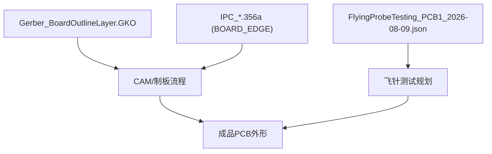
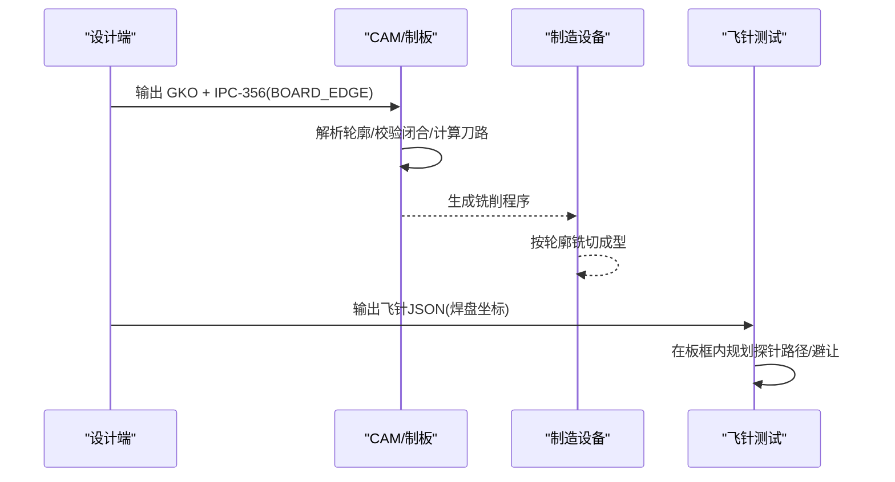
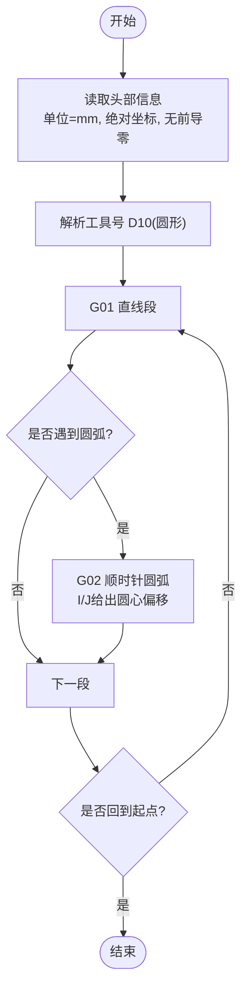

# 板框文件

<cite>
**本文引用的文件**
- [Gerber_BoardOutlineLayer.GKO](file://gerber_unpacked/Gerber_BoardOutlineLayer.GKO)
- [IPC_PCB1_75mm_Brushed_FC_V1_2026-08-09.356a](file://IPC_PCB1_75mm_Brushed_FC_V1_2026-08-09.356a)
- [FlyingProbeTesting_PCB1_2026-08-09.json](file://flying_probe_unpacked/FlyingProbeTesting_PCB1_2026-08-09.json)
- [PCB下单必读.txt](file://gerber_unpacked/PCB下单必读.txt)
</cite>

## 目录
1. [简介](#简介)
2. [项目结构](#项目结构)
3. [核心组件](#核心组件)
4. [架构总览](#架构总览)
5. [详细组件分析](#详细组件分析)
6. [依赖关系分析](#依赖关系分析)
7. [性能与精度考量](#性能与精度考量)
8. [故障排查指南](#故障排查指南)
9. [结论](#结论)
10. [附录](#附录)

## 简介
本规范聚焦于PCB的板框文件（GKO，Board Outline Layer），用于定义PCB外形轮廓、倒角与圆角、尺寸标注基准及装配边界。文档基于仓库中的实际Gerber与IPC数据，说明：
- GKO层的作用与格式要点
- 坐标系统与尺寸标注方法
- 与装配图/丝印/钻孔等文件的对应关系
- 设计注意事项（避免锐角、装配间隙、测试点预留）
- 验证方法与常见错误排查

## 项目结构
本项目包含以下与板框相关的输出物：
- Gerber层：Gerber_BoardOutlineLayer.GKO（板框）
- IPC-356：IPC_PCB1_75mm_Brushed_FC_V1_2026-08-09.356a（含BOARD_EDGE段）
- 飞针测试配置：FlyingProbeTesting_PCB1_2026-08-09.json（引脚/焊盘坐标）
- 下单指引：PCB下单必读.txt

图表来源
- [Gerber_BoardOutlineLayer.GKO:1-31](file://gerber_unpacked/Gerber_BoardOutlineLayer.GKO#L1-L31)
- [IPC_PCB1_75mm_Brushed_FC_V1_2026-08-09.356a:311-314](file://IPC_PCB1_75mm_Brushed_FC_V1_2026-08-09.356a#L311-L314)
- [FlyingProbeTesting_PCB1_2026-08-09.json:1-200](file://flying_probe_unpacked/FlyingProbeTesting_PCB1_2026-08-09.json#L1-L200)

章节来源
- [Gerber_BoardOutlineLayer.GKO:1-31](file://gerber_unpacked/Gerber_BoardOutlineLayer.GKO#L1-L31)
- [IPC_PCB1_75mm_Brushed_FC_V1_2026-08-09.356a:311-314](file://IPC_PCB1_75mm_Brushed_FC_V1_2026-08-09.356a#L311-L314)
- [FlyingProbeTesting_PCB1_2026-08-09.json:1-200](file://flying_probe_unpacked/FlyingProbeTesting_PCB1_2026-08-09.json#L1-L200)
- [PCB下单必读.txt:1-4](file://gerber_unpacked/PCB下单必读.txt#L1-L4)

## 核心组件
- 板框层（GKO）：以Gerber格式描述PCB外轮廓，包含直线与圆弧指令，用于切割成型。
- IPC-356（BOARD_EDGE）：以线段/折线形式定义板边，便于CAM系统校验与追溯。
- 飞针测试JSON：提供焊盘/引脚坐标，用于在板框范围内规划测试路径与避让。

章节来源
- [Gerber_BoardOutlineLayer.GKO:1-31](file://gerber_unpacked/Gerber_BoardOutlineLayer.GKO#L1-L31)
- [IPC_PCB1_75mm_Brushed_FC_V1_2026-08-09.356a:311-314](file://IPC_PCB1_75mm_Brushed_FC_V1_2026-08-09.356a#L311-L314)
- [FlyingProbeTesting_PCB1_2026-08-09.json:1-200](file://flying_probe_unpacked/FlyingProbeTesting_PCB1_2026-08-09.json#L1-L200)

## 架构总览
从设计到制造的板框数据流如下：
- 设计端导出GKO（Gerber）与IPC-356（含BOARD_EDGE）
- CAM端读取GKO进行刀路生成，同时用IPC-356做几何一致性校验
- 制造端依据GKO进行铣削成型；测试端依据飞针JSON规划探针路径并避开板框

图表来源
- [Gerber_BoardOutlineLayer.GKO:1-31](file://gerber_unpacked/Gerber_BoardOutlineLayer.GKO#L1-L31)
- [IPC_PCB1_75mm_Brushed_FC_V1_2026-08-09.356a:311-314](file://IPC_PCB1_75mm_Brushed_FC_V1_2026-08-09.356a#L311-L314)
- [FlyingProbeTesting_PCB1_2026-08-09.json:1-200](file://flying_probe_unpacked/FlyingProbeTesting_PCB1_2026-08-09.json#L1-L200)

## 详细组件分析

### GKO板框层规范与解读
- 单位与格式
  - 单位为毫米（mm），绝对坐标，无前导零，整数位4位、小数位5位。
  - 使用Gerber标准命令：G01直线插补、G02顺时针圆弧插补，配合I/J圆心偏移。
  - 工具号D10为轮廓描边刀具（圆形），用于绘制板框。
- 轮廓特征
  - 四段直线与四段圆弧构成带圆角的矩形轮廓，四个角均为相同半径的圆弧过渡。
  - 通过G02指令的I/J值可反推圆角半径（见下节“圆角半径推导”）。
- 闭合性
  - 首尾坐标一致，形成封闭轮廓，满足CAM对轮廓闭合的要求。

图表来源
- [Gerber_BoardOutlineLayer.GKO:1-31](file://gerber_unpacked/Gerber_BoardOutlineLayer.GKO#L1-L31)

章节来源
- [Gerber_BoardOutlineLayer.GKO:1-31](file://gerber_unpacked/Gerber_BoardOutlineLayer.GKO#L1-L31)

#### 圆角半径推导与倒角处理
- 圆弧段示例：G02 X... Y... I... J...
  - I/J表示从当前点到圆心的相对偏移。对于水平/垂直边的圆角，I或J之一为0，另一个的绝对值即为圆角半径。
  - 本文件中I/J的绝对值为20320（单位：微米，因小数位5位），换算为毫米即2.032 mm。
- 倒角与圆角
  - 本例采用圆角过渡（非斜边倒角），四个角半径一致，保证外观与应力集中优化。
  - 若需斜边倒角，应使用两段直线相交并去除多余部分，而非圆弧指令。

章节来源
- [Gerber_BoardOutlineLayer.GKO:22-28](file://gerber_unpacked/Gerber_BoardOutlineLayer.GKO#L22-L28)

#### 坐标系统与尺寸标注
- 坐标系
  - 绝对坐标，原点由设计软件确定；X/Y方向遵循Gerber约定。
  - 所有坐标以毫米为单位，且保留5位小数，确保高精度。
- 尺寸标注建议
  - 在装配图中以同一原点标注关键外形尺寸（长、宽、孔位、定位孔等）。
  - 建议在装配图上标注最小/最大包络尺寸，以及关键特征（圆角半径、倒角尺寸）公差。

章节来源
- [Gerber_BoardOutlineLayer.GKO:5-6](file://gerber_unpacked/Gerber_BoardOutlineLayer.GKO#L5-L6)

#### 与装配图的对应关系
- 装配图应与GKO轮廓严格对齐，包括：
  - 外形包络、定位孔、安装孔、接口位置、屏蔽罩/外壳干涉区。
  - 丝印/字符不应侵入装配边界，必要时在装配图中明确禁布区。
- 本项目的IPC-356中BOARD_EDGE段可作为装配图与Gerber的一致性核对依据。

章节来源
- [IPC_PCB1_75mm_Brushed_FC_V1_2026-08-09.356a:311-314](file://IPC_PCB1_75mm_Brushed_FC_V1_2026-08-09.356a#L311-L314)

### 飞针测试与板框的关系
- 飞针测试JSON提供各焊盘/引脚坐标，测试路径需在板框范围内规划，避免越界。
- 建议在CAM阶段将板框作为“不可加工区域”，并在测试程序中设置安全边界。

章节来源
- [FlyingProbeTesting_PCB1_2026-08-09.json:1-200](file://flying_probe_unpacked/FlyingProbeTesting_PCB1_2026-08-09.json#L1-L200)

## 依赖关系分析
- GKO与IPC-356（BOARD_EDGE）互为校验：两者应一致，差异可能源于导出设置或版本差异。
- 飞针测试JSON依赖准确的板框边界，以确保探针路径不越界。
- 下单指引文件提供外部参考链接，便于了解具体工厂要求。

图表来源
- [Gerber_BoardOutlineLayer.GKO:1-31](file://gerber_unpacked/Gerber_BoardOutlineLayer.GKO#L1-L31)
- [IPC_PCB1_75mm_Brushed_FC_V1_2026-08-09.356a:311-314](file://IPC_PCB1_75mm_Brushed_FC_V1_2026-08-09.356a#L311-L314)
- [FlyingProbeTesting_PCB1_2026-08-09.json:1-200](file://flying_probe_unpacked/FlyingProbeTesting_PCB1_2026-08-09.json#L1-L200)

章节来源
- [Gerber_BoardOutlineLayer.GKO:1-31](file://gerber_unpacked/Gerber_BoardOutlineLayer.GKO#L1-L31)
- [IPC_PCB1_75mm_Brushed_FC_V1_2026-08-09.356a:311-314](file://IPC_PCB1_75mm_Brushed_FC_V1_2026-08-09.356a#L311-L314)
- [FlyingProbeTesting_PCB1_2026-08-09.json:1-200](file://flying_probe_unpacked/FlyingProbeTesting_PCB1_2026-08-09.json#L1-L200)

## 性能与精度考量
- 精度
  - 坐标单位mm，小数位5位，适合高精度铣削。
  - 圆角半径2.032 mm，符合常规工艺能力。
- 效率
  - 轮廓简洁（4直线+4圆弧），CAM刀路计算开销低。
- 建议
  - 保持轮廓闭合且无自交。
  - 避免过小的圆角或过窄的倒角，以免超出设备能力。
  - 在装配图中明确关键尺寸的公差带，指导制造与检验。

[本节为通用指导，不直接分析具体文件]

## 故障排查指南
- 轮廓未闭合
  - 现象：CAM报错或无法生成刀路。
  - 排查：检查首尾坐标是否一致，是否存在断点。
- 圆弧参数异常
  - 现象：圆角形状错误或CAM无法识别。
  - 排查：核对G02的I/J是否为0或非0组合合理，确认半径与期望一致。
- 单位不一致
  - 现象：尺寸放大/缩小。
  - 排查：确认头部声明单位为mm，且坐标小数位正确。
- 与IPC-356不一致
  - 现象：CAM校验失败。
  - 排查：对比GKO与IPC-356的BOARD_EDGE段，修正导出设置。
- 飞针测试越界
  - 现象：探针路径被拒绝或碰撞。
  - 排查：在测试程序中引入板框边界限制，确保路径在轮廓内部。

章节来源
- [Gerber_BoardOutlineLayer.GKO:1-31](file://gerber_unpacked/Gerber_BoardOutlineLayer.GKO#L1-L31)
- [IPC_PCB1_75mm_Brushed_FC_V1_2026-08-09.356a:311-314](file://IPC_PCB1_75mm_Brushed_FC_V1_2026-08-09.356a#L311-L314)
- [FlyingProbeTesting_PCB1_2026-08-09.json:1-200](file://flying_probe_unpacked/FlyingProbeTesting_PCB1_2026-08-09.json#L1-L200)

## 结论
- GKO层以毫米为单位、绝对坐标、无前导零，使用G01/G02构建闭合轮廓，本例为带圆角的矩形。
- 圆角半径可通过G02的I/J推导，本例为2.032 mm。
- 装配图应与GKO严格对齐，并以IPC-356的BOARD_EDGE作为一致性校验。
- 飞针测试需在板框范围内规划路径，避免越界。
- 设计时应避免锐角、考虑装配间隙、预留测试点位置，并确保轮廓闭合与精度达标。

[本节为总结性内容，不直接分析具体文件]

## 附录
- 下单指引：请参考项目中的“PCB下单必读.txt”获取外部链接与工厂要求。

章节来源
- [PCB下单必读.txt:1-4](file://gerber_unpacked/PCB下单必读.txt#L1-L4)

## 相关文档
- [Gerber文件规范](Gerber文件规范.md)（GKO 层所属的规范体系）
- [制造文件](制造文件.md)（制造文件总述）
- [PCB布局设计](../硬件设计/PCB布局设计.md)（板框与机械约束）