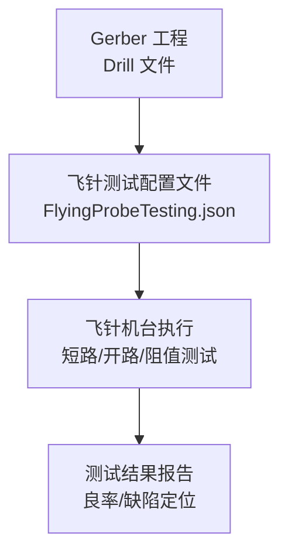
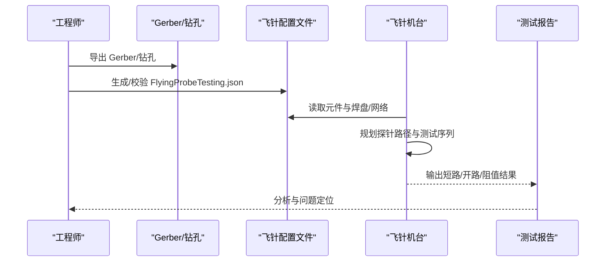

# 测试配置文件

<cite>
**本文引用的文件**
- [FlyingProbeTesting_PCB1_2026-08-09.json](file://flying_probe_unpacked/FlyingProbeTesting_PCB1_2026-08-09.json)（主引用，已补入后优先使用此路径）
- [FlyingProbeTesting.json](file://gerber_unpacked/FlyingProbeTesting.json)（备用副本，与上为同一文件）
- [PCB下单必读.txt](file://gerber_unpacked/PCB下单必读.txt)
</cite>

## 目录
1. [简介](#简介)
2. [项目结构](#项目结构)
3. [核心组件](#核心组件)
4. [架构总览](#架构总览)
5. [详细组件分析](#详细组件分析)
6. [依赖关系分析](#依赖关系分析)
7. [性能与效率考虑](#性能与效率考虑)
8. [故障排查指南](#故障排查指南)
9. [结论](#结论)
10. [附录：配置更新与优化建议](#附录：配置更新与优化建议)

## 简介
本文件面向飞针测试（Flying Probe Test）的配置文件，围绕 FlyingProbeTesting.json 的结构、测试点定义格式、电气连接关系、测试项目设置、容差范围配置进行说明；并给出测试程序执行流程、质量判定标准、测试点优化建议、数据分析与故障定位方法，以及根据设计变更更新配置文件的步骤。

## 项目结构
仓库包含两类关键数据：
- Gerber 工程与钻孔文件（用于生成或验证测试点坐标与网络信息）
- 飞针测试配置文件（JSON），描述元件位置与焊盘/引脚的网络映射，供飞针机台执行短路/开路/阻值等测试

**图表来源**
- [FlyingProbeTesting.json:1-589](file://gerber_unpacked/FlyingProbeTesting.json#L1-L589)
- [FlyingProbeTesting_PCB1_2026-08-09.json:1-589](file://flying_probe_unpacked/FlyingProbeTesting_PCB1_2026-08-09.json#L1-L589)

**章节来源**
- [FlyingProbeTesting.json:1-589](file://gerber_unpacked/FlyingProbeTesting.json#L1-L589)
- [FlyingProbeTesting_PCB1_2026-08-09.json:1-589](file://flying_probe_unpacked/FlyingProbeTesting_PCB1_2026-08-09.json#L1-L589)
- [PCB下单必读.txt:1-4](file://gerber_unpacked/PCB下单必读.txt#L1-L4)

## 核心组件
该 JSON 配置文件由以下核心部分组成：
- 顶层元数据
  - lengthUnit：长度单位（mil）
  - remark：备注（如 fly_line）
- components：元件清单
  - fields：字段定义（编号、名称、层、X/Y、角度）
  - rows：每行一个元件记录
- pins：焊盘/引脚清单
  - fields：字段定义（序号、名称、X/Y、层、类型、网络名、网络类型、焊盘形状/尺寸、孔尺寸/长度、角度）
  - rows：每行一个焊盘/引脚记录

这些字段共同描述了“元件—焊盘—网络”的关系，是飞针测试的基础数据源。

**章节来源**
- [FlyingProbeTesting.json:1-20](file://gerber_unpacked/FlyingProbeTesting.json#L1-L20)
- [FlyingProbeTesting.json:206-210](file://gerber_unpacked/FlyingProbeTesting.json#L206-L210)
- [FlyingProbeTesting_PCB1_2026-08-09.json:1-20](file://flying_probe_unpacked/FlyingProbeTesting_PCB1_2026-08-09.json#L1-L20)
- [FlyingProbeTesting_PCB1_2026-08-09.json:206-210](file://flying_probe_unpacked/FlyingProbeTesting_PCB1_2026-08-09.json#L206-L210)

## 架构总览
从数据到执行的总体流程如下：

**图表来源**
- [FlyingProbeTesting.json:1-589](file://gerber_unpacked/FlyingProbeTesting.json#L1-L589)
- [FlyingProbeTesting_PCB1_2026-08-09.json:1-589](file://flying_probe_unpacked/FlyingProbeTesting_PCB1_2026-08-09.json#L1-L589)

## 详细组件分析

### 顶层元数据
- lengthUnit：统一使用 mil，确保坐标与尺寸一致
- remark：可附加测试策略或版本信息（例如 fly_line）

**章节来源**
- [FlyingProbeTesting.json:1-4](file://gerber_unpacked/FlyingProbeTesting.json#L1-L4)
- [FlyingProbeTesting_PCB1_2026-08-09.json:1-4](file://flying_probe_unpacked/FlyingProbeTesting_PCB1_2026-08-09.json#L1-L4)

### 元件清单 components
- fields：COMPONENT_NO, COMPONENT_NAME, LAYER, X_COORDINATE, Y_COORDINATE, ANGLE
- rows：每个元件一行，提供其在板上的位置与方向，便于机台快速定位与视觉对位

典型用途：
- 辅助定位复杂封装（如 U1、U2、U5、NRF1、SWD、USART 等）
- 为后续在对应封装附近添加测试点提供参考

**章节来源**
- [FlyingProbeTesting.json:4-20](file://gerber_unpacked/FlyingProbeTesting.json#L4-L20)
- [FlyingProbeTesting_PCB1_2026-08-09.json:4-20](file://flying_probe_unpacked/FlyingProbeTesting_PCB1_2026-08-09.json#L4-L20)

### 焊盘/引脚清单 pins
- fields：PIN_NO, PIN_NAME, PIN_X, PIN_Y, LAYER, PIN_TYPE, NET_NAME, NET_TYPE, PAD_SHAPE, PAD_SIZEX, PAD_SIZEY, HOLE_SIZE, HOLE_LEN, PAD_ANGLE
- rows：每个焊盘/引脚一行，明确其坐标、层、类型、所属网络、形状与尺寸等

关键字段说明：
- NET_NAME：网络名，决定短路/开路测试的连通性判断
- NET_TYPE：网络类型（如 GND），可用于电源完整性与地网检测
- PAD_SHAPE/PAD_SIZEX/PAD_SIZEY：焊盘几何，影响探针接触可靠性
- HOLE_SIZE/HOLE_LEN：过孔/通孔尺寸，影响测试可行性

常见网络类别：
- 电源类：VBAT、VBAT_SW、5V、3V3
- 信号类：JOY_LX/LY/RX/RY、NRF_CE/CSN/SCK/MOSI/MISO/IRQ、TX/RX（串口）、SWDIO/SWCLK
- 地网：GND
- 未连接：NC

**章节来源**
- [FlyingProbeTesting.json:206-589](file://gerber_unpacked/FlyingProbeTesting.json#L206-L589)
- [FlyingProbeTesting_PCB1_2026-08-09.json:206-589](file://flying_probe_unpacked/FlyingProbeTesting_PCB1_2026-08-09.json#L206-L589)

### 电气连接关系与测试项
- 短路/开路：基于 NET_NAME 将同一网络的多个焊盘视为应连通；不同网络间不应短路
- 电源完整性：对 VBAT、VBAT_SW、5V、3V3 等网络进行电压/阻抗检查（需结合机台能力）
- 信号连通性：对 JOY、NRF、UART、SWD 等信号网络进行点对点连通性验证
- 特殊网络：NC 表示不连接，应避免误判为开路

示例关系（以网络为单位）：
- GND 网络：大量焊盘应彼此连通
- 3V3/5V/VBAT/VBAT_SW：各自独立电源网络，内部连通但与其他电源隔离
- 信号网络：按命名一一对应，避免跨网络短路

**章节来源**
- [FlyingProbeTesting.json:209-589](file://gerber_unpacked/FlyingProbeTesting.json#L209-L589)
- [FlyingProbeTesting_PCB1_2026-08-09.json:209-589](file://flying_probe_unpacked/FlyingProbeTesting_PCB1_2026-08-09.json#L209-L589)

### 测试点选择与布局建议
- 优先选择易接触、尺寸合适、无遮挡的 SMD/DIP 焊盘
- 电源网络：在每个电源域至少选取 2-3 个分散焊盘，评估压降与噪声
- 信号网络：在关键接口（如 NRF SPI、UART、SWD）各选 1-2 个代表性焊盘
- 地网：多点采样，评估地平面完整性
- 避免：过小焊盘、被器件遮挡、靠近边缘易滑针的位置

**章节来源**
- [FlyingProbeTesting.json:209-589](file://gerber_unpacked/FlyingProbeTesting.json#L209-L589)
- [FlyingProbeTesting_PCB1_2026-08-09.json:209-589](file://flying_probe_unpacked/FlyingProbeTesting_PCB1_2026-08-09.json#L209-L589)

## 依赖关系分析
- 配置文件依赖 Gerber/钻孔数据：坐标与网络必须与真实 PCB 一致
- 机台依赖配置文件：读取元件与焊盘信息，自动规划探针路径
- 测试报告依赖机台执行：短路/开路/阻值结果汇总，用于质量判定

**图表来源**
- [FlyingProbeTesting.json:1-589](file://gerber_unpacked/FlyingProbeTesting.json#L1-L589)
- [FlyingProbeTesting_PCB1_2026-08-09.json:1-589](file://flying_probe_unpacked/FlyingProbeTesting_PCB1_2026-08-09.json#L1-L589)

**章节来源**
- [FlyingProbeTesting.json:1-589](file://gerber_unpacked/FlyingProbeTesting.json#L1-L589)
- [FlyingProbeTesting_PCB1_2026-08-09.json:1-589](file://flying_probe_unpacked/FlyingProbeTesting_PCB1_2026-08-09.json#L1-L589)

## 性能与效率考虑
- 减少冗余焊盘：合并重复网络点，降低测试时间
- 合理分组：按网络批量测试，减少探针移动距离
- 优先级排序：先测电源与地网，再测信号，尽早发现致命缺陷
- 容差与阈值：依据工艺能力设定合理的短路/开路/阻值阈值，避免误报

[本节为通用指导，无需特定文件引用]

## 故障排查指南
常见问题与定位思路：
- 短路报警
  - 检查是否误将不同网络设为同一 NET_NAME
  - 核对相邻网络是否存在物理短路（锡桥、铜皮连片）
- 开路报警
  - 确认焊盘坐标与层是否正确
  - 检查过孔/走线是否断裂
- 阻值异常
  - 检查电阻/电感/二极管等元件是否装反或损坏
  - 确认测量电流/电压是否在安全范围内
- 电源完整性问题
  - 多点测量 3V3/5V 压降，定位高阻路径
  - 检查去耦电容与地回路

**章节来源**
- [FlyingProbeTesting.json:209-589](file://gerber_unpacked/FlyingProbeTesting.json#L209-L589)
- [FlyingProbeTesting_PCB1_2026-08-09.json:209-589](file://flying_probe_unpacked/FlyingProbeTesting_PCB1_2026-08-09.json#L209-L589)

## 结论
该飞针测试配置文件通过 components 与 pins 两个核心部分，完整表达了元件位置与焊盘网络关系，支撑短路/开路/阻值等测试。配合合理的测试点选择与容差设置，可有效保障 PCB 制造质量。当设计变更时，应及时同步更新配置文件，确保测试覆盖最新设计。

[本节为总结性内容，无需特定文件引用]

## 附录：配置更新与优化建议

### 根据设计变更更新配置文件
- 新增/修改元件：更新 components 中的元件信息与坐标
- 新增/修改网络：在 pins 中补充焊盘/引脚及其 NET_NAME、NET_TYPE
- 删除废弃网络：移除不再使用的焊盘条目，避免误测
- 坐标一致性：确保与最新 Gerber/钻孔数据一致

**章节来源**
- [FlyingProbeTesting.json:4-20](file://gerber_unpacked/FlyingProbeTesting.json#L4-L20)
- [FlyingProbeTesting.json:206-589](file://gerber_unpacked/FlyingProbeTesting.json#L206-L589)
- [FlyingProbeTesting_PCB1_2026-08-09.json:4-20](file://flying_probe_unpacked/FlyingProbeTesting_PCB1_2026-08-09.json#L4-L20)
- [FlyingProbeTesting_PCB1_2026-08-09.json:206-589](file://flying_probe_unpacked/FlyingProbeTesting_PCB1_2026-08-09.json#L206-L589)

### 测试点优化建议
- 关键信号测试点选择
  - 优先选择易于接触且尺寸合适的焊盘
  - 对高频/敏感信号增加多点采样，评估噪声与串扰
- 电源完整性测试
  - 在负载端与输入端分别取样，评估压降与纹波
  - 对地网进行多点测量，检查地平面完整性
- 短路/开路检测
  - 对密集引脚区域增加邻近点检测，提高覆盖率
  - 对 NC 网络严格排除，避免误判

**章节来源**
- [FlyingProbeTesting.json:209-589](file://gerber_unpacked/FlyingProbeTesting.json#L209-L589)
- [FlyingProbeTesting_PCB1_2026-08-09.json:209-589](file://flying_probe_unpacked/FlyingProbeTesting_PCB1_2026-08-09.json#L209-L589)

### 测试程序执行流程与质量判定
- 执行流程
  - 加载配置文件，解析元件与焊盘/网络
  - 规划探针路径，按网络分组执行短路/开路/阻值测试
  - 采集结果并生成报告
- 质量判定标准
  - 短路：同网络内任意两点短路为合格；不同网络间短路为不合格
  - 开路：应连通的两点断开为不合格
  - 阻值：在规定阈值内为合格；超出阈值为不合格
  - 电源完整性：电压/压降/纹波在规格范围内为合格

[本节为通用流程与标准说明，无需特定文件引用]

### 测试数据分析与故障定位方法
- 数据维度
  - 按网络统计短路/开路次数
  - 按区域统计缺陷密度，识别高风险区
- 定位方法
  - 结合 Gerber 查看疑似短路/开路区域的走线与焊盘
  - 针对异常网络缩小范围，逐点复测
  - 对比历史批次数据，识别趋势性问题

**章节来源**
- [FlyingProbeTesting.json:209-589](file://gerber_unpacked/FlyingProbeTesting.json#L209-L589)
- [FlyingProbeTesting_PCB1_2026-08-09.json:209-589](file://flying_probe_unpacked/FlyingProbeTesting_PCB1_2026-08-09.json#L209-L589)

## 相关文档
- [测试与质量保证](../测试与质量保证.md)（飞针测试流程与验收标准）
- [制造文件](制造文件.md)（制造文件总述）
- [调试指南](../调试指南.md)（测试不通过时的调试方法）