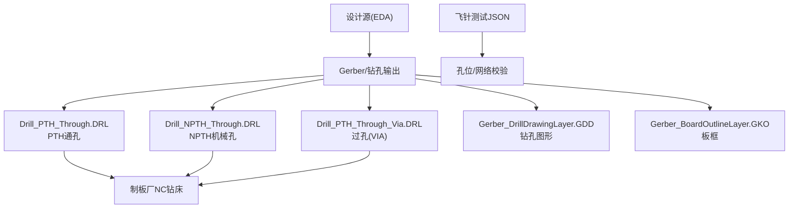
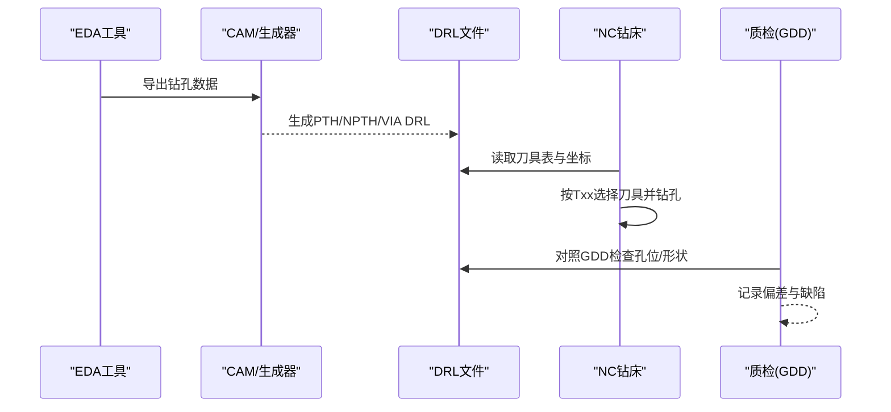
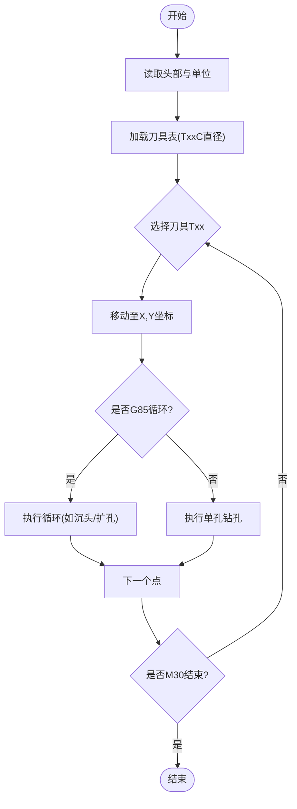
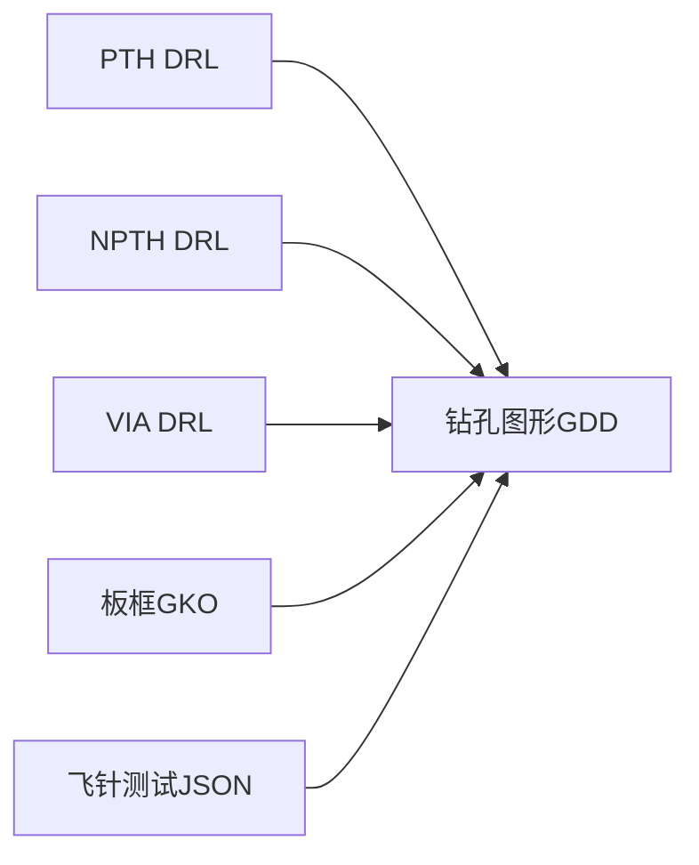

# 钻孔文件规范

<cite>
**本文引用的文件**
- [Drill_PTH_Through.DRL](file://gerber_unpacked/Drill_PTH_Through.DRL)
- [Drill_NPTH_Through.DRL](file://gerber_unpacked/Drill_NPTH_Through.DRL)
- [Drill_PTH_Through_Via.DRL](file://gerber_unpacked/Drill_PTH_Through_Via.DRL)
- [Gerber_DrillDrawingLayer.GDD](file://gerber_unpacked/Gerber_DrillDrawingLayer.GDD)
- [Gerber_BoardOutlineLayer.GKO](file://gerber_unpacked/Gerber_BoardOutlineLayer.GKO)
- [PCB下单必读.txt](file://gerber_unpacked/PCB下单必读.txt)
- [FlyingProbeTesting_PCB1_2026-08-09.json](file://flying_probe_unpacked/FlyingProbeTesting_PCB1_2026-08-09.json)
</cite>

## 目录
1. [简介](#简介)
2. [项目结构](#项目结构)
3. [核心组件](#核心组件)
4. [架构总览](#架构总览)
5. [详细组件分析](#详细组件分析)
6. [依赖关系分析](#依赖关系分析)
7. [性能与工艺考量](#性能与工艺考量)
8. [故障排查指南](#故障排查指南)
9. [结论](#结论)
10. [附录](#附录)

## 简介
本规范基于仓库中的实际钻孔数据，系统化说明Excellon钻孔格式在以下三类孔中的应用：
- PTH通孔钻孔（带金属化孔壁）
- NPTH非通孔钻孔（无金属化孔壁）
- 过孔钻孔（层间连接用通孔）

文档涵盖坐标系统、刀具号与孔径映射、G代码指令、最小孔径限制、孔边距要求、生成参数建议、质量检验标准与常见问题处理方法。所有技术要点均结合本项目中三个DRL文件与辅助Gerber文件进行验证与说明。

## 项目结构
- gerber_unpacked
  - Drill_PTH_Through.DRL：包含多种尺寸的PTH通孔及矩形槽孔，使用多把刀具完成不同孔径加工
  - Drill_NPTH_Through.DRL：仅含NPTH机械固定孔，尺寸较大
  - Drill_PTH_Through_Via.DRL：仅含小尺寸过孔（VIA），用于层间电气连接
  - Gerber_DrillDrawingLayer.GDD：钻孔图形展示，标注各孔位与形状
  - Gerber_BoardOutlineLayer.GKO：板框轮廓，提供坐标系基准
  - PCB下单必读.txt：下单指引链接
- flying_probe_unpacked
  - FlyingProbeTesting_PCB1_2026-08-09.json：飞针测试数据，包含元件与焊盘信息，可用于核对孔位与网络

图表来源
- [Drill_PTH_Through.DRL:1-25](file://gerber_unpacked/Drill_PTH_Through.DRL#L1-L25)
- [Drill_NPTH_Through.DRL:1-13](file://gerber_unpacked/Drill_NPTH_Through.DRL#L1-L13)
- [Drill_PTH_Through_Via.DRL:1-13](file://gerber_unpacked/Drill_PTH_Through_Via.DRL#L1-L13)
- [Gerber_DrillDrawingLayer.GDD:1-40](file://gerber_unpacked/Gerber_DrillDrawingLayer.GDD#L1-L40)
- [Gerber_BoardOutlineLayer.GKO:1-13](file://gerber_unpacked/Gerber_BoardOutlineLayer.GKO#L1-L13)

章节来源
- [Drill_PTH_Through.DRL:1-25](file://gerber_unpacked/Drill_PTH_Through.DRL#L1-L25)
- [Drill_NPTH_Through.DRL:1-13](file://gerber_unpacked/Drill_NPTH_Through.DRL#L1-L13)
- [Drill_PTH_Through_Via.DRL:1-13](file://gerber_unpacked/Drill_PTH_Through_Via.DRL#L1-L13)
- [Gerber_DrillDrawingLayer.GDD:1-40](file://gerber_unpacked/Gerber_DrillDrawingLayer.GDD#L1-L40)
- [Gerber_BoardOutlineLayer.GKO:1-13](file://gerber_unpacked/Gerber_BoardOutlineLayer.GKO#L1-L13)

## 核心组件
- 钻孔类型与用途
  - PTH通孔：用于插件元件安装与接地/电源等关键节点，孔壁需金属化
  - NPTH机械孔：用于定位、固定或散热，孔壁不金属化
  - 过孔（VIA）：用于层间电气连接，通常为较小直径的通孔
- 坐标系统与单位
  - 绝对坐标模式（G90），单位为毫米（mm）
  - 原点与方向以板框Gerber为准，X/Y为平面坐标
- 刀具号与孔径映射
  - 通过TxxC<直径>定义刀具号与对应孔径
  - 不同DRL文件中刀具号可独立定义，但同一文件内必须唯一
- 常用G代码
  - M48：公制单位
  - G05：启用极坐标插补（部分CAM支持）
  - G90：绝对坐标
  - Txx：选择刀具
  - X...Y...：移动到目标位置并钻孔
  - G85：特定CAM的循环指令（如沉头/扩孔等）
  - M30：程序结束

章节来源
- [Drill_PTH_Through.DRL:1-25](file://gerber_unpacked/Drill_PTH_Through.DRL#L1-L25)
- [Drill_NPTH_Through.DRL:1-13](file://gerber_unpacked/Drill_NPTH_Through.DRL#L1-L13)
- [Drill_PTH_Through_Via.DRL:1-13](file://gerber_unpacked/Drill_PTH_Through_Via.DRL#L1-L13)
- [Gerber_DrillDrawingLayer.GDD:1-40](file://gerber_unpacked/Gerber_DrillDrawingLayer.GDD#L1-L40)

## 架构总览
从设计到制造的钻孔数据流如下：
- EDA导出三套钻孔文件：PTH、NPTH、VIA
- 每份DRL文件包含：头部注释、单位设置、刀具表、G代码序列、结束符
- NC钻床读取DRL，按刀具号执行相应孔径钻孔
- 钻孔图形（GDD）用于人工/自动检查孔位与形状
- 板框（GKO）提供装配与坐标参考

图表来源
- [Drill_PTH_Through.DRL:1-25](file://gerber_unpacked/Drill_PTH_Through.DRL#L1-L25)
- [Drill_NPTH_Through.DRL:1-13](file://gerber_unpacked/Drill_NPTH_Through.DRL#L1-L13)
- [Drill_PTH_Through_Via.DRL:1-13](file://gerber_unpacked/Drill_PTH_Through_Via.DRL#L1-L13)
- [Gerber_DrillDrawingLayer.GDD:1-40](file://gerber_unpacked/Gerber_DrillDrawingLayer.GDD#L1-L40)

## 详细组件分析

### PTH通孔钻孔（Drill_PTH_Through.DRL）
- 头部信息
  - 类型：PLATED（带金属化孔壁）
  - 单位：METRIC,LZ,0000.00000
  - 刀具表：T01至T09，分别对应不同孔径（例如T01=0.305mm、T02=0.4064mm等）
- 坐标与指令
  - G90绝对坐标；X/Y为毫米单位
  - 使用Txx切换刀具后直接给出坐标点执行钻孔
  - 存在G85指令段，表示特定循环（如沉头/扩孔）
- 典型用途
  - 插件元件引脚孔、大电流/接地孔、矩形槽孔（由连续坐标构成）
- 注意事项
  - 刀具号与孔径必须严格一致，避免误用导致孔径超差
  - 矩形槽孔需确保相邻点间距合理，避免断刀或过切

图表来源
- [Drill_PTH_Through.DRL:1-25](file://gerber_unpacked/Drill_PTH_Through.DRL#L1-L25)
- [Drill_PTH_Through.DRL:80-170](file://gerber_unpacked/Drill_PTH_Through.DRL#L80-L170)

章节来源
- [Drill_PTH_Through.DRL:1-25](file://gerber_unpacked/Drill_PTH_Through.DRL#L1-L25)
- [Drill_PTH_Through.DRL:80-170](file://gerber_unpacked/Drill_PTH_Through.DRL#L80-L170)

### NPTH机械孔（Drill_NPTH_Through.DRL）
- 头部信息
  - 类型：NON_PLATED（无金属化孔壁）
  - 单位：METRIC,LZ,0000.00000
  - 刀具表：T01=1.8mm、T02=2.5mm、T03=3.2mm
- 坐标与指令
  - 绝对坐标，直接列出各孔位
- 典型用途
  - 机械固定孔、定位孔、散热孔
- 注意事项
  - 孔边距需满足结构强度要求，避免应力集中
  - 大孔加工时注意刀具路径与进给速度

章节来源
- [Drill_NPTH_Through.DRL:1-13](file://gerber_unpacked/Drill_NPTH_Through.DRL#L1-L13)
- [Drill_NPTH_Through.DRL:16-31](file://gerber_unpacked/Drill_NPTH_Through.DRL#L16-L31)

### 过孔钻孔（Drill_PTH_Through_Via.DRL）
- 头部信息
  - 类型：PLATED（带金属化孔壁）
  - 单位：METRIC,LZ,0000.00000
  - 刀具表：T01=0.305mm、T02=0.4064mm
- 坐标与指令
  - 绝对坐标，密集的小孔阵列，用于层间连接
- 典型用途
  - 信号/电源层间互连，高密度布线时的过孔群
- 注意事项
  - 小孔加工易出现偏斜与毛刺，需控制钻头磨损与冷却
  - 过孔间距与孔径比需满足阻抗与可靠性要求

章节来源
- [Drill_PTH_Through_Via.DRL:1-13](file://gerber_unpacked/Drill_PTH_Through_Via.DRL#L1-L13)
- [Drill_PTH_Through_Via.DRL:14-66](file://gerber_unpacked/Drill_PTH_Through_Via.DRL#L14-L66)

### 钻孔图形与板框（GDD与GKO）
- 钻孔图形（GDD）
  - 显示所有孔位与形状，便于人工/自动检测
  - 包含文本与符号，标注孔的类型与尺寸
- 板框（GKO）
  - 定义PCB外形与圆角，作为坐标与装配基准
  - 单位与缩放信息与DRL保持一致

章节来源
- [Gerber_DrillDrawingLayer.GDD:1-40](file://gerber_unpacked/Gerber_DrillDrawingLayer.GDD#L1-L40)
- [Gerber_DrillDrawingLayer.GDD:43-202](file://gerber_unpacked/Gerber_DrillDrawingLayer.GDD#L43-L202)
- [Gerber_BoardOutlineLayer.GKO:1-13](file://gerber_unpacked/Gerber_BoardOutlineLayer.GKO#L1-L13)

## 依赖关系分析
- 文件间依赖
  - DRL文件依赖GDD进行可视化校验
  - 所有文件共享同一坐标系与单位（mm，绝对坐标）
  - 板框GKO为装配与坐标参考
- 外部依赖
  - 制板厂NC设备需支持Excellon格式与所用G代码
  - 飞针测试JSON可用于孔位与网络一致性校验

图表来源
- [Gerber_DrillDrawingLayer.GDD:1-40](file://gerber_unpacked/Gerber_DrillDrawingLayer.GDD#L1-L40)
- [Gerber_BoardOutlineLayer.GKO:1-13](file://gerber_unpacked/Gerber_BoardOutlineLayer.GKO#L1-L13)
- [FlyingProbeTesting_PCB1_2026-08-09.json:1-20](file://flying_probe_unpacked/FlyingProbeTesting_PCB1_2026-08-09.json#L1-L20)

章节来源
- [Gerber_DrillDrawingLayer.GDD:1-40](file://gerber_unpacked/Gerber_DrillDrawingLayer.GDD#L1-L40)
- [Gerber_BoardOutlineLayer.GKO:1-13](file://gerber_unpacked/Gerber_BoardOutlineLayer.GKO#L1-L13)
- [FlyingProbeTesting_PCB1_2026-08-09.json:1-20](file://flying_probe_unpacked/FlyingProbeTesting_PCB1_2026-08-09.json#L1-L20)

## 性能与工艺考量
- 最小孔径限制
  - 本项目最小PTH孔径为0.305mm（T01），过孔亦使用该尺寸
  - 小于0.3mm的孔需评估钻头强度与良率，通常不建议常规生产
- 孔边距要求
  - NPTH机械孔需保证足够的材料强度，避免边缘开裂
  - PTH与VIA需考虑铜箔蚀刻与电镀均匀性，避免短路或断线
- 刀具管理与效率
  - 合并同孔径孔位，减少换刀次数
  - 优化钻孔顺序，减少空行程
- 钻孔深度与退刀
  - 根据板厚设定合适的钻深与退刀量，避免断刀或孔底残留
- 冷却与排屑
  - 小孔密集区域需加强冷却与排屑，防止堵塞与过热

[本节为通用工艺指导，无需具体文件引用]

## 故障排查指南
- 常见错误与处理
  - 刀具号与孔径不一致：检查TxxC定义，确保与实际钻头匹配
  - 坐标偏移：核对G90与单位设置，确认原点与板框一致
  - 漏孔/重复孔：对比GDD与DRL，检查坐标列表完整性
  - 孔形异常：检查G85循环参数与刀具路径
  - 小孔毛刺/偏斜：更换新钻头、降低进给速度、增加冷却
- 质量检验方法
  - 视觉检查：利用GDD叠加DRL，核对孔位与形状
  - 电测：飞针测试或ICT验证网络连通性
  - 切片/金相：抽检PTH孔壁镀层厚度与空洞情况
- 参考资源
  - 下单指引：参见“PCB下单必读.txt”中的链接

章节来源
- [PCB下单必读.txt:1-4](file://gerber_unpacked/PCB下单必读.txt#L1-L4)
- [Gerber_DrillDrawingLayer.GDD:43-202](file://gerber_unpacked/Gerber_DrillDrawingLayer.GDD#L43-L202)
- [FlyingProbeTesting_PCB1_2026-08-09.json:206-220](file://flying_probe_unpacked/FlyingProbeTesting_PCB1_2026-08-09.json#L206-L220)

## 结论
本项目提供了完整的Excellon钻孔数据样例，覆盖PTH、NPTH与VIA三类孔型。通过统一的坐标系统与刀具表管理，结合GDD可视化与板框基准，可实现高精度、高可靠性的钻孔制造。建议在设计与CAM阶段严格控制最小孔径、孔边距与刀具路径，并在制造阶段加强过程监控与质量检验，以确保最终产品符合预期。

[本节为总结性内容，无需具体文件引用]

## 附录
- 钻孔文件生成参数建议
  - 单位：公制（mm），绝对坐标（G90）
  - 刀具表：按孔径从小到大排序，避免频繁换刀
  - 指令集：基础G代码（G90、Txx、X/Y）、可选循环（G85）
  - 结束符：M30
- 质量检验标准
  - 孔径公差：依据IPC标准与工厂能力设定
  - 孔位精度：±0.05mm以内（视设备能力调整）
  - 孔壁质量：无分层、无裂纹、镀层连续
- 常见问题快速定位
  - 坐标问题：比对GDD与DRL
  - 刀具问题：核对TxxC定义
  - 工艺问题：调整进给、转速、冷却

[本节为补充信息，无需具体文件引用]

## 相关文档
- [Gerber文件规范](Gerber文件规范.md)（与钻孔配套的铜层/阻焊数据）
- [制造文件](制造文件.md)（制造文件总述）
- [制造指导](制造指导.md)（钻孔工艺指导）