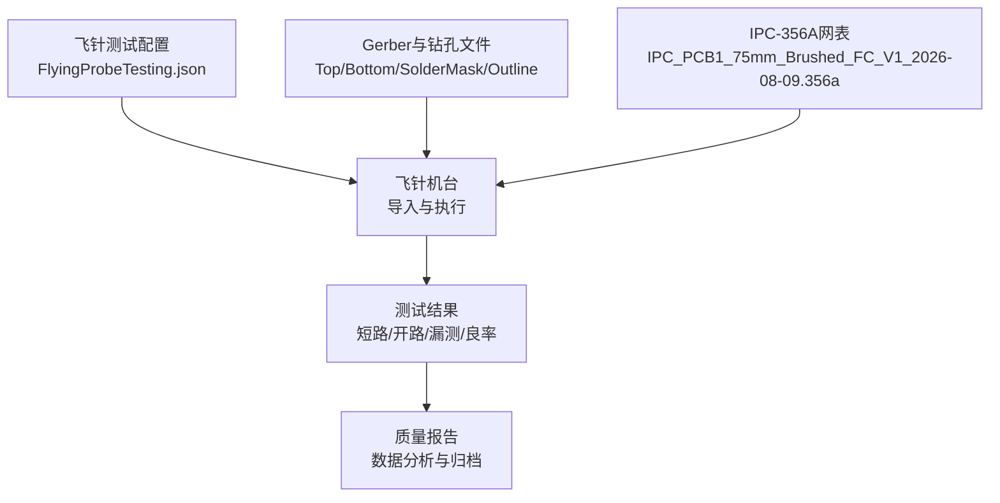
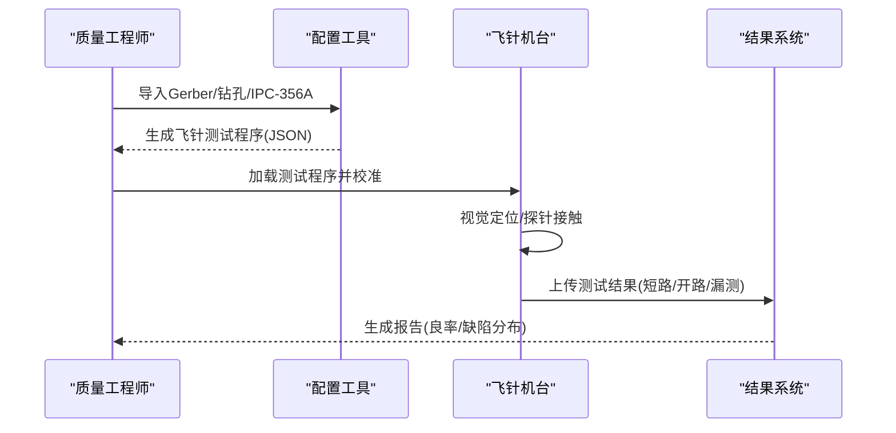
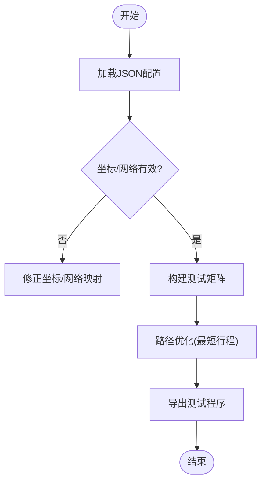

# 测试与质量保证

<cite>
**本文档引用的文件**
- [FlyingProbeTesting_PCB1_2026-08-09.json](file://flying_probe_unpacked/FlyingProbeTesting_PCB1_2026-08-09.json)（主引用，已补入后优先使用此路径）
- [FlyingProbeTesting.json](file://gerber_unpacked/FlyingProbeTesting.json)（备用副本，与上为同一文件）
- [IPC_PCB1_75mm_Brushed_FC_V1_2026-08-09.356a](file://IPC_PCB1_75mm_Brushed_FC_V1_2026-08-09.356a)
- [PCB下单必读.txt](file://gerber_unpacked/PCB下单必读.txt)
</cite>

## 目录
1. [简介](#简介)
2. [项目结构](#项目结构)
3. [核心组件](#核心组件)
4. [架构总览](#架构总览)
5. [详细组件分析](#详细组件分析)
6. [依赖关系分析](#依赖关系分析)
7. [性能考虑](#性能考虑)
8. [故障诊断指南](#故障诊断指南)
9. [结论](#结论)
10. [附录](#附录)

## 简介
本文件面向飞针测试（Flying Probe Test）的测试与质量保证，覆盖测试配置、测试点定义、上电测试、通信测试、功能验证流程、设备要求与设置、数据分析与报告生成、质量控制流程与验收标准。文档基于仓库中的飞针测试JSON配置文件、Gerber/DRC导出文件以及IPC-356A网表文件进行说明，确保测试可追溯、可重复、可审计。

## 项目结构
仓库包含三类关键资料：
- 飞针测试配置（JSON）：定义测试点坐标、网络名、焊盘形状尺寸等，供飞针机台导入执行。
- Gerber与钻孔文件：用于定位器件与焊盘几何信息，辅助飞针机台视觉定位与路径规划。
- IPC-356A网表：描述各焊盘的电气网络连接，作为短路/开路测试的依据。

**图表来源**
- [FlyingProbeTesting.json:1-589](file://gerber_unpacked/FlyingProbeTesting.json#L1-L589)
- [IPC_PCB1_75mm_Brushed_FC_V1_2026-08-09.356a:1-315](file://IPC_PCB1_75mm_Brushed_FC_V1_2026-08-09.356a#L1-L315)

**章节来源**
- [FlyingProbeTesting.json:1-589](file://gerber_unpacked/FlyingProbeTesting.json#L1-L589)
- [IPC_PCB1_75mm_Brushed_FC_V1_2026-08-09.356a:1-315](file://IPC_PCB1_75mm_Brushed_FC_V1_2026-08-09.356a#L1-L315)

## 核心组件
- 飞针测试配置（JSON）
  - 长度单位：mil
  - 备注：fly_line（表示使用飞线测试策略）
  - components：器件位置与参考位号（含层、坐标、角度），用于视觉定位与路径规划
  - pins：每个焊盘的引脚编号、名称、坐标、层、类型（SMD/DIP）、网络名、焊盘形状与尺寸、孔径等，是短路/开路测试的核心依据
- IPC-356A网表
  - 以行记录形式描述各焊盘的网络连接关系，包括过孔、顶层/底层走线、板边轮廓等
  - 提供短路/开路判定基准，与飞针测试配置相互校验
- Gerber与钻孔文件
  - 提供板框、阻焊、丝印、铜层及钻孔信息，辅助飞针机台进行图像识别与探针接触点选择

**章节来源**
- [FlyingProbeTesting.json:1-589](file://gerber_unpacked/FlyingProbeTesting.json#L1-L589)
- [IPC_PCB1_75mm_Brushed_FC_V1_2026-08-09.356a:1-315](file://IPC_PCB1_75mm_Brushed_FC_V1_2026-08-09.356a#L1-L315)

## 架构总览
飞针测试系统由“配置与数据准备”“机台执行”“结果采集与分析”三部分构成。配置阶段将Gerber、钻孔与IPC-356A网表转换为飞针机台可读的测试程序；执行阶段通过探针逐点接触并测量导通/阻抗；分析阶段输出短路、开路、漏测统计与良率报告。

**图表来源**
- [FlyingProbeTesting.json:1-589](file://gerber_unpacked/FlyingProbeTesting.json#L1-L589)
- [IPC_PCB1_75mm_Brushed_FC_V1_2026-08-09.356a:1-315](file://IPC_PCB1_75mm_Brushed_FC_V1_2026-08-09.356a#L1-L315)

## 详细组件分析

### 飞针测试配置（JSON）解析
- 字段说明
  - lengthUnit：长度单位为mil，影响坐标与尺寸换算
  - remark：fly_line，指示采用飞线测试策略
  - components：器件参考位号、层、坐标、角度，用于视觉定位与路径优化
  - pins：每个焊盘的详细信息，包括PIN_NO、PIN_NAME、坐标、层、类型（SMD/DIP）、NET_NAME、NET_TYPE、PAD_SHAPE、PAD_SIZEX/Y、HOLE_SIZE/HOLE_LEN、PAD_ANGLE
- 数据结构复杂度
  - 组件与焊盘数量较多，时间复杂度主要受测试点数N影响，典型为O(N)扫描与匹配
  - 空间复杂度与焊盘数量线性相关，需保证内存充足以避免卡顿
- 依赖关系
  - 与IPC-356A网表一致的网络名用于短路/开路判定
  - 与Gerber/钻孔文件一致的坐标用于视觉定位与探针路径规划

**图表来源**
- [FlyingProbeTesting.json:1-589](file://gerber_unpacked/FlyingProbeTesting.json#L1-L589)

**章节来源**
- [FlyingProbeTesting.json:1-589](file://gerber_unpacked/FlyingProbeTesting.json#L1-L589)

### IPC-356A网表与测试基准
- 网表内容包含各焊盘的网络名、层、坐标与走线信息，用于：
  - 短路检测：同一网络内不应出现非预期连接
  - 开路检测：期望连接的两端必须导通
  - 漏测检测：确认所有焊盘均被探针访问
- 与JSON配置的交叉校验
  - 网络名一致性：确保JSON中NET_NAME与IPC-356A网表一致
  - 坐标一致性：确保JSON坐标与Gerber/钻孔坐标一致，避免视觉定位失败

**章节来源**
- [IPC_PCB1_75mm_Brushed_FC_V1_2026-08-09.356a:1-315](file://IPC_PCB1_75mm_Brushed_FC_V1_2026-08-09.356a#L1-L315)

### 测试点定义与质量标准
- 测试点定义
  - 电源网络：VBAT、VBAT_SW、5V、3V3、GND等
  - 信号网络：JOY_LX/LY、JOY_RX、JOY_RY、NRF_SCK/MOSI/MISO/CE/CSN/IRQ、TX/RX（串口）、SWDIO/SWCLK等
  - 连接器与接口：J1、SWD、USART等
- 质量标准
  - 短路：同网络内非预期连接数为0
  - 开路：期望连接两端导通率为100%
  - 漏测：所有焊盘均被访问，漏测率为0
  - 良率：批次良率≥目标值（如≥98%）

**章节来源**
- [FlyingProbeTesting.json:1-589](file://gerber_unpacked/FlyingProbeTesting.json#L1-L589)
- [IPC_PCB1_75mm_Brushed_FC_V1_2026-08-09.356a:1-315](file://IPC_PCB1_75mm_Brushed_FC_V1_2026-08-09.356a#L1-L315)

### 上电测试流程
- 目的：验证电源完整性与基本供电能力
- 步骤
  1. 准备可调直流电源与万用表
  2. 将可调电源接至电池输入接口J1（VBAT/GND），设定电池电压（单节锂电约3.0~4.2V）与限流保护
  3. 闭合电源开关SW1，确认VBAT_SW电压与输入一致
  4. 缓慢上电，依次监测U2（PW5100-50升压）输出5V、U1（LDO）输出3V3是否在容差范围内
  5. 检查是否有异常发热或短路迹象
  6. 记录数据并归档
- 注意事项
  - 先低电流上电，逐步增加至额定值
  - 关注大电容充电瞬间的浪涌电流
  - 若发现短路，立即断电并排查

**章节来源**
- [IPC_PCB1_75mm_Brushed_FC_V1_2026-08-09.356a:1-315](file://IPC_PCB1_75mm_Brushed_FC_V1_2026-08-09.356a#L1-L315)

### 通信测试流程
- 目的：验证关键通信链路（如SPI/NRF、UART、SWD）连通性与协议基础
- 步骤
  1. 连接上位机与目标板（USB转串口、SWD调试器）
  2. 配置波特率、数据位、停止位、校验位（UART）
  3. 发送/接收测试帧，验证响应正确性
  4. 对SPI链路，读取NRF寄存器，验证读写时序
  5. 记录日志并归档
- 注意事项
  - 确保电平匹配与接地良好
  - 避免在通信过程中改变电源状态
  - 使用示波器或逻辑分析仪辅助定位时序问题

**章节来源**
- [IPC_PCB1_75mm_Brushed_FC_V1_2026-08-09.356a:1-315](file://IPC_PCB1_75mm_Brushed_FC_V1_2026-08-09.356a#L1-L315)

### 功能验证流程
- 目的：验证摇杆、无线模块等外设功能
- 步骤
  1. 输入激励（摇杆移动）
  2. 读取对应信号（JOY_LX/LY、JOY_RX、JOY_RY）
  3. 验证输出是否符合预期（阈值、去抖、范围）
  4. 对无线模块，进行配对与数据传输测试
  5. 记录数据并归档
- 注意事项
  - 确保固件版本与测试脚本匹配
  - 避免环境干扰（电磁噪声、机械振动）
  - 多次重复测试以提高置信度

**章节来源**
- [IPC_PCB1_75mm_Brushed_FC_V1_2026-08-09.356a:1-315](file://IPC_PCB1_75mm_Brushed_FC_V1_2026-08-09.356a#L1-L315)

## 依赖关系分析
- JSON配置与IPC-356A网表的依赖
  - 网络名一致性决定短路/开路判定的准确性
  - 坐标一致性决定视觉定位与探针接触的可靠性
- Gerber/钻孔文件的依赖
  - 提供物理边界与焊盘几何，影响探针路径规划与接触成功率
- 外部设备依赖
  - 飞针机台、电源、通信工具、数据采集与分析软件

**图表来源**
- [FlyingProbeTesting.json:1-589](file://gerber_unpacked/FlyingProbeTesting.json#L1-L589)
- [IPC_PCB1_75mm_Brushed_FC_V1_2026-08-09.356a:1-315](file://IPC_PCB1_75mm_Brushed_FC_V1_2026-08-09.356a#L1-L315)

**章节来源**
- [FlyingProbeTesting.json:1-589](file://gerber_unpacked/FlyingProbeTesting.json#L1-L589)
- [IPC_PCB1_75mm_Brushed_FC_V1_2026-08-09.356a:1-315](file://IPC_PCB1_75mm_Brushed_FC_V1_2026-08-09.356a#L1-L315)

## 性能考虑
- 测试效率
  - 路径优化：减少探针移动距离，提升测试速度
  - 并行测试：多探针同时接触不同网络，缩短整体时间
- 精度与稳定性
  - 坐标精度：确保JSON坐标与Gerber/钻孔一致，避免视觉定位误差
  - 探针压力：合理设置接触压力，避免损坏焊盘或接触不良
- 数据处理
  - 批量处理：对大批量PCB进行自动化测试与报告生成
  - 异常过滤：剔除误报与噪声数据，提高良率统计准确性

[本节为通用指导，不直接分析具体文件]

## 故障诊断指南
- 常见问题与解决方案
  - 视觉定位失败：检查Gerber/钻孔文件是否完整，确认JSON坐标与板框一致
  - 探针接触不良：清洁焊盘，调整探针压力与Z轴高度
  - 短路误报：核对IPC-356A网表与JSON网络名，确认无设计错误
  - 开路误报：检查走线与过孔，确认无断线或虚焊
  - 漏测：确认所有焊盘均在测试矩阵中，补充缺失点
- 诊断步骤
  1. 查看测试结果明细，定位失败点
  2. 对比IPC-356A网表与JSON配置，确认网络与坐标
  3. 使用显微镜或AOI检查焊盘与走线
  4. 复测并记录复测结果
  5. 归档问题与解决方案，形成知识库

**章节来源**
- [FlyingProbeTesting.json:1-589](file://gerber_unpacked/FlyingProbeTesting.json#L1-L589)
- [IPC_PCB1_75mm_Brushed_FC_V1_2026-08-09.356a:1-315](file://IPC_PCB1_75mm_Brushed_FC_V1_2026-08-09.356a#L1-L315)

## 结论
本质量保证文档基于仓库中的飞针测试配置、Gerber/钻孔文件与IPC-356A网表，提供了完整的测试流程、质量标准与故障诊断方法。通过严格的配置校验、标准化的测试步骤与数据归档，确保PCB制造质量可控、可追溯、可改进。建议在生产环境中持续优化路径算法与测试策略，提升良率与效率。

[本节为总结，不直接分析具体文件]

## 附录
- 设备要求与设置
  - 飞针机台：支持JSON配置导入，具备视觉定位与探针控制功能
  - 电源：可调直流电源，带限流保护
  - 通信工具：USB转串口、SWD调试器
  - 软件：数据采集与分析软件，支持报告生成与归档
- 测试数据与分析
  - 数据格式：CSV/Excel，包含测试点、结果、时间戳
  - 分析方法：统计短路/开路/漏测比例，计算良率，绘制缺陷分布图
  - 报告模板：包含批次信息、测试条件、结果摘要、问题清单、改进建议
- 质量控制流程
  - 首件检验：每批次首件全检，确认测试程序有效性
  - 过程监控：实时监控良率与异常趋势，及时调整
  - 最终验收：按验收标准（短路=0、开路=0、漏测=0、良率≥目标）放行
- 验收标准
  - 短路：0
  - 开路：0
  - 漏测：0
  - 良率：≥目标值（如≥98%）
  - 报告：完整归档，可追溯

**章节来源**
- [PCB下单必读.txt:1-4](file://gerber_unpacked/PCB下单必读.txt#L1-L4)

## 相关文档
- [调试指南](调试指南.md)（个人调试排障流程）
- [测试配置文件](制造文件/测试配置文件.md)（飞针测试配置详解）
- [装配指南](装配指南.md)（装配质量检验）
- [资料总览](资料总览.md)（入口索引）