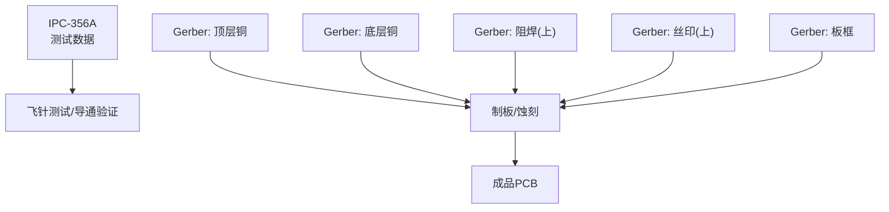
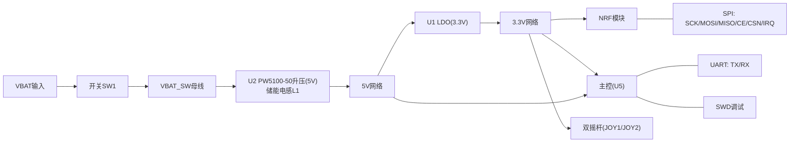
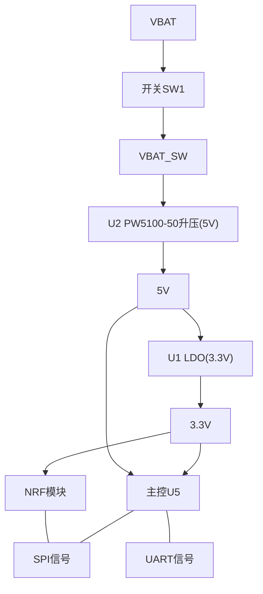

# PCB布局设计

<cite>
**本文引用的文件**
- [IPC_PCB1_75mm_Brushed_FC_V1_2026-08-09.356a](file://IPC_PCB1_75mm_Brushed_FC_V1_2026-08-09.356a)
- [Gerber_BoardOutlineLayer.GKO](file://gerber_unpacked/Gerber_BoardOutlineLayer.GKO)
- [Gerber_TopLayer.GTL](file://gerber_unpacked/Gerber_TopLayer.GTL)
- [Gerber_BottomLayer.GBL](file://gerber_unpacked/Gerber_BottomLayer.GBL)
- [Gerber_TopSolderMaskLayer.GTS](file://gerber_unpacked/Gerber_TopSolderMaskLayer.GTS)
- [Gerber_TopSilkscreenLayer.GTO](file://gerber_unpacked/Gerber_TopSilkscreenLayer.GTO)
- [FlyingProbeTesting_PCB1_2026-08-09.json](file://flying_probe_unpacked/FlyingProbeTesting_PCB1_2026-08-09.json)
- [PCB下单必读.txt](file://gerber_unpacked/PCB下单必读.txt)
</cite>

## 目录
1. [简介](#简介)
2. [项目结构](#项目结构)
3. [核心组件](#核心组件)
4. [架构总览](#架构总览)
5. [详细组件分析](#详细组件分析)
6. [依赖关系分析](#依赖关系分析)
7. [性能与可靠性考虑](#性能与可靠性考虑)
8. [故障排查指南](#故障排查指南)
9. [结论](#结论)
10. [附录](#附录)

## 简介
本文件为“75mm×50mm”双面板PCB的完整布局设计说明，覆盖板边轮廓、层叠结构、元件布局原则、走线规则、信号完整性（SI）、电源完整性（PI）、热管理策略、阻抗控制与差分对布线建议、DRC检查规则、生产与制造要求，以及装配指导。文档基于工程Gerber与IPC-356A测试数据进行分析总结，确保与实际可制造性一致。

## 项目结构
本项目包含：
- IPC-356A测试数据：用于飞针测试网表与焊盘信息
- Gerber输出：顶层/底层铜、阻焊、丝印、板框等
- 下单说明：外部链接指引

图表来源
- [Gerber_TopLayer.GTL:1-20](file://gerber_unpacked/Gerber_TopLayer.GTL#L1-L20)
- [Gerber_BottomLayer.GBL:1-20](file://gerber_unpacked/Gerber_BottomLayer.GBL#L1-L20)
- [Gerber_TopSolderMaskLayer.GTS:1-20](file://gerber_unpacked/Gerber_TopSolderMaskLayer.GTS#L1-L20)
- [Gerber_TopSilkscreenLayer.GTO:1-20](file://gerber_unpacked/Gerber_TopSilkscreenLayer.GTO#L1-L20)
- [Gerber_BoardOutlineLayer.GKO:1-33](file://gerber_unpacked/Gerber_BoardOutlineLayer.GKO#L1-L33)

章节来源
- [IPC_PCB1_75mm_Brushed_FC_V1_2026-08-09.356a:1-20](file://IPC_PCB1_75mm_Brushed_FC_V1_2026-08-09.356a#L1-L20)
- [Gerber_BoardOutlineLayer.GKO:1-33](file://gerber_unpacked/Gerber_BoardOutlineLayer.GKO#L1-L33)

## 核心组件
- 尺寸与外形：矩形板，四角圆角；依据Gerber板框定义
- 层数：双层（Top/Bottom）
- 关键功能区域：
  - 电源输入与开关：VBAT、SW1、滤波电容
  - 电压转换：U2（PW5100-50同步升压，VBAT_SW→5V，储能电感L1）、U1（LDO，5V→3.3V）
  - 无线模块接口：NRF系列信号（CE/CSN/SCK/MOSI/MISO/IRQ）
  - 双摇杆：JOY1/JOY2（含滤波去耦电容）
  - 调试与通信：SWD、USART（TX/RX）
  - 大量过孔用于跨层连接与电源/地分布

章节来源
- [IPC_PCB1_75mm_Brushed_FC_V1_2026-08-09.356a:22-105](file://IPC_PCB1_75mm_Brushed_FC_V1_2026-08-09.356a#L22-L105)
- [Gerber_TopLayer.GTL:1-20](file://gerber_unpacked/Gerber_TopLayer.GTL#L1-L20)
- [Gerber_BottomLayer.GBL:1-20](file://gerber_unpacked/Gerber_BottomLayer.GBL#L1-L20)

## 架构总览
该PCB采用典型的双层布局：顶层放置主要器件与走线，底层以大面积铺铜为主，配合密集过孔形成低阻抗回流路径。电源从VBAT经开关SW1进入VBAT_SW，由U2（PW5100-50升压）生成5V，再经U1（LDO）降压生成3.3V，为各模块供电。NRF相关SPI信号在顶层短距布设，必要时通过过孔跨层。摇杆模拟信号就近滤波去耦并返回GND平面。

图表来源
- [IPC_PCB1_75mm_Brushed_FC_V1_2026-08-09.356a:90-105](file://IPC_PCB1_75mm_Brushed_FC_V1_2026-08-09.356a#L90-L105)
- [IPC_PCB1_75mm_Brushed_FC_V1_2026-08-09.356a:147-196](file://IPC_PCB1_75mm_Brushed_FC_V1_2026-08-09.356a#L147-L196)

## 详细组件分析

### 板边轮廓与机械约束
- 外形：矩形，四角带圆角；单位毫米，绝对坐标
- 尺寸：根据标题与板框数据，板尺寸为75mm×50mm
- 安装孔：当前Gerber板框未显示标准安装孔图形，如需安装固定，建议在四角或长边增加定位孔（直径≥2.0mm），并在Gerber中补充钻孔图
- 安全间距：板边到最近铜皮/走线建议≥0.5mm，避免铣刀偏差导致短路

章节来源
- [Gerber_BoardOutlineLayer.GKO:1-33](file://gerber_unpacked/Gerber_BoardOutlineLayer.GKO#L1-L33)
- [IPC_PCB1_75mm_Brushed_FC_V1_2026-08-09.356a:311-314](file://IPC_PCB1_75mm_Brushed_FC_V1_2026-08-09.356a#L311-L314)

### 层叠结构与功能分配
- 层数：Top/Bottom（双层）
- Top层：主要器件、信号走线、少量电源分支
- Bottom层：大面积GND/电源铺铜，降低回路面积，提供良好回流
- 过孔：大量过孔用于跨层连接，优先使用小孔径（如0.3mm）+大焊盘以提升可靠性

章节来源
- [IPC_PCB1_75mm_Brushed_FC_V1_2026-08-09.356a:6-9](file://IPC_PCB1_75mm_Brushed_FC_V1_2026-08-09.356a#L6-L9)
- [Gerber_TopLayer.GTL:1-20](file://gerber_unpacked/Gerber_TopLayer.GTL#L1-L20)
- [Gerber_BottomLayer.GBL:1-20](file://gerber_unpacked/Gerber_BottomLayer.GBL#L1-L20)

### 元件布局原则
- 电源路径最短：VBAT→SW1→VBAT_SW→U2（升压）→5V→U1（LDO）→3.3V，尽量缩短高电流路径，减少环路面积
- 高频/敏感信号靠近IC：NRF相关引脚靠近主控，走线短且直
- 去耦电容贴近IC电源引脚：3.3V与5V旁路电容就近放置，减小寄生电感
- 双摇杆分区：左右摇杆分别集中布置，各自就近滤波去耦，避免串扰
- 连接器与接口：SWD/USART置于板边便于插拔与调试

章节来源
- [IPC_PCB1_75mm_Brushed_FC_V1_2026-08-09.356a:90-105](file://IPC_PCB1_75mm_Brushed_FC_V1_2026-08-09.356a#L90-L105)
- [IPC_PCB1_75mm_Brushed_FC_V1_2026-08-09.356a:147-196](file://IPC_PCB1_75mm_Brushed_FC_V1_2026-08-09.356a#L147-L196)

### 走线规则
- 信号线：最小宽度建议0.2mm，关键信号加粗至0.3mm；保持等长（SPI短距内差异<0.5mm）
- 电源走线：按电流承载选择线宽，3.3V/5V主干建议≥0.5mm
- 过孔：信号跨层使用0.3mm孔径，电源跨层可用0.6mm孔径以降低阻抗
- 间距：信号线与GND/电源间距≥0.2mm；高压或大电流区域适当放宽
- 避免直角与锐角：采用135°拐角或圆弧过渡，减少反射与尖峰

章节来源
- [Gerber_TopLayer.GTL:1-20](file://gerber_unpacked/Gerber_TopLayer.GTL#L1-L20)
- [Gerber_BottomLayer.GBL:1-20](file://gerber_unpacked/Gerber_BottomLayer.GBL#L1-L20)

### 信号完整性（SI）
- SPI总线（NRF_SCK/MOSI/MISO/CE/CSN/IRQ）：
  - 尽量在同一层连续布线，减少过孔数量
  - 相邻信号间保留至少0.2mm间距，避免耦合
  - 若需跨层，成对过孔靠近放置，保持参考平面连续
- 时钟与高速信号：
  - 避免跨越分割平面，必要时在分割处桥接
  - 控制走线长度匹配，减少时序偏差
- 模拟/数字隔离：
  - 摇杆模拟信号为低速信号，注意与射频信号区物理隔离

章节来源
- [IPC_PCB1_75mm_Brushed_FC_V1_2026-08-09.356a:22-29](file://IPC_PCB1_75mm_Brushed_FC_V1_2026-08-09.356a#L22-L29)
- [IPC_PCB1_75mm_Brushed_FC_V1_2026-08-09.356a:147-196](file://IPC_PCB1_75mm_Brushed_FC_V1_2026-08-09.356a#L147-L196)

### 电源完整性（PI）
- 去耦策略：每个IC电源引脚就近放置0.1μF电容，必要时并联大容量电容（如10μF）
- 电源平面：Bottom层大面积GND铺铜，3.3V/5V局部铺铜，保证低阻抗回流
- 电源入口：VBAT经开关后配置滤波电容（C1/C10），U2（升压）与U1（LDO）输入输出侧均配置足够电容
- 热点分流：大电流路径（如VBAT_SW→U2、5V→U1）加宽走线并多点接地

章节来源
- [IPC_PCB1_75mm_Brushed_FC_V1_2026-08-09.356a:90-105](file://IPC_PCB1_75mm_Brushed_FC_V1_2026-08-09.356a#L90-L105)
- [Gerber_TopLayer.GTL:1-20](file://gerber_unpacked/Gerber_TopLayer.GTL#L1-L20)

### 热管理策略
- 功率器件散热：升压转换器U2与LDO U1附近预留散热区域，底部铺铜作为散热面
- 热过孔：在发热器件下方打多颗热过孔连接到GND铺铜，提升散热
- 气流与外壳：若装入外壳，注意通风孔位置，避免遮挡主要热源

章节来源
- [Gerber_BottomLayer.GBL:1-20](file://gerber_unpacked/Gerber_BottomLayer.GBL#L1-L20)

### 阻抗控制与差分对布线
- 当前为低频/中速设计，未强制要求严格阻抗控制
- 若未来升级高速接口（如USB/以太网），建议：
  - 使用微带/带状线计算阻抗（目标90Ω/100Ω）
  - 差分对等长、等距，包地屏蔽
  - 参考平面连续，避免跨分割

章节来源
- [Gerber_TopLayer.GTL:1-20](file://gerber_unpacked/Gerber_TopLayer.GTL#L1-L20)

### 布局优化建议
- 将NRF模块靠近主控以减少SPI走线长度
- 摇杆滤波电容（C4~C7）紧贴对应信号引脚
- 电源入口区域集中放置滤波元件，减少噪声注入
- 板边连接器周围留足操作空间，避免装配干涉

章节来源
- [IPC_PCB1_75mm_Brushed_FC_V1_2026-08-09.356a:90-105](file://IPC_PCB1_75mm_Brushed_FC_V1_2026-08-09.356a#L90-L105)

### DRC检查规则（推荐）
- 最小线宽：0.2mm；最小间距：0.2mm
- 过孔孔径：信号0.3mm，电源0.6mm；焊盘外径≥0.6mm
- 板边到铜皮：≥0.5mm
- 丝印到铜皮：≥0.3mm
- 禁止在板框外布线
- 电源/地网络：优先铺铜，避免孤岛

章节来源
- [Gerber_TopLayer.GTL:1-20](file://gerber_unpacked/Gerber_TopLayer.GTL#L1-L20)
- [Gerber_BottomLayer.GBL:1-20](file://gerber_unpacked/Gerber_BottomLayer.GBL#L1-L20)

### 生产与制造要求
- 工艺：常规FR-4，双面喷锡或沉金（依供应商能力）
- 钻孔：PTH/NPTH按Gerber钻孔文件执行
- 表面处理：建议ENIG或HASL，保证焊接可靠性
- 检验：AOI+飞针测试（已有IPC-356A数据）
- 包装：防静电袋+隔板，避免运输损伤

章节来源
- [PCB下单必读.txt:1-4](file://gerber_unpacked/PCB下单必读.txt#L1-L4)
- [Gerber_BoardOutlineLayer.GKO:1-33](file://gerber_unpacked/Gerber_BoardOutlineLayer.GKO#L1-L33)

### 3D视图与装配指导
- 3D视图：建议使用EDA软件导入Gerber与模型查看装配关系
- 装配顺序：
  1) 先贴装被动元件（电阻、电容）
  2) 再贴装IC与连接器
  3) 最后插件件（如有）
- 注意事项：
  - 极性器件方向与丝印一致
  - 连接器方向朝向板边，便于插拔
  - 避免在热敏器件上方覆盖金属屏蔽罩（除非有开孔散热）

章节来源
- [Gerber_TopSilkscreenLayer.GTO:1-20](file://gerber_unpacked/Gerber_TopSilkscreenLayer.GTO#L1-L20)

## 依赖关系分析
- 电源依赖：VBAT→SW1→VBAT_SW→U2（PW5100-50升压）→5V→U1（LDO）→3.3V网络
- 信号依赖：NRF SPI依赖主控GPIO；UART依赖MCU串口
- 地依赖：所有信号与电源均以GND为参考，需保证地平面连续

图表来源
- [IPC_PCB1_75mm_Brushed_FC_V1_2026-08-09.356a:90-105](file://IPC_PCB1_75mm_Brushed_FC_V1_2026-08-09.356a#L90-L105)
- [IPC_PCB1_75mm_Brushed_FC_V1_2026-08-09.356a:147-196](file://IPC_PCB1_75mm_Brushed_FC_V1_2026-08-09.356a#L147-L196)

章节来源
- [IPC_PCB1_75mm_Brushed_FC_V1_2026-08-09.356a:90-105](file://IPC_PCB1_75mm_Brushed_FC_V1_2026-08-09.356a#L90-L105)
- [IPC_PCB1_75mm_Brushed_FC_V1_2026-08-09.356a:147-196](file://IPC_PCB1_75mm_Brushed_FC_V1_2026-08-09.356a#L147-L196)

## 性能与可靠性考虑
- SI：SPI短距、少过孔、参考平面连续，降低反射与串扰
- PI：大面积GND铺铜+就近去耦，降低电源噪声与地弹
- 热：热过孔+底部铺铜散热，避免热点堆积
- 可靠性：关键节点加保险/TVS（可选），提高抗浪涌能力

[本节为通用指导，不直接引用具体文件]

## 故障排查指南
- 无3.3V输出：检查U1输入/输出电容、使能端R2、开关接触、走线断点
- NRF通信异常：检查SPI走线是否交叉、过孔过多、参考平面分割
- 摇杆读数异常：检查滤波电容（C4~C7）是否缺失、走线过长引入噪声
- 发热严重：检查LDO负载电流、输入电压是否满足压差要求、散热路径

章节来源
- [IPC_PCB1_75mm_Brushed_FC_V1_2026-08-09.356a:90-105](file://IPC_PCB1_75mm_Brushed_FC_V1_2026-08-09.356a#L90-L105)
- [IPC_PCB1_75mm_Brushed_FC_V1_2026-08-09.356a:147-196](file://IPC_PCB1_75mm_Brushed_FC_V1_2026-08-09.356a#L147-L196)

## 结论
本设计采用简洁高效的双层布局，满足低功耗无线与控制应用需求。通过合理的电源路径、去耦策略与地平面设计，保障了SI与PI的基本指标。后续若引入高速接口，应补充阻抗控制与差分对规范。建议在生产前进行完整DRC与DFM检查，并结合飞针测试确保良率。

[本节为总结，不直接引用具体文件]

## 附录
- 下单指引：请参考提供的链接获取详细下单流程
- 测试数据：IPC-356A已提供，可用于导通与开路检测

章节来源
- [PCB下单必读.txt:1-4](file://gerber_unpacked/PCB下单必读.txt#L1-L4)
- [IPC_PCB1_75mm_Brushed_FC_V1_2026-08-09.356a:1-20](file://IPC_PCB1_75mm_Brushed_FC_V1_2026-08-09.356a#L1-L20)

## 相关文档
- [信号完整性设计](信号完整性设计.md)（SI 设计细节）
- [电源完整性设计](电源完整性设计.md)（PI 设计细节）
- [制造文件](../制造文件/制造文件.md)（发板厂的文件说明）
- [资料总览](../资料总览.md)（入口索引）