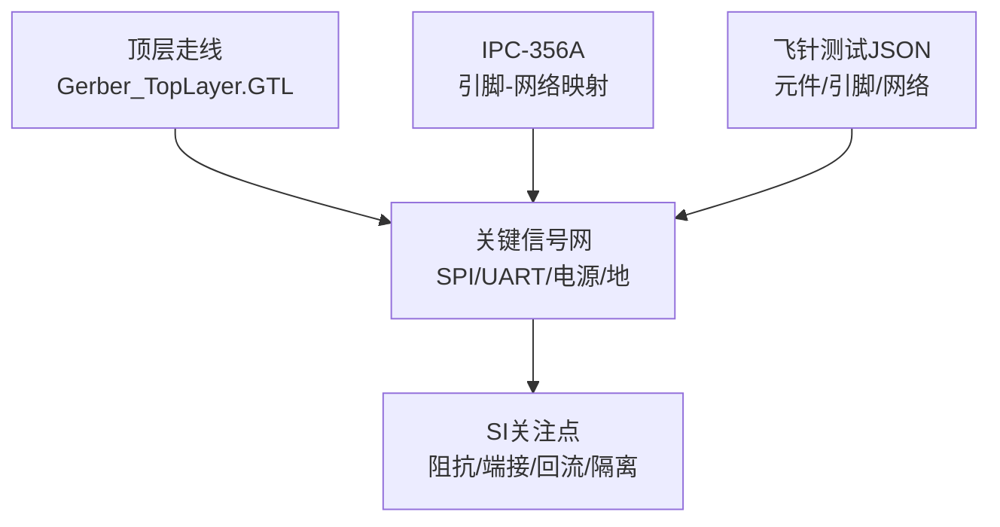
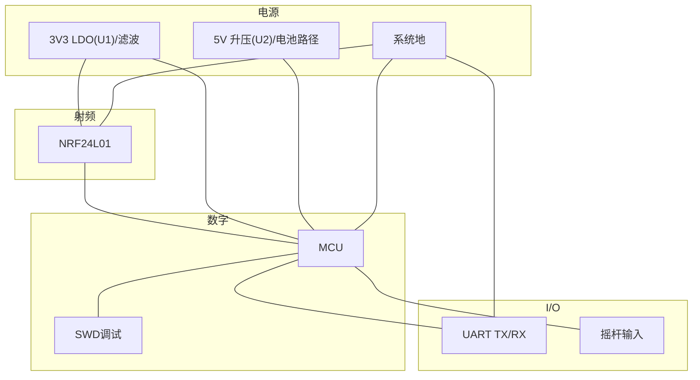
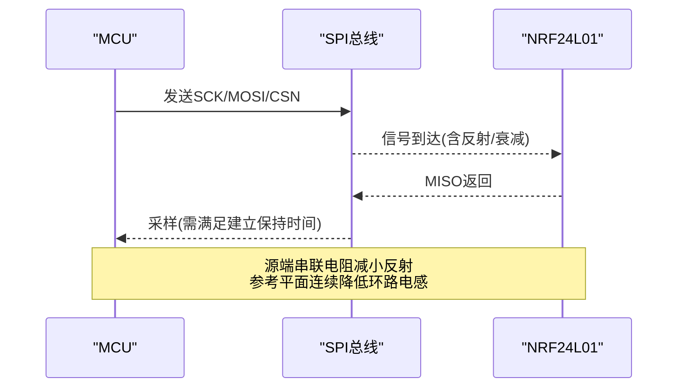
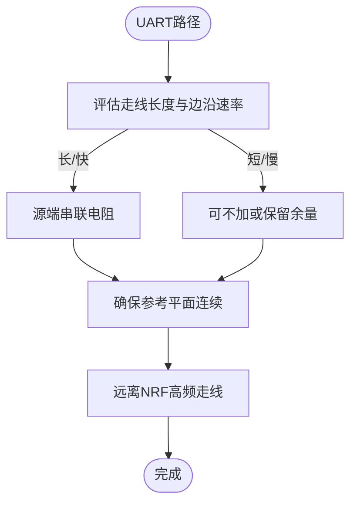
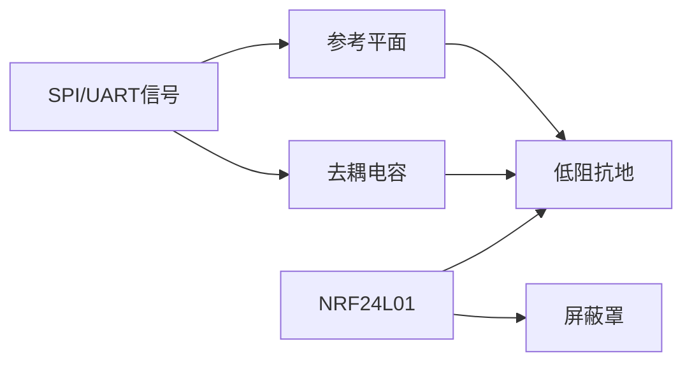

# 信号完整性设计

<cite>
**本文引用的文件**
- [IPC_PCB1_75mm_Brushed_FC_V1_2026-08-09.356a](file://IPC_PCB1_75mm_Brushed_FC_V1_2026-08-09.356a)
- [FlyingProbeTesting_PCB1_2026-08-09.json](file://flying_probe_unpacked/FlyingProbeTesting_PCB1_2026-08-09.json)
- [Gerber_TopLayer.GTL](file://gerber_unpacked/Gerber_TopLayer.GTL)
- [PCB下单必读.txt](file://gerber_unpacked/PCB下单必读.txt)
</cite>

## 目录
1. [简介](#简介)
2. [项目结构](#项目结构)
3. [核心组件](#核心组件)
4. [架构总览](#架构总览)
5. [详细组件分析](#详细组件分析)
6. [依赖关系分析](#依赖关系分析)
7. [性能与SI考量](#性能与si考量)
8. [故障排查指南](#故障排查指南)
9. [结论](#结论)
10. [附录](#附录)

## 简介
本文件面向高速数字与射频混合的PCB设计，聚焦以下目标：
- 高速信号路径（SPI总线、UART串口）的阻抗匹配与端接策略
- 时钟与关键控制信号的完整性保障
- 数字与模拟区域的隔离与噪声抑制
- 传输线理论在布局布线中的应用
- 反射、串扰、地弹等SI问题的预防与测试方法
- 2.4GHz射频部分（NRF24L01）的屏蔽与接地建议
- 调试工具与性能优化技巧

说明：本项目为双面板（顶层/底层），包含NRF24L01无线模块、MCU及外设接口（UART/SWD/摇杆）、电源与去耦网络。下文基于IPC-356A与飞针测试数据对关键信号网进行SI分析与改进建议。

## 项目结构
- 顶层铜层与走线信息来源于Gerber Top Layer；关键信号通过过孔跨层连接
- IPC-356A提供器件引脚到网络的映射，便于定位SPI、UART、电源与地网络
- 飞针测试JSON提供元件位置与引脚网络，辅助识别关键路径与潜在耦合区域

图表来源
- [Gerber_TopLayer.GTL:1-200](file://gerber_unpacked/Gerber_TopLayer.GTL#L1-L200)
- [IPC_PCB1_75mm_Brushed_FC_V1_2026-08-09.356a:18-315](file://IPC_PCB1_75mm_Brushed_FC_V1_2026-08-09.356a#L18-L315)
- [FlyingProbeTesting_PCB1_2026-08-09.json:206-589](file://flying_probe_unpacked/FlyingProbeTesting_PCB1_2026-08-09.json#L206-L589)

章节来源
- [IPC_PCB1_75mm_Brushed_FC_V1_2026-08-09.356a:1-315](file://IPC_PCB1_75mm_Brushed_FC_V1_2026-08-09.356a#L1-L315)
- [Gerber_TopLayer.GTL:1-200](file://gerber_unpacked/Gerber_TopLayer.GTL#L1-L200)
- [FlyingProbeTesting_PCB1_2026-08-09.json:206-589](file://flying_probe_unpacked/FlyingProbeTesting_PCB1_2026-08-09.json#L206-L589)

## 核心组件
- NRF24L01无线模块（SPI接口，2.4GHz射频）
- MCU与调试接口（SWDIO/SWCLK）
- UART串口（TX/RX）
- 电源与去耦网络（3V3/5V/VBAT）
- 摇杆输入（模拟信号）

章节来源
- [IPC_PCB1_75mm_Brushed_FC_V1_2026-08-09.356a:22-103](file://IPC_PCB1_75mm_Brushed_FC_V1_2026-08-09.356a#L22-L103)
- [FlyingProbeTesting_PCB1_2026-08-09.json:296-522](file://flying_probe_unpacked/FlyingProbeTesting_PCB1_2026-08-09.json#L296-L522)

## 架构总览
从SI角度，系统可抽象为：
- 射频前端（NRF24L01）：对高频噪声敏感，需良好屏蔽与低感回路；由3V3网络供电（网表：NRF1.1属3V3网络，5V网络不含任何NRF引脚）
- 数字逻辑（MCU）：产生SPI时钟与数据、UART串行流，需要受控阻抗与回流通路
- 电源分配：多电压域（3V3/5V/VBAT_SW），需就近去耦与分区供电
- I/O与外部接口：UART、摇杆等，注意信号质量与隔离

图表来源
- [IPC_PCB1_75mm_Brushed_FC_V1_2026-08-09.356a:22-103](file://IPC_PCB1_75mm_Brushed_FC_V1_2026-08-09.356a#L22-L103)
- [FlyingProbeTesting_PCB1_2026-08-09.json:296-522](file://flying_probe_unpacked/FlyingProbeTesting_PCB1_2026-08-09.json#L296-L522)

## 详细组件分析

### SPI总线（NRF24L01）SI设计与端接
- 信号定义：SCK、MOSI、MISO、CSN、CE、IRQ
- 传输线特性：NRF24L01工作频率可达数十MHz级SPI时钟，需考虑走线长度与时延、边沿速率引起的谐波分量
- 阻抗与端接：
  - 若走线长度接近或超过信号上升时间的1/6传播距离，应作为传输线处理
  - 建议在MCU侧串联小电阻（典型10–33Ω）实现源端匹配，降低反射与振铃
  - 避免长距离平行走线，必要时加地保护线并缩短间距
- 回流路径：确保每根信号线下方有连续参考平面（优先3V3或GND平面），减少环路面积
- 过孔使用：跨层时尽量靠近信号路径放置，避免形成大环路；图中可见多处NRF相关信号过孔，需评估其回流连续性

图表来源
- [IPC_PCB1_75mm_Brushed_FC_V1_2026-08-09.356a:22-29](file://IPC_PCB1_75mm_Brushed_FC_V1_2026-08-09.356a#L22-L29)
- [IPC_PCB1_75mm_Brushed_FC_V1_2026-08-09.356a:74-89](file://IPC_PCB1_75mm_Brushed_FC_V1_2026-08-09.356a#L74-L89)
- [IPC_PCB1_75mm_Brushed_FC_V1_2026-08-09.356a:147-158](file://IPC_PCB1_75mm_Brushed_FC_V1_2026-08-09.356a#L147-L158)
- [FlyingProbeTesting_PCB1_2026-08-09.json:301-316](file://flying_probe_unpacked/FlyingProbeTesting_PCB1_2026-08-09.json#L301-L316)

章节来源
- [IPC_PCB1_75mm_Brushed_FC_V1_2026-08-09.356a:22-89](file://IPC_PCB1_75mm_Brushed_FC_V1_2026-08-09.356a#L22-L89)
- [IPC_PCB1_75mm_Brushed_FC_V1_2026-08-09.356a:147-158](file://IPC_PCB1_75mm_Brushed_FC_V1_2026-08-09.356a#L147-L158)
- [FlyingProbeTesting_PCB1_2026-08-09.json:301-316](file://flying_probe_unpacked/FlyingProbeTesting_PCB1_2026-08-09.json#L301-L316)

### UART串口SI与端接
- 信号定义：TX、RX
- 传输线考虑：UART通常较低速，但若板内走线较长或边沿较陡，仍建议串联小电阻（如22–47Ω）以抑制反射
- 回流与隔离：避免与NRF高频信号平行走线；必要时用地线隔离
- 过孔与参考面：跨层时保证参考面连续，避免跨越分割缝

图表来源
- [IPC_PCB1_75mm_Brushed_FC_V1_2026-08-09.356a:83-84](file://IPC_PCB1_75mm_Brushed_FC_V1_2026-08-09.356a#L83-L84)
- [IPC_PCB1_75mm_Brushed_FC_V1_2026-08-09.356a:99-102](file://IPC_PCB1_75mm_Brushed_FC_V1_2026-08-09.356a#L99-L102)
- [IPC_PCB1_75mm_Brushed_FC_V1_2026-08-09.356a:175-178](file://IPC_PCB1_75mm_Brushed_FC_V1_2026-08-09.356a#L175-L178)

章节来源
- [IPC_PCB1_75mm_Brushed_FC_V1_2026-08-09.356a:83-102](file://IPC_PCB1_75mm_Brushed_FC_V1_2026-08-09.356a#L83-L102)
- [IPC_PCB1_75mm_Brushed_FC_V1_2026-08-09.356a:175-178](file://IPC_PCB1_75mm_Brushed_FC_V1_2026-08-09.356a#L175-L178)

### ADC采样线路与数字/模拟隔离
- 本设计中存在模拟输入（摇杆轴信号），需注意：
  - 将模拟信号路径与数字开关噪声隔离，避免穿越数字区
  - 模拟地（AGND）与数字地（DGND）单点汇接，防止地环路
  - 在ADC输入端就近放置去耦电容，减小高频噪声注入
- 参考平面：模拟路径下保持完整参考平面，避免跨分割

章节来源
- [IPC_PCB1_75mm_Brushed_FC_V1_2026-08-09.356a:32-37](file://IPC_PCB1_75mm_Brushed_FC_V1_2026-08-09.356a#L32-L37)
- [IPC_PCB1_75mm_Brushed_FC_V1_2026-08-09.356a:46-55](file://IPC_PCB1_75mm_Brushed_FC_V1_2026-08-09.356a#L46-L55)
- [FlyingProbeTesting_PCB1_2026-08-09.json:241-260](file://flying_probe_unpacked/FlyingProbeTesting_PCB1_2026-08-09.json#L241-L260)

### 电源与去耦网络
- 3V3/5V/VBAT网络分布广泛，需在每个IC电源引脚附近放置去耦电容，缩短回路
- 大电流路径（如VBAT）采用宽走线或多层并联，降低IR压降与寄生电感
- 电源平面分割合理，避免数字开关噪声耦合至模拟/射频区域

章节来源
- [IPC_PCB1_75mm_Brushed_FC_V1_2026-08-09.356a:60-103](file://IPC_PCB1_75mm_Brushed_FC_V1_2026-08-09.356a#L60-L103)
- [IPC_PCB1_75mm_Brushed_FC_V1_2026-08-09.356a:110-141](file://IPC_PCB1_75mm_Brushed_FC_V1_2026-08-09.356a#L110-L141)
- [FlyingProbeTesting_PCB1_2026-08-09.json:225-236](file://flying_probe_unpacked/FlyingProbeTesting_PCB1_2026-08-09.json#L225-L236)

### 2.4GHz射频部分（NRF24L01）屏蔽与接地
- 天线与射频走线应尽量短且直，避免锐角与过孔密集区域
- 屏蔽罩：建议为NRF24L01加装金属屏蔽罩，降低辐射与外部干扰
- 接地：射频地需与系统地低阻抗连接，避免地弹；周围铺地并多点过孔接地
- 隔离：射频区与数字区物理隔离，必要时开槽或分区供电

章节来源
- [IPC_PCB1_75mm_Brushed_FC_V1_2026-08-09.356a:22-29](file://IPC_PCB1_75mm_Brushed_FC_V1_2026-08-09.356a#L22-L29)
- [IPC_PCB1_75mm_Brushed_FC_V1_2026-08-09.356a:147-158](file://IPC_PCB1_75mm_Brushed_FC_V1_2026-08-09.356a#L147-L158)

## 依赖关系分析
- 信号网依赖参考平面：SPI/UART信号的回流路径依赖于相邻参考面的连续性
- 电源网依赖去耦：各IC电源引脚的去耦电容与地回路影响高频噪声抑制
- 射频依赖屏蔽与接地：NRF24L01的性能受屏蔽与地弹影响显著

图表来源
- [IPC_PCB1_75mm_Brushed_FC_V1_2026-08-09.356a:22-103](file://IPC_PCB1_75mm_Brushed_FC_V1_2026-08-09.356a#L22-L103)
- [IPC_PCB1_75mm_Brushed_FC_V1_2026-08-09.356a:110-141](file://IPC_PCB1_75mm_Brushed_FC_V1_2026-08-09.356a#L110-L141)

章节来源
- [IPC_PCB1_75mm_Brushed_FC_V1_2026-08-09.356a:22-141](file://IPC_PCB1_75mm_Brushed_FC_V1_2026-08-09.356a#L22-L141)

## 性能与SI考量
- 传输线理论应用
  - 当走线长度大于信号上升时间的约1/6传播距离时，按传输线设计
  - 控制特征阻抗（如50Ω/75Ω），采用微带/带状线结构，保持参考面连续
  - 避免T型分支与急弯，使用圆弧或45°折线
- 端接电阻选择
  - 源端串联电阻：10–33Ω（SPI），22–47Ω（UART），根据实际边沿与负载调整
  - 终端匹配：仅在必要时使用并联/串联终端，优先考虑源端匹配以减少功耗
- 布局布线最佳实践
  - 信号与地平面紧邻，避免跨分割；关键信号下方不穿其他信号
  - 减少过孔数量，跨层时靠近信号路径放置
  - 电源与地网络加粗，降低寄生电感
- 反射、串扰、地弹预防
  - 反射：源端匹配、避免开路/短路末端、控制走线长度
  - 串扰：增大信号间距、加地保护线、避免长距离平行
  - 地弹：多点接地、降低地回路电感、合理分割地与电源
- 测试方法与工具
  - 示波器观察SPI/UART波形，检查振铃、过冲、建立保持时间
  - TDR测量阻抗不连续点，定位过孔/拐角问题
  - 频谱仪/EMI近场探头评估射频辐射与耦合
  - 矢量网络分析仪（可选）测量S参数与回波损耗
- 性能优化技巧
  - 降低驱动强度或增加串联电阻以减缓边沿
  - 优化去耦电容值与布局（大容量+小容量组合）
  - 对NRF24L01增加屏蔽罩并改善接地

[本节为通用指导，无需特定文件引用]

## 故障排查指南
- 常见问题
  - SPI通信不稳定：检查源端匹配电阻、参考平面连续性、过孔回流路径
  - UART误码率高：检查边沿速率与接收端阈值、地弹与电源噪声
  - 射频性能下降：检查屏蔽罩安装、接地连接、天线周边净空
- 排查步骤
  - 用示波器抓取关键节点波形，对比预期时序
  - 逐步移除/替换可疑元件（如去耦电容、串联电阻）验证
  - 使用近场探头定位噪声源，针对性屏蔽或隔离
- 依据文件
  - 通过IPC-356A与飞针JSON定位具体网络与走线，结合Gerber查看实际布局

章节来源
- [IPC_PCB1_75mm_Brushed_FC_V1_2026-08-09.356a:22-103](file://IPC_PCB1_75mm_Brushed_FC_V1_2026-08-09.356a#L22-L103)
- [FlyingProbeTesting_PCB1_2026-08-09.json:296-522](file://flying_probe_unpacked/FlyingProbeTesting_PCB1_2026-08-09.json#L296-L522)

## 结论
- 本项目为双面板，包含NRF24L01射频模块与多种数字接口，SI关键在于参考平面连续性、源端匹配与电源去耦
- SPI与UART建议采用源端串联电阻，避免长距离平行走线与跨分割
- 射频区域需屏蔽与低阻抗接地，减少辐射与干扰
- 通过示波器/TDR/近场测试等手段验证与优化，确保系统可靠性

[本节为总结性内容，无需特定文件引用]

## 附录
- PCB下单指引见“PCB下单必读.txt”
- 如需进一步仿真与优化，建议使用SI工具进行传输线建模与EM仿真

章节来源
- [PCB下单必读.txt:1-4](file://gerber_unpacked/PCB下单必读.txt#L1-L4)

## 相关文档
- [PCB布局设计](PCB布局设计.md)（布局与走线规则）
- [无线通信电路](电路原理图/无线通信电路.md)（SPI 信号来源）
- [资料总览](../资料总览.md)（入口索引）