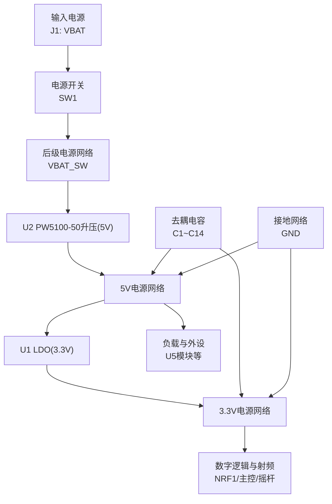
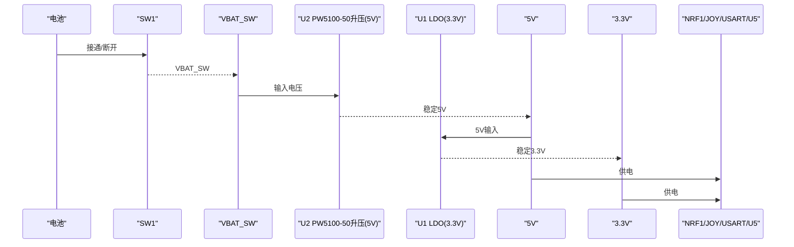
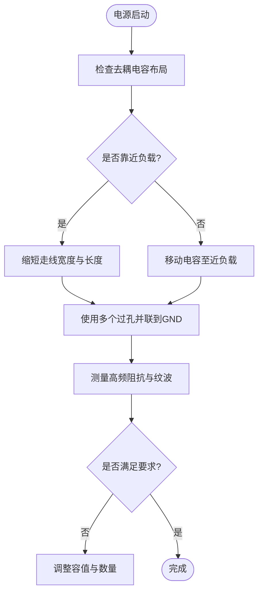
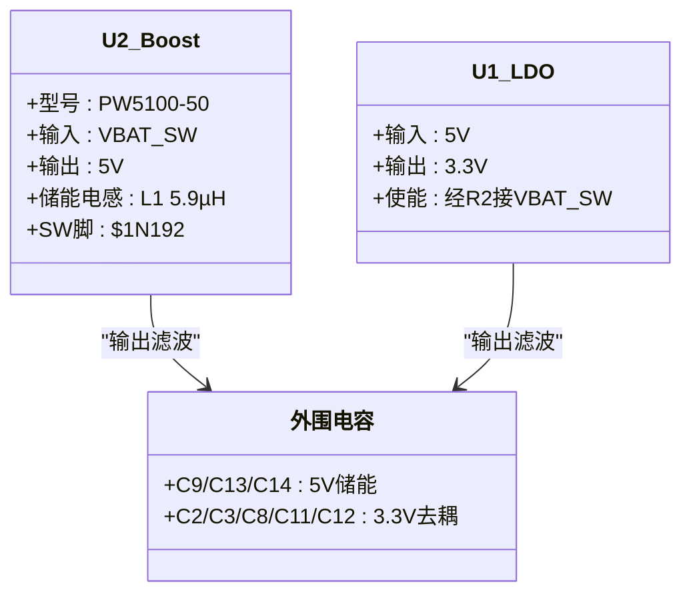
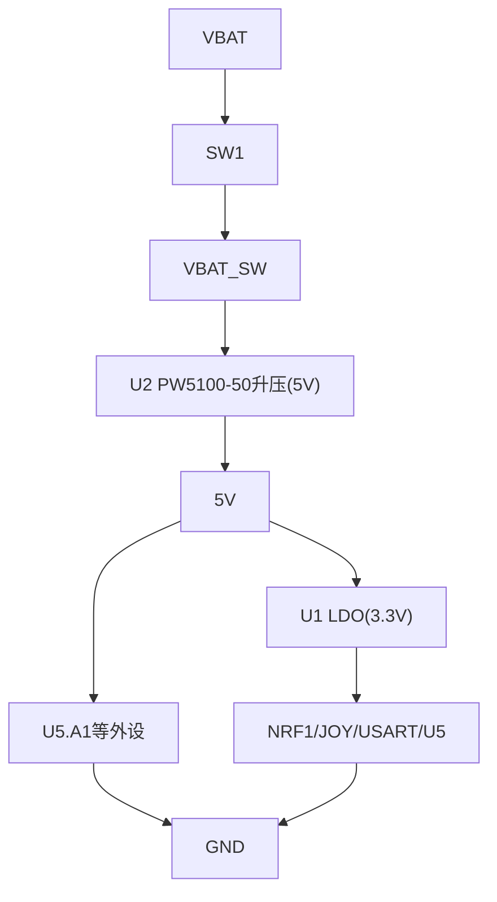
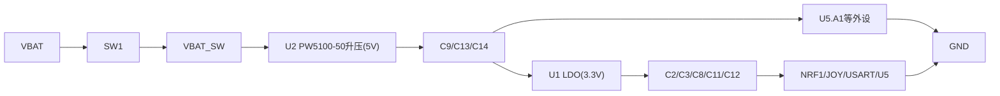

# 电源完整性设计

<cite>
**本文引用的文件**
- [IPC_PCB1_75mm_Brushed_FC_V1_2026-08-09.356a](file://IPC_PCB1_75mm_Brushed_FC_V1_2026-08-09.356a)
- [FlyingProbeTesting_PCB1_2026-08-09.json](file://flying_probe_unpacked/FlyingProbeTesting_PCB1_2026-08-09.json)
- [Gerber_TopLayer.GTL](file://gerber_unpacked/Gerber_TopLayer.GTL)
- [Gerber_BottomLayer.GBL](file://gerber_unpacked/Gerber_BottomLayer.GBL)
- [Gerber_TopSolderMaskLayer.GTS](file://gerber_unpacked/Gerber_TopSolderMaskLayer.GTS)
- [PCB下单必读.txt](file://gerber_unpacked/PCB下单必读.txt)
</cite>

## 目录
1. [简介](#简介)
2. [项目结构](#项目结构)
3. [核心组件](#核心组件)
4. [架构总览](#架构总览)
5. [详细组件分析](#详细组件分析)
6. [依赖关系分析](#依赖关系分析)
7. [性能与功耗考量](#性能与功耗考量)
8. [故障排查指南](#故障排查指南)
9. [结论](#结论)
10. [附录](#附录)

## 简介
本文件面向“75mm_Brushed_FC_V1”双面板PCB的电源完整性（PI）设计，围绕多电压域供电策略、电源平面分割、去耦电容布局、升压+LDO降压电路（VBAT_SW经PW5100-50升压至5V、U1 LDO降压至3.3V）、电池供电管理与低功耗优化、噪声抑制与纹波控制、瞬态响应优化、电源树分析、电流路径规划、热设计考虑，以及电源质量测试方法、负载调整率测量与效率评估进行系统化说明。文档基于工程数据（IPC-D-356A、飞针测试JSON、Gerber层信息）进行分析与归纳，确保内容与实际设计一致。

## 项目结构
本项目包含以下关键资料：
- IPC-D-356A工程数据：描述板级信息、网络与器件引脚连接、走线等，用于识别电源网络（VBAT、VBAT_SW、5V、3V3、GND）及关键器件（U1、U2、L1、SW1、NRF1、JOY1/2、USART、SWD）。
- 飞针测试JSON：提供元件位置、焊盘与网络映射，便于定位去耦电容、电源入口、关键节点。
- Gerber顶层/底层铜箔与阻焊层：反映电源/地平面分布、过孔与走线密度，辅助评估电源平面分割与回流路径。
- PCB下单说明：制造指引链接。

图表来源
- [IPC_PCB1_75mm_Brushed_FC_V1_2026-08-09.356a:22-143](file://IPC_PCB1_75mm_Brushed_FC_V1_2026-08-09.356a#L22-L143)
- [FlyingProbeTesting_PCB1_2026-08-09.json:209-378](file://flying_probe_unpacked/FlyingProbeTesting_PCB1_2026-08-09.json#L209-L378)

**章节来源**
- [IPC_PCB1_75mm_Brushed_FC_V1_2026-08-09.356a:1-143](file://IPC_PCB1_75mm_Brushed_FC_V1_2026-08-09.356a#L1-L143)
- [FlyingProbeTesting_PCB1_2026-08-09.json:1-378](file://flying_probe_unpacked/FlyingProbeTesting_PCB1_2026-08-09.json#L1-L378)

## 核心组件
- 电源入口与开关
  - J1：VBAT输入与GND
  - SW1：VBAT至VBAT_SW的电源开关
- 升压与LDO稳压
  - U2：PW5100-50同步升压转换器（VBAT_SW→5V），储能电感L1（5.9µH）接于VBAT_SW与U2第5脚SW（$1N192）之间
  - U1：3.3V LDO（5V→3.3V），使能端经R2接VBAT_SW
  - L1：U2升压电路的储能电感（5.9µH）
- 去耦与储能电容
  - C1~C14：分布在5V与3.3V网络，靠近负载与转换器输出端
- 负载与接口
  - NRF1：无线模块（3.3V供电）
  - JOY1/JOY2：双摇杆模拟输入（3.3V供电，按键引脚接GND）
  - USART/SWD：调试与通信接口（3.3V供电）
  - U5：主控MCU模块（3.3V供电，A1脚接5V）

**章节来源**
- [IPC_PCB1_75mm_Brushed_FC_V1_2026-08-09.356a:22-143](file://IPC_PCB1_75mm_Brushed_FC_V1_2026-08-09.356a#L22-L143)
- [FlyingProbeTesting_PCB1_2026-08-09.json:209-378](file://flying_probe_unpacked/FlyingProbeTesting_PCB1_2026-08-09.json#L209-L378)

## 架构总览
电源架构采用“电池输入→开关→中间母线→升压/LDO降压→多电压域”的分层拓扑：
- 输入侧：VBAT经SW1进入VBAT_SW，作为系统主供电节点
- 转换侧：U2（PW5100-50升压）将VBAT_SW升压为5V，U1（LDO）再将5V降压为3.3V
- 分配侧：通过合理的去耦电容与短回路连接到各负载
- 接地侧：统一GND参考，降低地弹与环路面积

图表来源
- [IPC_PCB1_75mm_Brushed_FC_V1_2026-08-09.356a:90-143](file://IPC_PCB1_75mm_Brushed_FC_V1_2026-08-09.356a#L90-L143)
- [FlyingProbeTesting_PCB1_2026-08-09.json:297-378](file://flying_probe_unpacked/FlyingProbeTesting_PCB1_2026-08-09.json#L297-L378)

## 详细组件分析

### 多电压域供电策略
- 电压域划分
  - VBAT：电池直连，经开关控制
  - VBAT_SW：开关后的中间网络，为U2（PW5100-50升压）提供输入
  - 5V：用于需要较高电压的外设或接口
  - 3.3V：数字逻辑与射频模块（如NRF1）
- 隔离与共享
  - 不同电压域在布局上尽量分区，避免大电流路径穿越敏感信号区
  - 共用GND但通过合理分割与单点汇聚减少地环路干扰

**章节来源**
- [IPC_PCB1_75mm_Brushed_FC_V1_2026-08-09.356a:22-143](file://IPC_PCB1_75mm_Brushed_FC_V1_2026-08-09.356a#L22-L143)
- [FlyingProbeTesting_PCB1_2026-08-09.json:209-378](file://flying_probe_unpacked/FlyingProbeTesting_PCB1_2026-08-09.json#L209-L378)

### 电源平面分割与去耦电容布局
- 平面分割原则
  - 5V与3.3V区域在顶层/底层分别布置，避免交叉耦合
  - GND平面保持完整，必要时以窄缝隔离噪声源，确保回流路径最短
- 去耦电容策略
  - 在升压输出端、LDO输出端与负载电源引脚附近放置小容量陶瓷电容（如C2/C3/C8/C11/C12），减小高频阻抗
  - 在5V与3.3V主干节点放置较大容量电容（如C9/C13/C14），提供瞬态能量缓冲
  - 电容与器件引脚间走线尽量短且宽，降低寄生电感

图表来源
- [IPC_PCB1_75mm_Brushed_FC_V1_2026-08-09.356a:110-143](file://IPC_PCB1_75mm_Brushed_FC_V1_2026-08-09.356a#L110-L143)
- [FlyingProbeTesting_PCB1_2026-08-09.json:209-236](file://flying_probe_unpacked/FlyingProbeTesting_PCB1_2026-08-09.json#L209-L236)

**章节来源**
- [IPC_PCB1_75mm_Brushed_FC_V1_2026-08-09.356a:110-143](file://IPC_PCB1_75mm_Brushed_FC_V1_2026-08-09.356a#L110-L143)
- [FlyingProbeTesting_PCB1_2026-08-09.json:209-236](file://flying_probe_unpacked/FlyingProbeTesting_PCB1_2026-08-09.json#L209-L236)

### 升压与LDO降压转换电路
- 转换拓扑（已按网表核实，U2型号PW5100-50由设计方确认）
  - U2 为 PW5100-50 PFM 同步升压转换器（SOT-23-5，固定输出5.0V，输入0.7~5.0V），从 VBAT_SW 升压生成 5V；储能电感 L1（5.9µH）接于 VBAT_SW 与 U2 第5脚 SW（$1N192）之间
  - U1 为 3.3V LDO，从 5V 降压生成 3.3V，使能端经R2（10kΩ）接VBAT_SW
  - 升压侧外围为储能电感与输入/输出电容；LDO 无需外部反馈网络
- 关键设计要点
  - 输入侧低阻抗路径：短而宽的走线，多过孔并联到GND
  - 输出侧快速瞬态响应：就近放置小容量陶瓷电容，降低环路面积
  - SW开关节点（$1N192，VBAT_SW↔L1↔U2第5脚）走线短小，靠近 U2 布置，降低EMI
  - 热设计：U1 LDO 压差×负载电流为片内功耗，选择合适封装与散热路径，避免热点集中

图表来源
- [IPC_PCB1_75mm_Brushed_FC_V1_2026-08-09.356a:90-143](file://IPC_PCB1_75mm_Brushed_FC_V1_2026-08-09.356a#L90-L143)
- [FlyingProbeTesting_PCB1_2026-08-09.json:209-236](file://flying_probe_unpacked/FlyingProbeTesting_PCB1_2026-08-09.json#L209-L236)

**章节来源**
- [IPC_PCB1_75mm_Brushed_FC_V1_2026-08-09.356a:90-143](file://IPC_PCB1_75mm_Brushed_FC_V1_2026-08-09.356a#L90-L143)
- [FlyingProbeTesting_PCB1_2026-08-09.json:209-236](file://flying_probe_unpacked/FlyingProbeTesting_PCB1_2026-08-09.json#L209-L236)

### 电池供电管理与功耗优化
- 供电管理
  - SW1控制VBAT至VBAT_SW的通断，实现整机休眠/唤醒时的电源切断或保留
  - 在低功耗模式下，关闭非必要负载（如NRF1、USART），仅保留必要监控电路
- 功耗优化策略
  - 动态电源门控：根据任务状态切换电压域供电
  - 轻载优化：PW5100-50 为 PFM 调制，轻载自动降频保持高效率；U1 选择低压差、低静态电流的 LDO
  - 睡眠模式：降低时钟频率、关闭外设、进入深度睡眠并最小化漏电流

**章节来源**
- [IPC_PCB1_75mm_Brushed_FC_V1_2026-08-09.356a:142-143](file://IPC_PCB1_75mm_Brushed_FC_V1_2026-08-09.356a#L142-L143)
- [FlyingProbeTesting_PCB1_2026-08-09.json:321-328](file://flying_probe_unpacked/FlyingProbeTesting_PCB1_2026-08-09.json#L321-L328)

### 噪声抑制、纹波控制与瞬态响应优化
- 噪声抑制
  - 使用π型或LC滤波器在升压/LDO输入输出端抑制高频噪声
  - 对敏感信号（如NRF1的SPI总线）增加磁珠或小电阻串联，降低串扰
- 纹波控制
  - 增大输出电容容值与ESR匹配，降低输出电压纹波
  - 5V轨纹波来自PW5100开关动作，靠L1与C9/C13/C14滤波；3.3V轨依靠U1 LDO的PSRR进一步抑制
- 瞬态响应优化
  - 在负载突变时，就近去耦电容提供瞬时电流，减小电压跌落
  - U1输出电容按LDO数据手册的容值/ESR要求选取，确保环路稳定与响应速度

**章节来源**
- [IPC_PCB1_75mm_Brushed_FC_V1_2026-08-09.356a:110-143](file://IPC_PCB1_75mm_Brushed_FC_V1_2026-08-09.356a#L110-L143)
- [Gerber_TopLayer.GTL:1-200](file://gerber_unpacked/Gerber_TopLayer.GTL#L1-L200)
- [Gerber_BottomLayer.GBL:1-200](file://gerber_unpacked/Gerber_BottomLayer.GBL#L1-L200)

### 电源树分析与电流路径规划
- 电源树
  - VBAT → SW1 → VBAT_SW → U2（PW5100-50升压）→ 5V → U1（LDO）→ 3.3V → 负载
- 电流路径规划
  - 大电流路径（如VBAT_SW至U2、5V至U1）应使用宽走线与多层过孔，降低阻抗
  - 小电流信号路径（如NRF1 SPI）远离大电流路径，避免耦合噪声
  - 地回路尽量闭合且面积小，减少辐射与感应噪声

图表来源
- [IPC_PCB1_75mm_Brushed_FC_V1_2026-08-09.356a:90-143](file://IPC_PCB1_75mm_Brushed_FC_V1_2026-08-09.356a#L90-L143)
- [FlyingProbeTesting_PCB1_2026-08-09.json:209-378](file://flying_probe_unpacked/FlyingProbeTesting_PCB1_2026-08-09.json#L209-L378)

**章节来源**
- [IPC_PCB1_75mm_Brushed_FC_V1_2026-08-09.356a:90-143](file://IPC_PCB1_75mm_Brushed_FC_V1_2026-08-09.356a#L90-L143)
- [FlyingProbeTesting_PCB1_2026-08-09.json:209-378](file://flying_probe_unpacked/FlyingProbeTesting_PCB1_2026-08-09.json#L209-L378)

### 热设计考虑
- 热源识别
  - 升压转换器U2、LDO U1（压差×负载电流为片内功耗）、储能电感L1、开关SW1为主要热源
- 散热措施
  - 使用大面积铺铜与多过孔将热量传导至内层/底层
  - 合理布局发热器件，避免集中；必要时添加散热垫或金属屏蔽罩
- 温度监测
  - 在关键节点预留测温点或热敏电阻，便于量产检测与可靠性验证

**章节来源**
- [IPC_PCB1_75mm_Brushed_FC_V1_2026-08-09.356a:90-143](file://IPC_PCB1_75mm_Brushed_FC_V1_2026-08-09.356a#L90-L143)
- [Gerber_TopLayer.GTL:1-200](file://gerber_unpacked/Gerber_TopLayer.GTL#L1-L200)
- [Gerber_BottomLayer.GBL:1-200](file://gerber_unpacked/Gerber_BottomLayer.GBL#L1-L200)

## 依赖关系分析
- 电源网络依赖
  - VBAT_SW依赖SW1的通断控制
  - 5V依赖U2升压效率与稳定性，3.3V依赖U1（LDO）的输入5V质量
  - 负载（NRF1/JOY/USART/U5）依赖对应电压域的纯净度与瞬态响应
- 去耦与回路的依赖
  - 去耦电容的容值与位置影响高频噪声抑制效果
  - GND平面的完整性影响地弹与环路噪声

图表来源
- [IPC_PCB1_75mm_Brushed_FC_V1_2026-08-09.356a:90-143](file://IPC_PCB1_75mm_Brushed_FC_V1_2026-08-09.356a#L90-L143)
- [FlyingProbeTesting_PCB1_2026-08-09.json:209-236](file://flying_probe_unpacked/FlyingProbeTesting_PCB1_2026-08-09.json#L209-L236)

**章节来源**
- [IPC_PCB1_75mm_Brushed_FC_V1_2026-08-09.356a:90-143](file://IPC_PCB1_75mm_Brushed_FC_V1_2026-08-09.356a#L90-L143)
- [FlyingProbeTesting_PCB1_2026-08-09.json:209-236](file://flying_probe_unpacked/FlyingProbeTesting_PCB1_2026-08-09.json#L209-L236)

## 性能与功耗考量
- 效率评估
  - 在不同负载条件下测量转换效率：U2升压效率（PW5100典型可达95%）与U1 LDO效率（≈VOUT/VIN）
  - 关注轻载效率，避免待机功耗过高
- 负载调整率
  - 在满载与空载之间变化负载，测量输出电压波动，确保在允许范围内
- 瞬态响应
  - 模拟负载阶跃变化，观察电压跌落与恢复时间，调整补偿与去耦
- 噪声与纹波
  - 使用频谱分析仪测量电源噪声频谱，优化滤波与布局
  - 控制开关噪声对敏感信号的耦合，必要时增加屏蔽

[本节为通用指导，不直接分析具体文件]

## 故障排查指南
- 常见问题
  - 开机不稳：检查SW1接触与VBAT_SW路径阻抗
  - 电压跌落：检查去耦电容容量与位置，确认大电流路径宽度与过孔数量
  - 噪声过大：检查升压SW节点（$1N192）布局与去耦、LDO输入裕量与输出电容，优化滤波与屏蔽
- 诊断步骤
  - 使用示波器测量关键点波形（VBAT_SW、5V、3.3V）
  - 逐步加载，观察电压变化与瞬态响应
  - 对比不同负载条件下的效率曲线，定位异常点

**章节来源**
- [IPC_PCB1_75mm_Brushed_FC_V1_2026-08-09.356a:90-143](file://IPC_PCB1_75mm_Brushed_FC_V1_2026-08-09.356a#L90-L143)
- [Gerber_TopLayer.GTL:1-200](file://gerber_unpacked/Gerber_TopLayer.GTL#L1-L200)
- [Gerber_BottomLayer.GBL:1-200](file://gerber_unpacked/Gerber_BottomLayer.GBL#L1-L200)

## 结论
本设计通过分层电源架构、合理的平面分割与去耦布局、PW5100-50升压与LDO降压组合及完善的噪声抑制策略，实现了稳定的多电压域供电。结合电池管理与低功耗优化，满足了系统在复杂负载下的电源完整性要求。后续可通过实测数据进一步优化效率与瞬态响应，确保长期可靠性。

[本节为总结性内容，不直接分析具体文件]

## 附录
- 制造指引
  - PCB下单请参考：https://prodocs.lceda.cn/cn/pcb/order-order-pcb/index.html

**章节来源**
- [PCB下单必读.txt:1-4](file://gerber_unpacked/PCB下单必读.txt#L1-L4)

## 相关文档
- [射频专项设计](射频专项设计.md)（发射脉冲对 3V3 供电的要求）
- [电源电路设计](电路原理图/电源电路设计.md)（PW5100-50升压 + LDO 稳压电路原理）
- [PCB布局设计](PCB布局设计.md)（去耦布局落地）
- [调试指南](../调试指南.md)（电源逐级调试步骤）
- [资料总览](../资料总览.md)（入口索引）