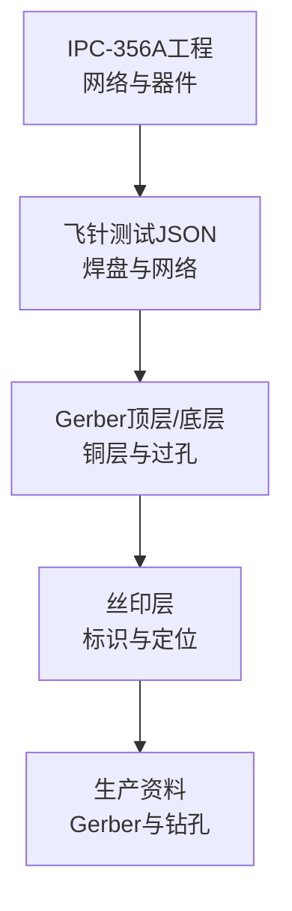
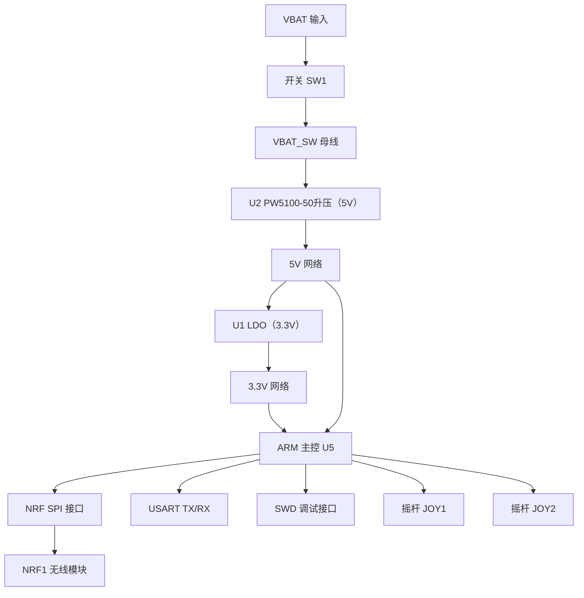
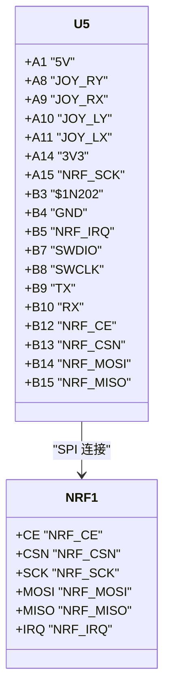
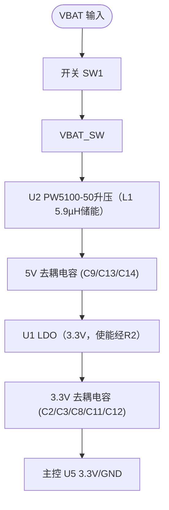
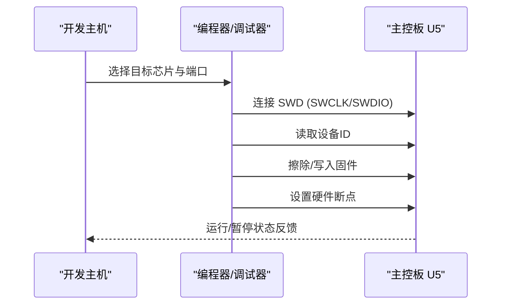
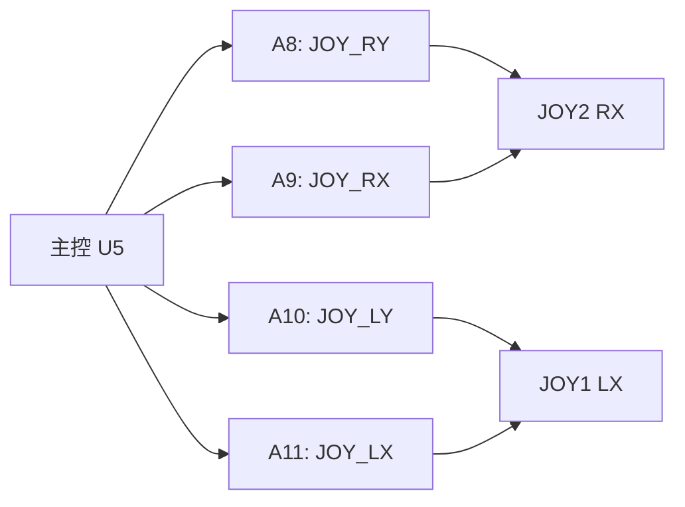
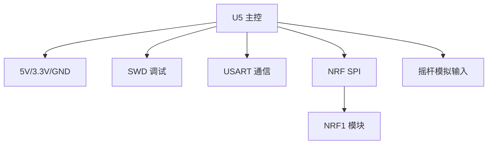

# 主控电路设计

<cite>
**本文引用的文件**
- [IPC_PCB1_75mm_Brushed_FC_V1_2026-08-09.356a](file://IPC_PCB1_75mm_Brushed_FC_V1_2026-08-09.356a)
- [FlyingProbeTesting_PCB1_2026-08-09.json](file://flying_probe_unpacked/FlyingProbeTesting_PCB1_2026-08-09.json)
- [Gerber_TopLayer.GTL](file://gerber_unpacked/Gerber_TopLayer.GTL)
- [Gerber_BottomLayer.GBL](file://gerber_unpacked/Gerber_BottomLayer.GBL)
- [Gerber_TopSilkscreenLayer.GTO](file://gerber_unpacked/Gerber_TopSilkscreenLayer.GTO)
- [PCB下单必读.txt](file://gerber_unpacked/PCB下单必读.txt)
</cite>

## 目录
1. [简介](#简介)
2. [项目结构](#项目结构)
3. [核心组件](#核心组件)
4. [架构总览](#架构总览)
5. [详细组件分析](#详细组件分析)
6. [依赖关系分析](#依赖关系分析)
7. [性能与信号完整性](#性能与信号完整性)
8. [故障排查指南](#故障排查指南)
9. [结论](#结论)
10. [附录：引脚定义表与仿真建议](#附录引脚定义表与仿真建议)

## 简介
本文件基于提供的PCB工程数据（IPC-356A、飞针测试JSON、Gerber层），对主控电路板进行系统化设计与实现说明。重点覆盖ARM微控制器外围电路、时钟与复位、调试接口（SWD）、电源分配与去耦、I/O分配、NRF无线模块接口、按键输入、串口通信等。文档同时给出信号完整性考虑、EMC防护建议，并提供完整的引脚定义表与仿真验证建议。

## 项目结构
- IPC-356A工程文件：包含板级信息、网络命名、器件封装与走线拓扑的关键线索。
- 飞针测试JSON：提供元件位置、焊盘坐标、网络名称与类型，用于核对连接关系与测试点。
- Gerber顶层/底层丝印：确认布局、丝印标注、过孔与铜皮分布。
- PCB下单说明：外部链接指引。

**图表来源**
- [IPC_PCB1_75mm_Brushed_FC_V1_2026-08-09.356a:1-18](file://IPC_PCB1_75mm_Brushed_FC_V1_2026-08-09.356a#L1-L18)
- [Gerber_TopLayer.GTL:1-10](file://gerber_unpacked/Gerber_TopLayer.GTL#L1-L10)
- [Gerber_BottomLayer.GBL:1-10](file://gerber_unpacked/Gerber_BottomLayer.GBL#L1-L10)
- [Gerber_TopSilkscreenLayer.GTO:1-10](file://gerber_unpacked/Gerber_TopSilkscreenLayer.GTO#L1-L10)

**章节来源**
- [IPC_PCB1_75mm_Brushed_FC_V1_2026-08-09.356a:1-18](file://IPC_PCB1_75mm_Brushed_FC_V1_2026-08-09.356a#L1-L18)
- [Gerber_TopLayer.GTL:1-10](file://gerber_unpacked/Gerber_TopLayer.GTL#L1-L10)
- [Gerber_BottomLayer.GBL:1-10](file://gerber_unpacked/Gerber_BottomLayer.GBL#L1-L10)
- [Gerber_TopSilkscreenLayer.GTO:1-10](file://gerber_unpacked/Gerber_TopSilkscreenLayer.GTO#L1-L10)

## 核心组件
- ARM主控芯片（U5）：提供GPIO、UART、SWD、SPI（用于NRF）等外设；引脚通过网络名映射到具体功能。
- NRF无线模块（NRF1）：通过SPI与主控通信，含CE、CSN、SCK、MOSI、MISO、IRQ等关键信号。
- 电源管理：
  - 输入VBAT经开关SW1形成VBAT_SW母线，U2（PW5100-50同步升压）升压得到5V，U1（LDO）降压得到3.3V。
  - 5V与3.3V电源网络广泛存在，为各模块供电。
- 输入接口：JOY1、JOY2两个摇杆模块，提供X/Y轴模拟信号至主控ADC（按键引脚接GND，未接入主控）。
- 调试与通信：
  - SWD接口（SWCLK、SWDIO）引出至排针，支持程序烧录与硬件断点。
  - USART接口（TX、RX）引出至排针，用于串口调试与上位机通信。

**章节来源**
- [IPC_PCB1_75mm_Brushed_FC_V1_2026-08-09.356a:22-102](file://IPC_PCB1_75mm_Brushed_FC_V1_2026-08-09.356a#L22-L102)
- [FlyingProbeTesting_PCB1_2026-08-09.json:25-33](file://flying_probe_unpacked/FlyingProbeTesting_PCB1_2026-08-09.json#L25-L33)
- [FlyingProbeTesting_PCB1_2026-08-09.json:331-338](file://flying_probe_unpacked/FlyingProbeTesting_PCB1_2026-08-09.json#L331-L338)
- [FlyingProbeTesting_PCB1_2026-08-09.json:409-416](file://flying_probe_unpacked/FlyingProbeTesting_PCB1_2026-08-09.json#L409-L416)

## 架构总览
主控以ARM为核心，外围包括NRF无线模块、双摇杆模拟输入、电源管理与调试/通信接口。电源路径从VBAT经开关SW1生成VBAT_SW，经U2（PW5100-50升压）升压得到5V、再经U1（LDO）降压得到3.3V网络；主控的3.3V由本地电容就近去耦。NRF通过SPI与主控相连，控制信号短而直，减少干扰。SWD与USART引出至排针，便于开发与调试。

**图表来源**
- [IPC_PCB1_75mm_Brushed_FC_V1_2026-08-09.356a:90-105](file://IPC_PCB1_75mm_Brushed_FC_V1_2026-08-09.356a#L90-L105)
- [IPC_PCB1_75mm_Brushed_FC_V1_2026-08-09.356a:22-29](file://IPC_PCB1_75mm_Brushed_FC_V1_2026-08-09.356a#L22-L29)
- [IPC_PCB1_75mm_Brushed_FC_V1_2026-08-09.356a:95-102](file://IPC_PCB1_75mm_Brushed_FC_V1_2026-08-09.356a#L95-L102)

## 详细组件分析

### 主控芯片（U5）与外围接口
- 引脚与网络映射（部分）：
  - A1: 5V
  - A8: JOY_RY
  - A9: JOY_RX
  - A10: JOY_LY
  - A11: JOY_LX
  - A14: 3V3
  - A15: NRF_SCK
  - B3: $1N202（经R1上拉至3V3）
  - B4: GND
  - B5: NRF_IRQ
  - B7: SWDIO
  - B8: SWCLK
  - B9: TX
  - B10: RX
  - B12: NRF_CE
  - B13: NRF_CSN
  - B14: NRF_MOSI
  - B15: NRF_MISO
- 以上引脚映射已按网表（Netlist_遥控器原理图_2026-08-10.tel）核实：串口为 B9=TX、B10=RX；B1、B2、B6、B11 在网表中未接任何网络（悬空，勿作 UART 使用）。
- 这些网络在IPC-356A中明确标注，并在飞针JSON中对应焊盘与网络类型，确保连接正确性。

**图表来源**
- [IPC_PCB1_75mm_Brushed_FC_V1_2026-08-09.356a:60-89](file://IPC_PCB1_75mm_Brushed_FC_V1_2026-08-09.356a#L60-L89)
- [IPC_PCB1_75mm_Brushed_FC_V1_2026-08-09.356a:22-29](file://IPC_PCB1_75mm_Brushed_FC_V1_2026-08-09.356a#L22-L29)

**章节来源**
- [IPC_PCB1_75mm_Brushed_FC_V1_2026-08-09.356a:60-89](file://IPC_PCB1_75mm_Brushed_FC_V1_2026-08-09.356a#L60-L89)
- [FlyingProbeTesting_PCB1_2026-08-09.json:349-392](file://flying_probe_unpacked/FlyingProbeTesting_PCB1_2026-08-09.json#L349-L392)

### 电源路径与去耦
- 输入VBAT经开关SW1生成VBAT_SW母线，作为系统主电源节点；U2（PW5100-50同步升压，SOT-23-5）升压产生5V，U1（LDO）将5V降压为3.3V。
- 5V与3.3V网络通过电容就近去耦，如C9/C13/C14对5V，C2/C3/C8/C11/C12对3.3V。
- 主控U5的3.3V与GND引脚附近布置了去耦电容，降低高频噪声。

**图表来源**
- [IPC_PCB1_75mm_Brushed_FC_V1_2026-08-09.356a:90-105](file://IPC_PCB1_75mm_Brushed_FC_V1_2026-08-09.356a#L90-L105)
- [IPC_PCB1_75mm_Brushed_FC_V1_2026-08-09.356a:110-133](file://IPC_PCB1_75mm_Brushed_FC_V1_2026-08-09.356a#L110-L133)

**章节来源**
- [IPC_PCB1_75mm_Brushed_FC_V1_2026-08-09.356a:110-133](file://IPC_PCB1_75mm_Brushed_FC_V1_2026-08-09.356a#L110-L133)
- [FlyingProbeTesting_PCB1_2026-08-09.json:225-236](file://flying_probe_unpacked/FlyingProbeTesting_PCB1_2026-08-09.json#L225-L236)

### 调试接口（SWD）与程序烧录流程
- SWD接口包含SWCLK、SWDIO、3V3、GND，引出至排针SWD。
- 典型烧录流程：
  1) 连接调试器至SWD排针。
  2) 上电并复位主控。
  3) 使用调试工具读取ID并配置目标芯片。
  4) 下载固件并启用硬件断点。
  5) 运行并观察日志（可通过USART输出）。

**图表来源**
- [IPC_PCB1_75mm_Brushed_FC_V1_2026-08-09.356a:95-98](file://IPC_PCB1_75mm_Brushed_FC_V1_2026-08-09.356a#L95-L98)
- [IPC_PCB1_75mm_Brushed_FC_V1_2026-08-09.356a:81-82](file://IPC_PCB1_75mm_Brushed_FC_V1_2026-08-09.356a#L81-L82)
- [FlyingProbeTesting_PCB1_2026-08-09.json:331-338](file://flying_probe_unpacked/FlyingProbeTesting_PCB1_2026-08-09.json#L331-L338)

**章节来源**
- [IPC_PCB1_75mm_Brushed_FC_V1_2026-08-09.356a:81-82](file://IPC_PCB1_75mm_Brushed_FC_V1_2026-08-09.356a#L81-L82)
- [IPC_PCB1_75mm_Brushed_FC_V1_2026-08-09.356a:95-98](file://IPC_PCB1_75mm_Brushed_FC_V1_2026-08-09.356a#L95-L98)
- [FlyingProbeTesting_PCB1_2026-08-09.json:331-338](file://flying_probe_unpacked/FlyingProbeTesting_PCB1_2026-08-09.json#L331-L338)

### 时钟与复位
- 时钟：主控通常内置RC振荡器或外接晶振；本设计中未明确看到外部晶振网络，建议使用内部时钟源或根据应用需求添加外部晶振以提高精度。
- 复位：复位信号可由主控内部RST引脚或外部复位电路产生；当前设计中未显式标注复位网络，建议在主控复位引脚增加RC复位电路以保证可靠上电复位。

[本节为概念性说明，不直接引用具体文件]

### I/O口分配与摇杆模拟输入
- 摇杆模拟通道：
  - JOY1: LX/LY模拟轴与3V3/GND。
  - JOY2: RX/RY模拟轴与3V3/GND。
  - 摇杆自带按键开关引脚直接接GND，未接入主控。
- 主控引脚映射：
  - A8: JOY_RY
  - A9: JOY_RX
  - A10: JOY_LY
  - A11: JOY_LX
- 这些信号通过电容就近接地，提高抗噪能力。

**图表来源**
- [IPC_PCB1_75mm_Brushed_FC_V1_2026-08-09.356a:67-70](file://IPC_PCB1_75mm_Brushed_FC_V1_2026-08-09.356a#L67-L70)
- [IPC_PCB1_75mm_Brushed_FC_V1_2026-08-09.356a:32-37](file://IPC_PCB1_75mm_Brushed_FC_V1_2026-08-09.356a#L32-L37)
- [IPC_PCB1_75mm_Brushed_FC_V1_2026-08-09.356a:46-51](file://IPC_PCB1_75mm_Brushed_FC_V1_2026-08-09.356a#L46-L51)

**章节来源**
- [IPC_PCB1_75mm_Brushed_FC_V1_2026-08-09.356a:67-70](file://IPC_PCB1_75mm_Brushed_FC_V1_2026-08-09.356a#L67-L70)
- [IPC_PCB1_75mm_Brushed_FC_V1_2026-08-09.356a:32-37](file://IPC_PCB1_75mm_Brushed_FC_V1_2026-08-09.356a#L32-L37)
- [IPC_PCB1_75mm_Brushed_FC_V1_2026-08-09.356a:46-51](file://IPC_PCB1_75mm_Brushed_FC_V1_2026-08-09.356a#L46-L51)

### 存储器扩展
- 当前设计中未发现外部存储器（如Flash/SRAM）的网络与引脚；若需扩展，可在主控的FSMC/SDIO/QuadSPI相关引脚上增加存储芯片，并确保时序与电源匹配。

[本节为概念性说明，不直接引用具体文件]

### 信号完整性与EMC防护
- 高速信号（SPI）：NRF的SCK/MOSI/MISO/IRQ尽量短且直连主控，避免长走线与交叉干扰。
- 电源去耦：在5V与3.3V网络靠近负载处放置去耦电容，减小瞬态电流引起的电压波动。
- EMC防护：
  - 输入VBAT路径可在后续版本增加TVS进行浪涌防护（当前设计未包含保护器件）。
  - 合理布局地平面，减少地环路面积。
  - 对敏感信号（如SWD、USART）加屏蔽或远离大电流路径。

**章节来源**
- [IPC_PCB1_75mm_Brushed_FC_V1_2026-08-09.356a:103-108](file://IPC_PCB1_75mm_Brushed_FC_V1_2026-08-09.356a#L103-L108)
- [IPC_PCB1_75mm_Brushed_FC_V1_2026-08-09.356a:110-133](file://IPC_PCB1_75mm_Brushed_FC_V1_2026-08-09.356a#L110-L133)

## 依赖关系分析
- 主控U5依赖：
  - 电源网络：5V、3.3V、GND。
  - 调试接口：SWD（SWCLK、SWDIO）。
  - 通信接口：USART（TX、RX）。
  - 外设接口：SPI（NRF_SCK、NRF_MOSI、NRF_MISO、NRF_CE、NRF_CSN、NRF_IRQ）。
  - 输入接口：摇杆模拟通道（JOY_LX、JOY_LY、JOY_RX、JOY_RY）。
- 电源路径依赖：
  - VBAT → SW1 → VBAT_SW → U2（PW5100-50升压）→ 5V → U1（LDO）→ 3.3V。
- 信号路径依赖：
  - NRF1 ↔ U5（SPI）。
  - 摇杆模拟信号 ↔ U5（ADC）。

**图表来源**
- [IPC_PCB1_75mm_Brushed_FC_V1_2026-08-09.356a:60-89](file://IPC_PCB1_75mm_Brushed_FC_V1_2026-08-09.356a#L60-L89)
- [IPC_PCB1_75mm_Brushed_FC_V1_2026-08-09.356a:22-29](file://IPC_PCB1_75mm_Brushed_FC_V1_2026-08-09.356a#L22-L29)
- [IPC_PCB1_75mm_Brushed_FC_V1_2026-08-09.356a:95-102](file://IPC_PCB1_75mm_Brushed_FC_V1_2026-08-09.356a#L95-L102)

**章节来源**
- [IPC_PCB1_75mm_Brushed_FC_V1_2026-08-09.356a:60-89](file://IPC_PCB1_75mm_Brushed_FC_V1_2026-08-09.356a#L60-L89)
- [IPC_PCB1_75mm_Brushed_FC_V1_2026-08-09.356a:22-29](file://IPC_PCB1_75mm_Brushed_FC_V1_2026-08-09.356a#L22-L29)
- [IPC_PCB1_75mm_Brushed_FC_V1_2026-08-09.356a:95-102](file://IPC_PCB1_75mm_Brushed_FC_V1_2026-08-09.356a#L95-L102)

## 性能与信号完整性
- 电源稳定性：
  - 在VBAT_SW后加入足够容量的储能电容，配合去耦电容抑制纹波。
  - 5V与3.3V网络分别就近放置去耦电容，缩短回路。
- 信号质量：
  - SPI信号（SCK/MOSI/MISO）保持短路径，避免跨越分割地。
  - SWD与USART信号远离大功率路径，必要时加磁珠或串联电阻。
- EMC措施：
  - 后续版本可在输入端增加TVS进行浪涌防护。
  - 地平面完整，减少天线效应。
  - 对高频噪声敏感区域采用屏蔽罩或隔离走线。

[本节为通用指导，不直接引用具体文件]

## 故障排查指南
- 无法烧录：
  - 检查SWD排针连接（SWCLK、SWDIO、3V3、GND）是否良好。
  - 确认主控供电正常（3.3V与GND）。
- 无线模块无响应：
  - 检查SPI信号（SCK、MOSI、MISO、CE、CSN、IRQ）连通性。
  - 确认NRF1供电（3.3V）与去耦电容。
- 摇杆无反应：
  - 检查摇杆供电引脚（3V3）与GND连接。
  - 确认主控ADC通道配置与采样校准。
  - 注意：摇杆按键引脚接GND未接入主控，不作为输入通道。
- 电源异常：
  - 测量VBAT、VBAT_SW、5V、3.3V电压。
  - 检查储能电感L1与U1/U2焊接是否正常。

**章节来源**
- [IPC_PCB1_75mm_Brushed_FC_V1_2026-08-09.356a:95-102](file://IPC_PCB1_75mm_Brushed_FC_V1_2026-08-09.356a#L95-L102)
- [IPC_PCB1_75mm_Brushed_FC_V1_2026-08-09.356a:22-29](file://IPC_PCB1_75mm_Brushed_FC_V1_2026-08-09.356a#L22-L29)
- [IPC_PCB1_75mm_Brushed_FC_V1_2026-08-09.356a:67-70](file://IPC_PCB1_75mm_Brushed_FC_V1_2026-08-09.356a#L67-L70)
- [IPC_PCB1_75mm_Brushed_FC_V1_2026-08-09.356a:103-108](file://IPC_PCB1_75mm_Brushed_FC_V1_2026-08-09.356a#L103-L108)

## 结论
该主控电路板以ARM为主控，集成NRF无线模块、双摇杆模拟输入、电源管理与调试/通信接口。电源路径清晰，去耦完善；SPI信号短直，利于稳定通信；SWD与USART便于开发与调试。建议在后续迭代中补充外部时钟与复位电路，并根据需要扩展存储器。整体设计满足常规嵌入式应用需求，具备良好的可维护性与扩展性。

[本节为总结性内容，不直接引用具体文件]

## 附录：引脚定义表与仿真建议

### 主控U5引脚定义（部分）
- A1: 5V
- A8: JOY_RY
- A9: JOY_RX
- A10: JOY_LY
- A11: JOY_LX
- A14: 3V3
- A15: NRF_SCK
- B3: $1N202
- B4: GND
- B5: NRF_IRQ
- B7: SWDIO
- B8: SWCLK
- B9: TX
- B10: RX
- B12: NRF_CE
- B13: NRF_CSN
- B14: NRF_MOSI
- B15: NRF_MISO

**章节来源**
- [IPC_PCB1_75mm_Brushed_FC_V1_2026-08-09.356a:60-89](file://IPC_PCB1_75mm_Brushed_FC_V1_2026-08-09.356a#L60-L89)
- [FlyingProbeTesting_PCB1_2026-08-09.json:349-392](file://flying_probe_unpacked/FlyingProbeTesting_PCB1_2026-08-09.json#L349-L392)

### 调试与通信接口
- SWD排针：
  - 1: 3V3
  - 2: GND
  - 3: SWDIO
  - 4: SWCLK
- USART排针：
  - 1: 3V3
  - 2: GND
  - 3: TX
  - 4: RX

**章节来源**
- [IPC_PCB1_75mm_Brushed_FC_V1_2026-08-09.356a:95-102](file://IPC_PCB1_75mm_Brushed_FC_V1_2026-08-09.356a#L95-L102)
- [FlyingProbeTesting_PCB1_2026-08-09.json:331-338](file://flying_probe_unpacked/FlyingProbeTesting_PCB1_2026-08-09.json#L331-L338)
- [FlyingProbeTesting_PCB1_2026-08-09.json:409-416](file://flying_probe_unpacked/FlyingProbeTesting_PCB1_2026-08-09.json#L409-L416)

### 仿真与验证建议
- 电源仿真：
  - 使用SPICE模型评估VBAT→VBAT_SW→5V/3.3V的瞬态响应与纹波。
  - 验证去耦电容对高频噪声的抑制效果。
- 信号仿真：
  - 对SPI信号进行时域与频域仿真，确保边沿与阻抗匹配。
  - 对SWD与USART进行眼图与抖动分析。
- 热仿真：
  - 评估电感L1与稳压器件温升，确保散热裕量。
- EMC仿真：
  - 若后续增加输入端TVS防护，评估其对浪涌的保护效果。
  - 优化地平面与屏蔽策略，降低辐射发射。

[本节为通用指导，不直接引用具体文件]

## 相关文档
- [固件设计规范](../../软件固件/固件设计规范.md)（U5 固件架构与协议）
- [无线通信电路](无线通信电路.md)（SPI 总线连接）
- [输入接口电路](输入接口电路.md)（ADC 通道来源）
- [调试指南](../../调试指南.md)（SWD/USART 调试）
- [电路原理图](电路原理图.md)（完整器件清单）