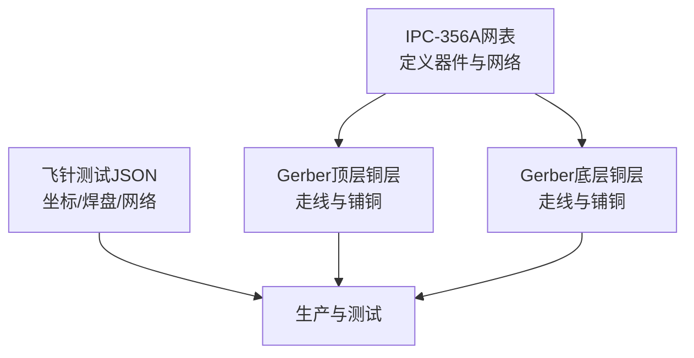
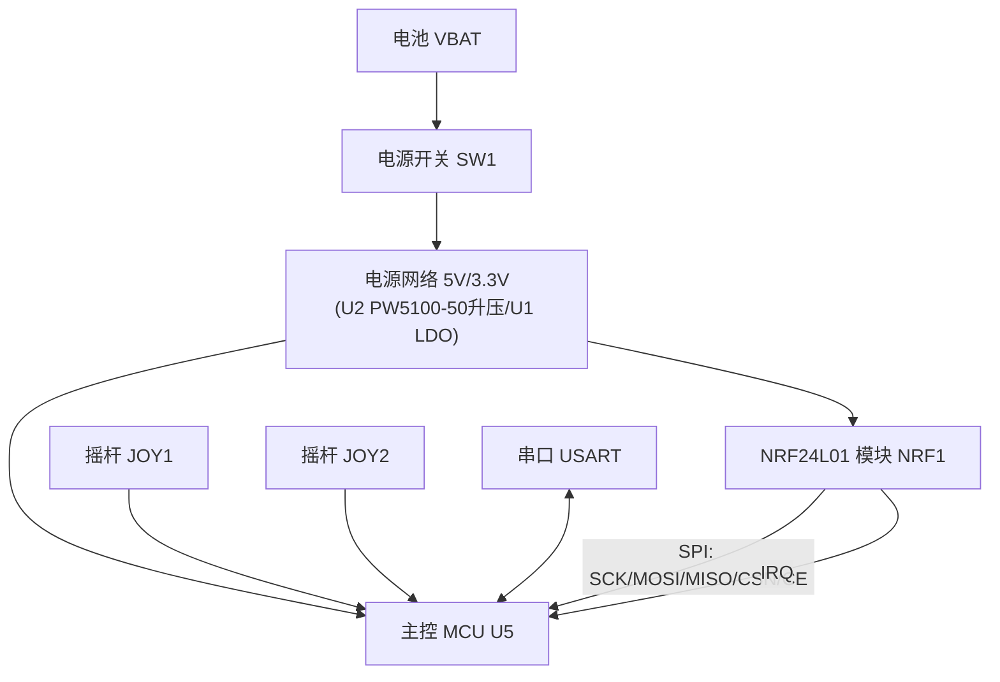
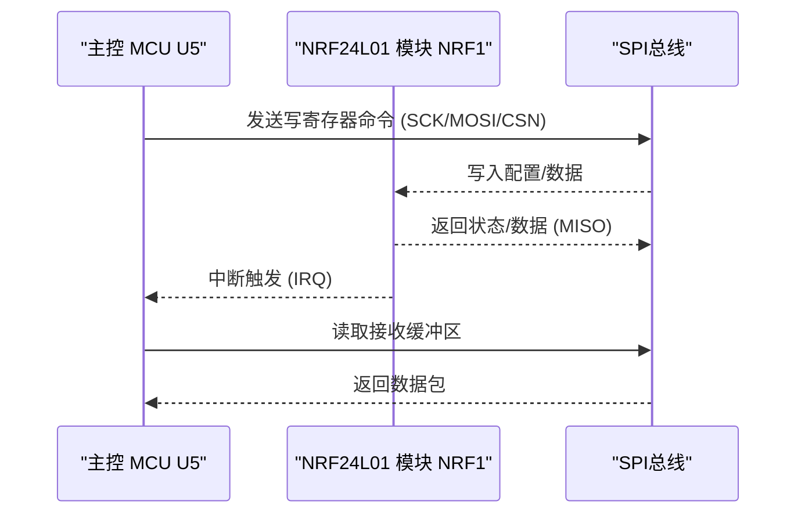
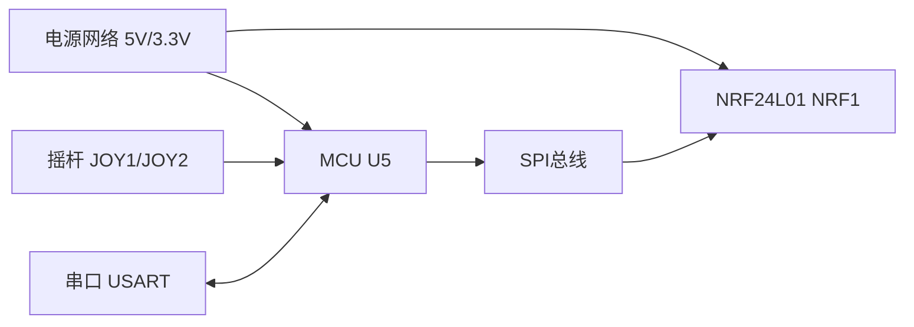

# 无线通信电路

<cite>
**本文引用的文件**
- [IPC_PCB1_75mm_Brushed_FC_V1_2026-08-09.356a](file://IPC_PCB1_75mm_Brushed_FC_V1_2026-08-09.356a)
- [Gerber_TopLayer.GTL](file://gerber_unpacked/Gerber_TopLayer.GTL)
- [Gerber_BottomLayer.GBL](file://gerber_unpacked/Gerber_BottomLayer.GBL)
- [FlyingProbeTesting_PCB1_2026-08-09.json](file://flying_probe_unpacked/FlyingProbeTesting_PCB1_2026-08-09.json)
- [PCB下单必读.txt](file://gerber_unpacked/PCB下单必读.txt)
</cite>

## 目录
1. [简介](#简介)
2. [项目结构](#项目结构)
3. [核心组件](#核心组件)
4. [架构总览](#架构总览)
5. [详细组件分析](#详细组件分析)
6. [依赖关系分析](#依赖关系分析)
7. [性能与射频考量](#性能与射频考量)
8. [故障排查指南](#故障排查指南)
9. [结论](#结论)
10. [附录](#附录)

## 简介
本文件面向无线通信电路设计与实现，重点围绕NRF24L01模块的集成、SPI接口电路、射频匹配网络、天线布局、阻抗匹配与信号完整性优化展开。同时给出2.4GHz频段的EMC设计要点、屏蔽措施与干扰抑制策略，并提供射频测试方法、传输距离优化与抗干扰能力提升方案。文档基于当前工程中的IPC-356A网表、飞针测试JSON以及Gerber层数据进行分析与说明。

## 项目结构
本项目包含以下关键交付物：
- IPC-356A网表：描述器件引脚、网络名与连接关系，用于验证布线与连通性
- Gerber顶层/底层铜层：反映实际走线、过孔与铺铜分布
- 飞针测试JSON：提供元件坐标、焊盘与网络映射，便于生产与测试
- PCB下单说明：指引PCB制造流程

图表来源
- [IPC_PCB1_75mm_Brushed_FC_V1_2026-08-09.356a:1-315](file://IPC_PCB1_75mm_Brushed_FC_V1_2026-08-09.356a#L1-L315)
- [Gerber_TopLayer.GTL:1-200](file://gerber_unpacked/Gerber_TopLayer.GTL#L1-L200)
- [Gerber_BottomLayer.GBL:1-200](file://gerber_unpacked/Gerber_BottomLayer.GBL#L1-L200)
- [FlyingProbeTesting_PCB1_2026-08-09.json:1-589](file://flying_probe_unpacked/FlyingProbeTesting_PCB1_2026-08-09.json#L1-L589)

章节来源
- [IPC_PCB1_75mm_Brushed_FC_V1_2026-08-09.356a:1-315](file://IPC_PCB1_75mm_Brushed_FC_V1_2026-08-09.356a#L1-L315)
- [Gerber_TopLayer.GTL:1-200](file://gerber_unpacked/Gerber_TopLayer.GTL#L1-L200)
- [Gerber_BottomLayer.GBL:1-200](file://gerber_unpacked/Gerber_BottomLayer.GBL#L1-L200)
- [FlyingProbeTesting_PCB1_2026-08-09.json:1-589](file://flying_probe_unpacked/FlyingProbeTesting_PCB1_2026-08-09.json#L1-L589)
- [PCB下单必读.txt:1-4](file://gerber_unpacked/PCB下单必读.txt#L1-L4)

## 核心组件
根据IPC-356A与飞针测试JSON，本板的关键功能块包括：
- NRF24L01无线收发模块（NRF1）：提供2.4GHz ISM频段无线通信能力
- 主控MCU（U5）：通过SPI与NRF24L01通信，并处理摇杆输入与串口输出
- 电源管理（U1、U2、L1、SW1等）：VBAT_SW经U2（PW5100-50同步升压）升至5V、U1（LDO）降压至3.3V，配合电容滤波
- 用户交互：双摇杆（JOY1、JOY2）、串口（USART）、调试接口（SWD）
- 连接器与排针：J1为电池接口，便于供电与测试

章节来源
- [IPC_PCB1_75mm_Brushed_FC_V1_2026-08-09.356a:22-103](file://IPC_PCB1_75mm_Brushed_FC_V1_2026-08-09.356a#L22-L103)
- [FlyingProbeTesting_PCB1_2026-08-09.json:24-33](file://flying_probe_unpacked/FlyingProbeTesting_PCB1_2026-08-09.json#L24-L33)

## 架构总览
从系统层面看，本设计以MCU为核心，NRF24L01作为无线链路，双摇杆作为输入源，串口作为调试与上位机通信通道。电源路径由电池经开关SW1进入VBAT_SW母线，经U2（PW5100-50升压）得到5V、U1（LDO）降压得到3.3V，再分配至各功能模块。

图表来源
- [IPC_PCB1_75mm_Brushed_FC_V1_2026-08-09.356a:22-103](file://IPC_PCB1_75mm_Brushed_FC_V1_2026-08-09.356a#L22-L103)
- [IPC_PCB1_75mm_Brushed_FC_V1_2026-08-09.356a:147-196](file://IPC_PCB1_75mm_Brushed_FC_V1_2026-08-09.356a#L147-L196)

## 详细组件分析

### NRF24L01模块集成与SPI接口
- 模块定位与引脚：NRF1具备3.3V供电、GND、CE、CSN、SCK、MOSI、MISO、IRQ等引脚，均通过IPC-356A与飞针JSON明确网络名
- SPI走线：SCK、MOSI、MISO、CSN、CE在顶层/底层均有走线记录，并通过多个过孔跨层连接，确保短路径与低寄生
- IRQ中断：NRF_IRQ独立走线，利于快速响应数据包到达事件
- 去耦与参考地：NRF1附近存在大量3.3V与GND电容，降低高频噪声；模块下方有完整接地平面支撑

图表来源
- [IPC_PCB1_75mm_Brushed_FC_V1_2026-08-09.356a:22-29](file://IPC_PCB1_75mm_Brushed_FC_V1_2026-08-09.356a#L22-L29)
- [IPC_PCB1_75mm_Brushed_FC_V1_2026-08-09.356a:147-158](file://IPC_PCB1_75mm_Brushed_FC_V1_2026-08-09.356a#L147-L158)
- [IPC_PCB1_75mm_Brushed_FC_V1_2026-08-09.356a:197-212](file://IPC_PCB1_75mm_Brushed_FC_V1_2026-08-09.356a#L197-L212)

章节来源
- [IPC_PCB1_75mm_Brushed_FC_V1_2026-08-09.356a:22-29](file://IPC_PCB1_75mm_Brushed_FC_V1_2026-08-09.356a#L22-L29)
- [IPC_PCB1_75mm_Brushed_FC_V1_2026-08-09.356a:147-158](file://IPC_PCB1_75mm_Brushed_FC_V1_2026-08-09.356a#L147-L158)
- [IPC_PCB1_75mm_Brushed_FC_V1_2026-08-09.356a:197-212](file://IPC_PCB1_75mm_Brushed_FC_V1_2026-08-09.356a#L197-L212)
- [FlyingProbeTesting_PCB1_2026-08-09.json:301-316](file://flying_probe_unpacked/FlyingProbeTesting_PCB1_2026-08-09.json#L301-L316)

### 电源管理与保护
- 输入控制：VBAT经开关SW1进入VBAT_SW母线；当前设计无独立防反接器件，装配时需核对电池接口极性
- 电压转换：U2（PW5100-50同步升压，储能电感L1）产生5V，U1（LDO）降压产生3.3V，配合周边电容滤波
- 去耦电容：多处3.3V与5V节点就近放置去耦电容，降低瞬态电流引起的电压波动
- 关键点：NRF1的3.3V与GND引脚旁有大量电容，保证射频前端供电纯净

章节来源
- [IPC_PCB1_75mm_Brushed_FC_V1_2026-08-09.356a:60-103](file://IPC_PCB1_75mm_Brushed_FC_V1_2026-08-09.356a#L60-L103)
- [IPC_PCB1_75mm_Brushed_FC_V1_2026-08-09.356a:110-141](file://IPC_PCB1_75mm_Brushed_FC_V1_2026-08-09.356a#L110-L141)
- [IPC_PCB1_75mm_Brushed_FC_V1_2026-08-09.356a:142-145](file://IPC_PCB1_75mm_Brushed_FC_V1_2026-08-09.356a#L142-L145)

### 摇杆与串口
- 摇杆：JOY1、JOY2提供X/Y轴模拟量输入，经滤波电容后连接到MCU的ADC（摇杆按键引脚接GND，未接入MCU）
- 串口：USART提供TX/RX与3.3V/GND，便于调试与数据透传
- SWD：调试接口用于烧录与在线调试

章节来源
- [IPC_PCB1_75mm_Brushed_FC_V1_2026-08-09.356a:32-55](file://IPC_PCB1_75mm_Brushed_FC_V1_2026-08-09.356a#L32-L55)
- [IPC_PCB1_75mm_Brushed_FC_V1_2026-08-09.356a:95-102](file://IPC_PCB1_75mm_Brushed_FC_V1_2026-08-09.356a#L95-L102)

### 射频匹配网络与天线设计
- 匹配网络：当前设计中未见明确的LC匹配网络（如串联电感+并联电容）直接位于NRF1射频输出端；建议依据NRF24L01数据手册与模块封装要求，在RF输出到天线馈点之间加入可调匹配网络，以实现50Ω阻抗匹配
- 天线类型：若使用板载PCB天线，需保证天线区域无金属遮挡，且下方参考地为完整平面；若使用外部陶瓷/PIFA天线，应遵循供应商提供的布局规范
- 走线控制：射频走线应采用微带线或共面波导结构，严格控制线宽与间距，保持特性阻抗约50Ω；避免锐角与长回环
- 过孔与回流：射频信号路径下的地平面应连续，减少过孔数量；必要时采用多过孔接地以降低寄生电感

章节来源
- [IPC_PCB1_75mm_Brushed_FC_V1_2026-08-09.356a:197-212](file://IPC_PCB1_75mm_Brushed_FC_V1_2026-08-09.356a#L197-L212)
- [Gerber_TopLayer.GTL:1-200](file://gerber_unpacked/Gerber_TopLayer.GTL#L1-L200)
- [Gerber_BottomLayer.GBL:1-200](file://gerber_unpacked/Gerber_BottomLayer.GBL#L1-L200)

### 信号完整性优化
- SPI高速信号：SCK、MOSI、MISO尽量短直走线，避免跨越分割平面；必要时增加地参考与邻近地线屏蔽
- 时钟与数字噪声隔离：将数字部分与射频部分分区布局，减少耦合；关键信号远离大电流路径
- 电源完整性：在电源入口与每个IC电源引脚附近放置合适容值的去耦电容，形成低阻抗回路

章节来源
- [IPC_PCB1_75mm_Brushed_FC_V1_2026-08-09.356a:110-141](file://IPC_PCB1_75mm_Brushed_FC_V1_2026-08-09.356a#L110-L141)
- [IPC_PCB1_75mm_Brushed_FC_V1_2026-08-09.356a:147-196](file://IPC_PCB1_75mm_Brushed_FC_V1_2026-08-09.356a#L147-L196)

## 依赖关系分析
- 模块间依赖：MCU依赖NRF24L01完成无线通信；NRF24L01依赖稳定电源与良好接地；摇杆与串口依赖MCU进行数据处理
- 电源依赖：所有模块依赖电源网络（5V/3.3V），电源质量直接影响射频性能与系统稳定性
- 信号依赖：SPI信号质量影响NRF24L01配置与数据传输可靠性；IRQ信号延迟会影响实时性

图表来源
- [IPC_PCB1_75mm_Brushed_FC_V1_2026-08-09.356a:22-103](file://IPC_PCB1_75mm_Brushed_FC_V1_2026-08-09.356a#L22-L103)

章节来源
- [IPC_PCB1_75mm_Brushed_FC_V1_2026-08-09.356a:22-103](file://IPC_PCB1_75mm_Brushed_FC_V1_2026-08-09.356a#L22-L103)

## 性能与射频考量
- 2.4GHz频段EMC要点
  - 辐射发射：控制数字边沿速率，合理布局与屏蔽；避免天线区域上方有大面积覆铜或金属件
  - 传导干扰：电源入口加磁珠/电感与电容滤波，减少高频噪声注入
  - 串扰抑制：SPI与射频走线分离，必要时用地线隔离；避免平行长距离走线
- 屏蔽措施
  - 对NRF24L01模块可采用金属屏蔽罩，注意散热与接地
  - 外壳与PCB地良好连接，形成法拉第笼效应
- 干扰抑制
  - 软件层面：跳频、重传机制、RSSI检测与信道选择
  - 硬件层面：合理匹配网络、去耦电容、低噪声LDO/DC-DC
- 射频测试方法与指标
  - 输出功率：使用频谱仪测量2.4GHz中心频率处的输出功率，目标符合模块规格
  - 接收灵敏度：在固定距离下测量误码率对应的最小接收功率
  - 驻波比/回波损耗：使用矢量网络分析仪测量天线端口S11，评估匹配效果
  - 邻道抑制与杂散：检查2.4GHz附近的谐波与杂散发射是否符合法规
- 传输距离优化
  - 提高发射功率（在法规允许范围内）
  - 优化天线增益与方向性
  - 改善环境反射与遮挡，避免金属物体靠近天线
- 抗干扰能力提升
  - 采用前向纠错与数据包校验
  - 动态信道切换与自适应功率控制
  - 合理设置滤波器带宽与解调参数

[本节为通用指导，不直接分析具体文件]

## 故障排查指南
- 无法初始化NRF24L01
  - 检查3.3V供电与去耦电容是否到位
  - 确认SPI时序与电平匹配，CSN/CE控制正确
  - 查看IRQ是否有响应
- 通信不稳定
  - 检查SPI走线长度与地参考连续性
  - 评估天线匹配与周围金属遮挡
  - 调整发射功率与数据速率
- 功耗异常
  - 检查电源路径与负载短路
  - 确认休眠模式与唤醒逻辑
- 使用工具
  - 万用表/示波器：测量电源纹波与SPI波形
  - 频谱仪/网络分析仪：评估射频性能与匹配
  - 飞针测试：验证网络连接与开路/短路

章节来源
- [IPC_PCB1_75mm_Brushed_FC_V1_2026-08-09.356a:22-29](file://IPC_PCB1_75mm_Brushed_FC_V1_2026-08-09.356a#L22-L29)
- [IPC_PCB1_75mm_Brushed_FC_V1_2026-08-09.356a:110-141](file://IPC_PCB1_75mm_Brushed_FC_V1_2026-08-09.356a#L110-L141)
- [IPC_PCB1_75mm_Brushed_FC_V1_2026-08-09.356a:147-196](file://IPC_PCB1_75mm_Brushed_FC_V1_2026-08-09.356a#L147-L196)

## 结论
本设计以NRF24L01为核心构建2.4GHz无线通信链路，结合MCU、电源管理与用户交互模块，形成完整的遥控/遥测平台。当前IPC-356A与Gerber数据显示了清晰的SPI走线与电源布局，但射频匹配网络与天线细节需在后续迭代中完善。通过合理的EMC设计、屏蔽与干扰抑制，以及系统的射频测试与优化，可实现稳定的远距离通信与高抗干扰能力。

[本节为总结性内容，不直接分析具体文件]

## 附录
- 生产与测试
  - 使用Gerber文件进行PCB制造
  - 通过飞针测试JSON进行连通性与位置校验
  - 参考PCB下单说明完成制造流程

章节来源
- [Gerber_TopLayer.GTL:1-200](file://gerber_unpacked/Gerber_TopLayer.GTL#L1-L200)
- [Gerber_BottomLayer.GBL:1-200](file://gerber_unpacked/Gerber_BottomLayer.GBL#L1-L200)
- [FlyingProbeTesting_PCB1_2026-08-09.json:1-589](file://flying_probe_unpacked/FlyingProbeTesting_PCB1_2026-08-09.json#L1-L589)
- [PCB下单必读.txt:1-4](file://gerber_unpacked/PCB下单必读.txt#L1-L4)

## 相关文档
- [射频专项设计](../射频专项设计.md)（2.4GHz 链路板级设计）
- [装配指南](../../装配指南.md)（NRF 引脚装配警告）
- [踩坑记录](../../踩坑记录.md)（引脚反序烧模块教训）
- [调试指南](../../调试指南.md)（NRF 无线调试步骤）
- [主控电路设计](主控电路设计.md)（SPI 主机侧）