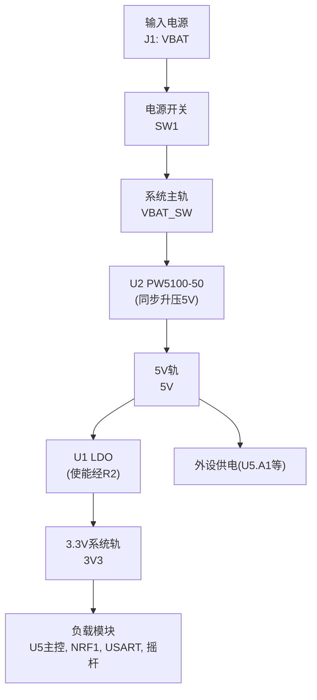
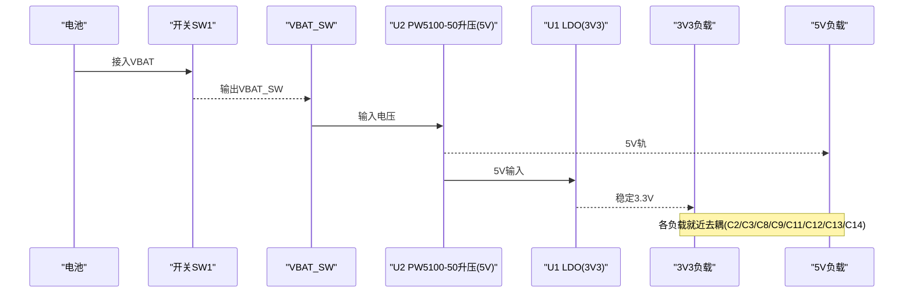
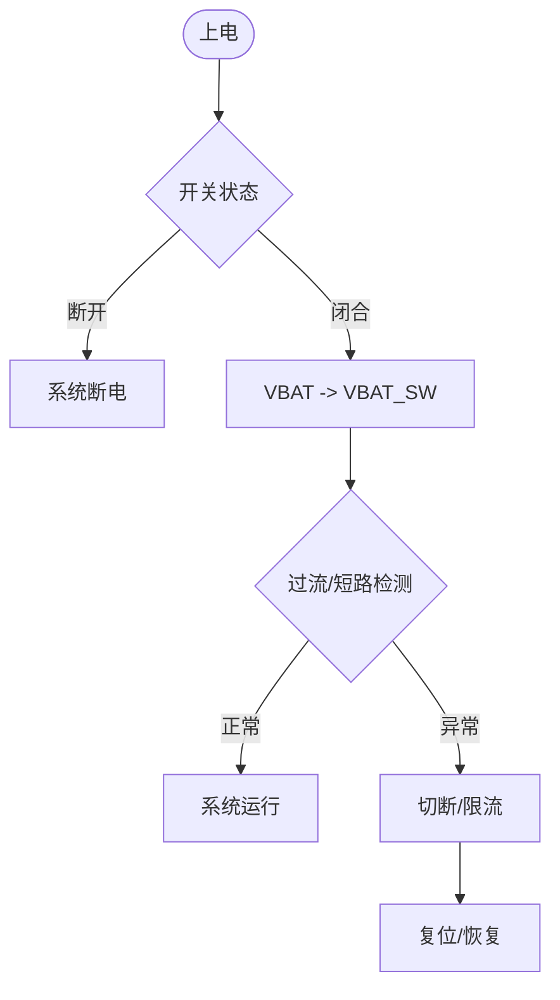
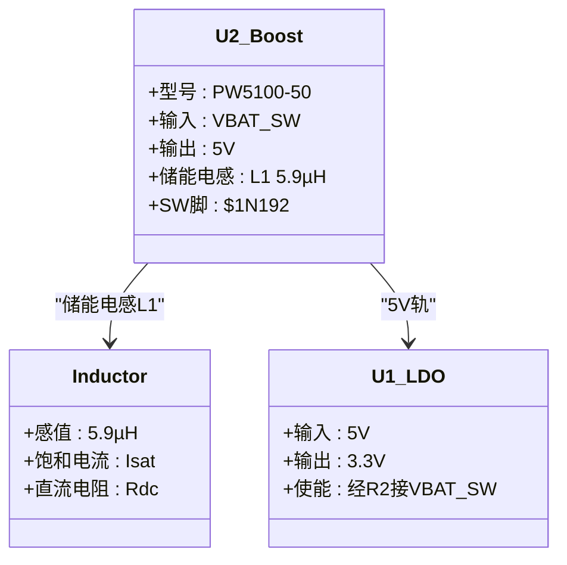
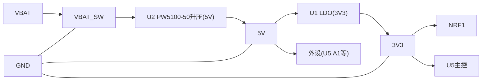

# 电源电路设计

<cite>
**本文引用的文件**
- [FlyingProbeTesting_PCB1_2026-08-09.json](file://flying_probe_unpacked/FlyingProbeTesting_PCB1_2026-08-09.json)
- [FlyingProbeTesting.json](file://gerber_unpacked/FlyingProbeTesting.json)
- [PCB下单必读.txt](file://gerber_unpacked/PCB下单必读.txt)
- [IPC_PCB1_75mm_Brushed_FC_V1_2026-08-09.356a](file://IPC_PCB1_75mm_Brushed_FC_V1_2026-08-09.356a)
</cite>

## 目录
1. [简介](#简介)
2. [项目结构](#项目结构)
3. [核心组件](#核心组件)
4. [架构总览](#架构总览)
5. [详细组件分析](#详细组件分析)
6. [依赖关系分析](#依赖关系分析)
7. [性能与功耗考量](#性能与功耗考量)
8. [故障诊断与测试](#故障诊断与测试)
9. [结论](#结论)
10. [附录](#附录)

## 简介
本文件基于提供的飞针测试数据、Gerber清单与IPC-356A网络表，对包含电池供电、升压与LDO稳压、电源路径控制的电源电路进行系统化设计说明。重点覆盖：
- 电池供电管理与电源路径切换（VBAT至系统负载）
- VBAT_SW经U2（PW5100-50升压）升至5V、U1（LDO）降压至3.3V的转换与去耦布局
- 关键保护机制建议（反接、过流、热保护等）
- 噪声抑制与电源完整性要点
- 热管理方案
- 测试方法与常见故障排查

说明：本文的电源拓扑结论已按网表（Netlist_遥控器原理图_2026-08-10.tel）核实并经设计方确认：VBAT经SW1得到VBAT_SW，先经U2（PW5100-50同步升压，SOT-23-5）升压输出固定5V，再经U1（SOT-23-5 LDO）降压输出3V3。U2第5脚为SW开关节点（$1N192），储能电感L1（5.9µH）接于VBAT_SW与该脚之间。

## 项目结构
本项目包含以下关键资料：
- 飞针测试JSON：描述元件位置、焊盘坐标、网络名（如VBAT、VBAT_SW、3V3、5V、GND等），用于验证电源网络连通性
- Gerber与钻孔文件：制造用数据（此处不展开）
- IPC-356A网络表：以网络名形式定义各引脚连接关系，便于交叉核对电源网络
- PCB下单说明：指向下单流程文档

图表来源
- [FlyingProbeTesting_PCB1_2026-08-09.json:209-236](file://flying_probe_unpacked/FlyingProbeTesting_PCB1_2026-08-09.json#L209-L236)
- [IPC_PCB1_75mm_Brushed_FC_V1_2026-08-09.356a:30-84](file://IPC_PCB1_75mm_Brushed_FC_V1_2026-08-09.356a#L30-L84)

章节来源
- [FlyingProbeTesting_PCB1_2026-08-09.json:209-236](file://flying_probe_unpacked/FlyingProbeTesting_PCB1_2026-08-09.json#L209-L236)
- [IPC_PCB1_75mm_Brushed_FC_V1_2026-08-09.356a:30-84](file://IPC_PCB1_75mm_Brushed_FC_V1_2026-08-09.356a#L30-L84)

## 核心组件
根据网络名与器件封装，可识别出以下电源相关核心部分：
- 电池输入与开关：J1（VBAT，PH2.0-2P）、SW1（SK12D07电源开关）
- 5V升压：U2（PW5100-50，SOT-23-5同步升压，固定输出5.0V），输入VBAT_SW、输出5V；储能电感L1（5.9µH）接于VBAT_SW与U2第5脚SW（$1N192网络）之间
- 3.3V稳压：U1（SOT-23-5 LDO），输入5V、输出3V3，使能端（3脚）经R2（10kΩ）接VBAT_SW
- 系统电源轨：VBAT_SW（经开关后的系统母线）、5V（U2升压输出轨）、3V3（数字逻辑与射频轨）
- 负载模块：NRF1（无线模块，由3V3供电）、U5（主控MCU模块，含UART/SWD/NRF信号）、USART（串口输出）、JOY1/JOY2（摇杆，3V3供电）
- 去耦电容：C1~C14分布于各电源节点附近（C1/C2/C3/C14为10µF，C4~C13为100nF），保障瞬态响应与噪声抑制

章节来源
- [FlyingProbeTesting_PCB1_2026-08-09.json:209-236](file://flying_probe_unpacked/FlyingProbeTesting_PCB1_2026-08-09.json#L209-L236)
- [FlyingProbeTesting_PCB1_2026-08-09.json:339-348](file://flying_probe_unpacked/FlyingProbeTesting_PCB1_2026-08-09.json#L339-L348)
- [IPC_PCB1_75mm_Brushed_FC_V1_2026-08-09.356a:30-84](file://IPC_PCB1_75mm_Brushed_FC_V1_2026-08-09.356a#L30-L84)

## 架构总览
从网络名可见，系统采用“单节锂电直供+升压/LDO降压多轨”的架构：
- 电池VBAT（单节锂电，约3.0~4.2V）经开关SW1进入系统母线VBAT_SW
- U2（PW5100-50同步升压）将VBAT_SW升压为固定5V
- U1（LDO）再将5V降压为3.3V，供给MCU及NRF等数字负载
- 5V轨同时为U5模块等外设供电
- 多处去耦电容就近放置于IC电源引脚附近，降低高频噪声

图表来源
- [FlyingProbeTesting_PCB1_2026-08-09.json:209-236](file://flying_probe_unpacked/FlyingProbeTesting_PCB1_2026-08-09.json#L209-L236)
- [FlyingProbeTesting_PCB1_2026-08-09.json:339-348](file://flying_probe_unpacked/FlyingProbeTesting_PCB1_2026-08-09.json#L339-L348)

## 详细组件分析

### 电池供电与电源路径切换
- 输入与开关：J1提供VBAT；SW1作为主开关，控制VBAT到VBAT_SW的通断
- 路径与储能：L1不在VBAT_SW主通路上，而是接于VBAT_SW与U2第5脚SW（$1N192）之间，作为U2升压电路的储能电感
- 保护建议：在VBAT输入端增加防反接二极管或MOSFET反向阻断；在VBAT_SW后级加入保险丝或PTC实现过流保护；必要时增加TVS抑制浪涌

图表来源
- [FlyingProbeTesting_PCB1_2026-08-09.json:209-236](file://flying_probe_unpacked/FlyingProbeTesting_PCB1_2026-08-09.json#L209-L236)

章节来源
- [FlyingProbeTesting_PCB1_2026-08-09.json:209-236](file://flying_probe_unpacked/FlyingProbeTesting_PCB1_2026-08-09.json#L209-L236)

### 升压与LDO降压转换
- 拓扑识别（已按网表核实，U2型号PW5100-50由设计方确认）：U2 为 PW5100-50 PFM 同步升压转换器（输入0.7~5.0V，固定输出5.0V），输入 VBAT_SW、输出 5V；U1 为 3.3V LDO，输入 5V、输出 3V3；储能电感 L1（5.9µH）接于 VBAT_SW 与 U2 第5脚 SW（$1N192 网络）之间。注意：$1N192/$1N202/$1N203 均为网络名而非器件，网表中不存在续流二极管等分立保护器件（PW5100为同步整流，无需外置二极管）
- 关键参数设计要点
  - 输入电压范围：PW5100-50 支持 0.7~5.0V 输入，单节锂电（3.0~4.2V）全区间可正常升压至5V；输入超过5V会损坏芯片，禁止使用多串电池组
  - 输出电流能力：满足 3.3V 负载峰值需求（含 NRF 发射尖峰），PW5100 输出能力约600mA量级，需核算负载余量
  - 效率与发热：升压效率典型可达95%；U1 LDO 压差×电流为片内功耗，注意温升与降额
  - 稳定性：升压侧按数据手册选取储能电感（饱和电流留裕量）与输出电容；U1 输出电容按 LDO 容值/ESR 要求匹配
- 去耦与布局：3V3节点配置C2、C3、C8、C11、C12等多颗电容就近放置，减小回路面积，抑制高频噪声

图表来源
- [FlyingProbeTesting_PCB1_2026-08-09.json:339-348](file://flying_probe_unpacked/FlyingProbeTesting_PCB1_2026-08-09.json#L339-L348)
- [FlyingProbeTesting_PCB1_2026-08-09.json:209-236](file://flying_probe_unpacked/FlyingProbeTesting_PCB1_2026-08-09.json#L209-L236)

章节来源
- [FlyingProbeTesting_PCB1_2026-08-09.json:339-348](file://flying_probe_unpacked/FlyingProbeTesting_PCB1_2026-08-09.json#L339-L348)

### 电源监控与低功耗模式
- 监控点：建议在VBAT、VBAT_SW、3V3、5V设置分压采样或专用监控芯片，用于欠压/过压告警
- 低功耗策略：
  - 选用低静态电流器件（PW5100静态电流约10µA、U1选低Iq LDO），轻载时降低整机静态功耗
  - 关闭闲置外设（如NRF待机/休眠）
  - 合理分配地平面与电源域，减少漏电流路径
- 休眠唤醒：通过摇杆动作或无线唤醒等外部事件触发，快速恢复工作（当前硬件无独立唤醒按键，摇杆按键引脚未接入主控）

章节来源
- [FlyingProbeTesting_PCB1_2026-08-09.json:209-236](file://flying_probe_unpacked/FlyingProbeTesting_PCB1_2026-08-09.json#L209-L236)

### 电源完整性与噪声抑制
- 去耦策略：每个IC电源引脚就近放置低ESR电容（如C2/C3/C8/C11/C12），大电容靠近电源入口（C1/C10）
- 布线要点：
  - 功率回路与信号回路分离，避免共阻抗耦合
  - 3V3与5V走线加宽以降低IR压降
  - 敏感模拟/射频区域远离电源回路（VBAT_SW主回路与$1N192节点）
- 滤波措施：在关键节点增加π型滤波或磁珠，抑制传导噪声

章节来源
- [FlyingProbeTesting_PCB1_2026-08-09.json:209-236](file://flying_probe_unpacked/FlyingProbeTesting_PCB1_2026-08-09.json#L209-L236)

### 热管理方案
- 散热路径：U1/U2封装下方铺铜并打多个过孔连接到底层地平面，增强散热
- 温升控制：U1 LDO 压差×负载电流即为片内功耗，U2升压损耗集中在芯片与储能电感，需按数据手册热阻核算结温并留裕量
- 热保护：优先选用内置过温保护的芯片（PW5100与常见LDO均具备），或在系统中加入温度监测与降额策略

章节来源
- [FlyingProbeTesting_PCB1_2026-08-09.json:339-348](file://flying_probe_unpacked/FlyingProbeTesting_PCB1_2026-08-09.json#L339-L348)

## 依赖关系分析
- 电源依赖链：VBAT → SW1 → VBAT_SW → U2（PW5100-50升压）→ 5V → U1（LDO）→ 3V3 → 各负载
- 关键网络：
  - VBAT：电池输入
  - VBAT_SW：系统母线
  - 5V：U2（PW5100-50升压）输出，供U1与外设
  - 3V3：数字逻辑、主控与射频模块供电
  - GND：统一参考地
- 器件间耦合：$1N192（VBAT_SW↔L1↔U2第5脚SW）为开关节点，电流变化剧烈，布局上应靠近 U2、走线短小并远离敏感信号

图表来源
- [FlyingProbeTesting_PCB1_2026-08-09.json:209-236](file://flying_probe_unpacked/FlyingProbeTesting_PCB1_2026-08-09.json#L209-L236)
- [IPC_PCB1_75mm_Brushed_FC_V1_2026-08-09.356a:30-84](file://IPC_PCB1_75mm_Brushed_FC_V1_2026-08-09.356a#L30-L84)

章节来源
- [FlyingProbeTesting_PCB1_2026-08-09.json:209-236](file://flying_probe_unpacked/FlyingProbeTesting_PCB1_2026-08-09.json#L209-L236)
- [IPC_PCB1_75mm_Brushed_FC_V1_2026-08-09.356a:30-84](file://IPC_PCB1_75mm_Brushed_FC_V1_2026-08-09.356a#L30-L84)

## 性能与功耗考量
- 效率优化：U2升压效率典型可达95%；U1 LDO 效率≈Vout/Vin，负载允许范围内选型低 Iq 器件
- 动态负载：针对NRF发射瞬间大电流，确保3V3轨有足够的储能电容与低阻抗路径
- 轻载功耗：利用U1使能端（经R2）与NRF休眠降低待机功耗，关闭不必要外设
- 电源质量：控制纹波与噪声，避免影响NRF灵敏度与通信质量

[本节为通用指导，无需特定文件引用]

## 故障诊断与测试
- 上电顺序与电压检查：
  - 测量VBAT、VBAT_SW、3V3、5V是否在标称范围
  - 确认开关SW1动作后VBAT_SW是否建立
- 负载能力测试：
  - 逐步增加3V3与5V负载，观察电压跌落与温升
  - 模拟NRF突发负载，评估瞬态响应
- 噪声与纹波：
  - 使用示波器探头短接地，测量3V3/5V纹波（5V纹波来自升压开关，3V3靠LDO抑制）
  - 检查 VBAT_SW 母线噪声经 L1/U2 的耦合情况
- 保护功能验证：
  - 短路/过流保护触发与恢复（依赖PW5100与LDO芯片内部保护）
  - 注意：当前板上无独立防反接器件，验证时须先核对电池接口极性
- 常见问题定位：
  - 无输出：检查开关SW1、U2输入/输出焊接、U1使能（R2上拉至VBAT_SW）
  - 输出不稳：检查去耦电容、输入电压是否在0.7~5.0V范围、负载是否超额定电流
  - 发热严重：检查压差过大、负载过大、散热不足

章节来源
- [FlyingProbeTesting_PCB1_2026-08-09.json:209-236](file://flying_probe_unpacked/FlyingProbeTesting_PCB1_2026-08-09.json#L209-L236)
- [IPC_PCB1_75mm_Brushed_FC_V1_2026-08-09.356a:30-84](file://IPC_PCB1_75mm_Brushed_FC_V1_2026-08-09.356a#L30-L84)

## 结论
该电源电路采用单节锂电输入、开关控制与"升压（PW5100-50）+LDO降压"的典型架构，具备清晰的VBAT→VBAT_SW→5V→3V3供电链路。通过合理的去耦布局、储能电感与器件选型及保护机制，可满足数字与射频负载的稳定供电需求。后续可在原理图与器件选型阶段进一步细化参数与保护策略，并通过系统级测试验证性能与可靠性。

[本节为总结性内容，无需特定文件引用]

## 附录
- 制造与下单：请参考PCB下单说明文档
- 网络核对：利用IPC-356A与飞针测试JSON进行网络连通性验证

章节来源
- [PCB下单必读.txt:1-4](file://gerber_unpacked/PCB下单必读.txt#L1-L4)
- [IPC_PCB1_75mm_Brushed_FC_V1_2026-08-09.356a:30-84](file://IPC_PCB1_75mm_Brushed_FC_V1_2026-08-09.356a#L30-L84)
- [FlyingProbeTesting_PCB1_2026-08-09.json:209-236](file://flying_probe_unpacked/FlyingProbeTesting_PCB1_2026-08-09.json#L209-L236)

## 相关文档
- [电源完整性设计](../电源完整性设计.md)（去耦与电源树）
- [调试指南](../../调试指南.md)（电源逐级调试）
- [踩坑记录](../../踩坑记录.md)（L1 属性误述教训）
- [电路原理图](电路原理图.md)（完整器件清单）