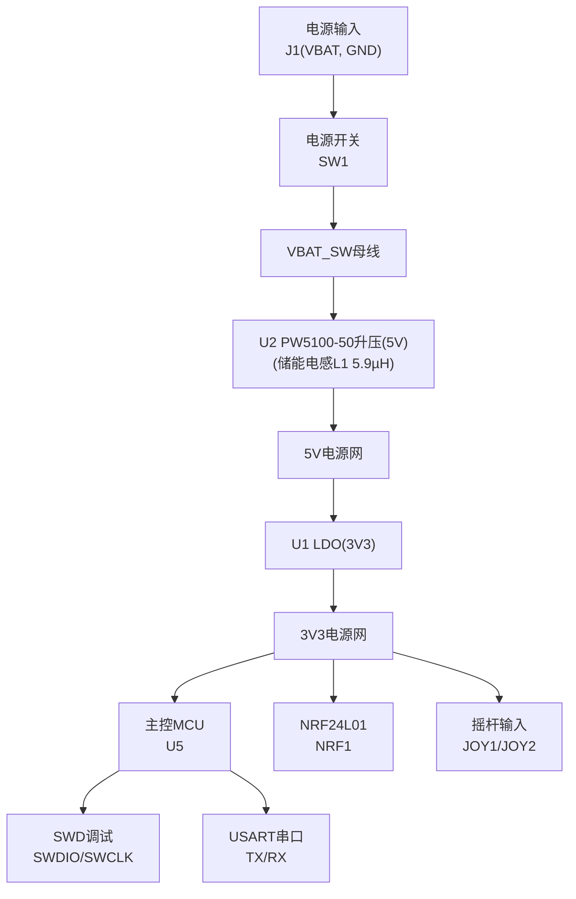
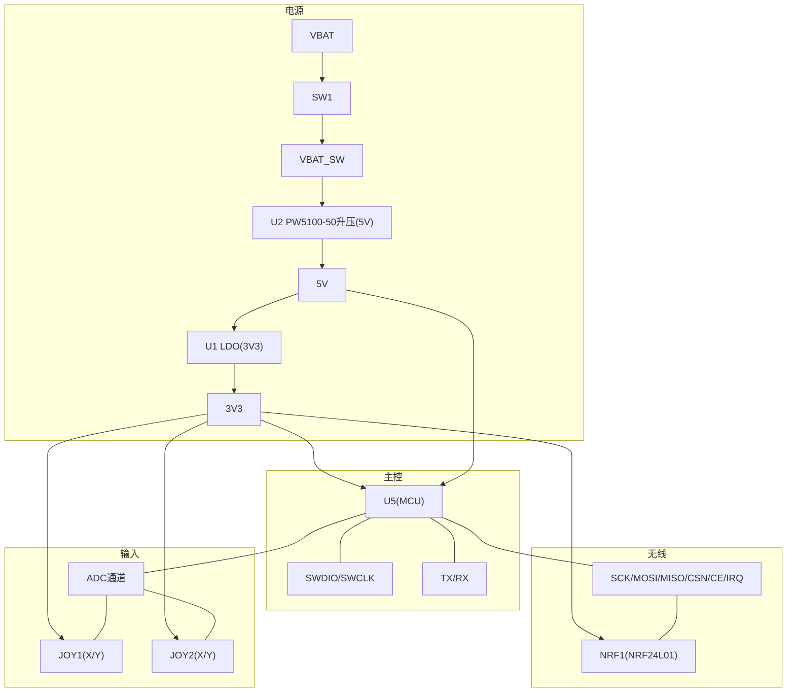
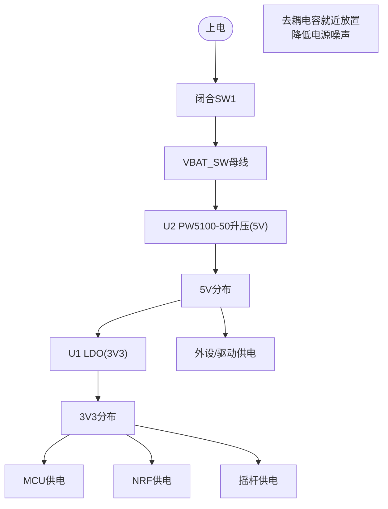
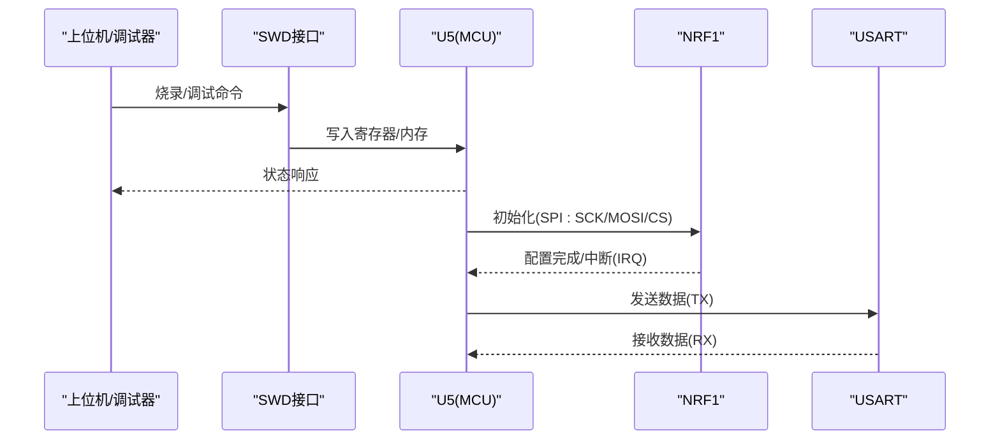
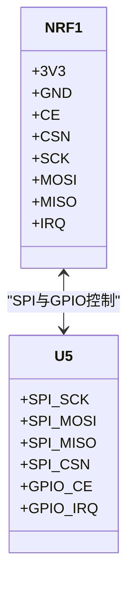
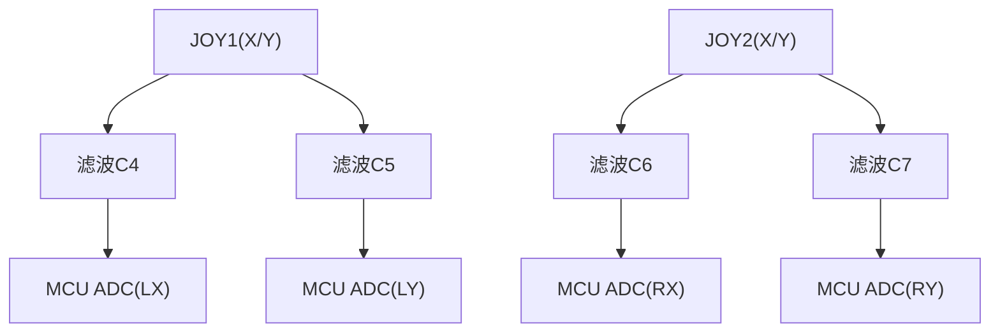
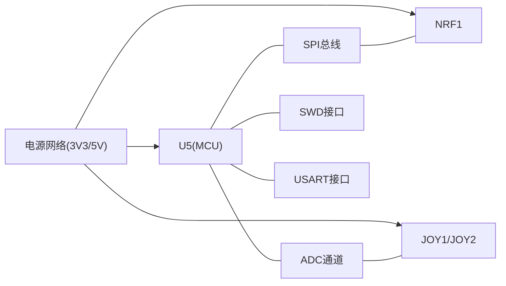

# 电路原理图

<cite>
**本文引用的文件**
- [IPC_PCB1_75mm_Brushed_FC_V1_2026-08-09.356a](file://IPC_PCB1_75mm_Brushed_FC_V1_2026-08-09.356a)
- [FlyingProbeTesting_PCB1_2026-08-09.json](file://flying_probe_unpacked/FlyingProbeTesting_PCB1_2026-08-09.json)
- [Gerber_TopLayer.GTL](file://gerber_unpacked/Gerber_TopLayer.GTL)
- [Gerber_BottomLayer.GBL](file://gerber_unpacked/Gerber_BottomLayer.GBL)
- [Gerber_TopSilkscreenLayer.GTO](file://gerber_unpacked/Gerber_TopSilkscreenLayer.GTO)
- [PCB下单必读.txt](file://gerber_unpacked/PCB下单必读.txt)
</cite>

## 目录
1. [简介](#简介)
2. [项目结构](#项目结构)
3. [核心模块](#核心模块)
4. [架构总览](#架构总览)
5. [详细模块分析](#详细模块分析)
6. [依赖关系分析](#依赖关系分析)
7. [性能与可靠性考虑](#性能与可靠性考虑)
8. [故障诊断与测试](#故障诊断与测试)
9. [结论](#结论)
10. [附录：BOM与规格说明](#附录bom与规格说明)

## 简介
本文件基于提供的IPC-356A、飞针测试JSON与Gerber数据，对一块双面板（Top/Bottom）的75mm级控制板进行系统化梳理。该板包含电源路径管理（VBAT→开关→电感→稳压）、主控MCU（含SWD调试接口与USART输出）、无线通信（NRF24L01 SPI接口）、以及双摇杆模拟输入接口。文档从系统架构、信号流向、关键参数、EMC与信号完整性、到可制造性与测试验证进行完整说明，并给出BOM与元件规格建议。

## 项目结构
- IPC-356A：描述器件引脚、网络名、过孔与走线信息，用于理解各模块间的电气连接。
- Gerber层：顶层铜、底层铜、丝印层，用于确认布局、焊盘、过孔与板框。
- 飞针测试JSON：提供器件坐标、焊盘尺寸、网络映射，便于核对装配与测试点。
- 下单说明：指向PCB下单流程指引。

图表来源
- [IPC_PCB1_75mm_Brushed_FC_V1_2026-08-09.356a:22-104](file://IPC_PCB1_75mm_Brushed_FC_V1_2026-08-09.356a#L22-L104)
- [IPC_PCB1_75mm_Brushed_FC_V1_2026-08-09.356a:142-147](file://IPC_PCB1_75mm_Brushed_FC_V1_2026-08-09.356a#L142-L147)

章节来源
- [IPC_PCB1_75mm_Brushed_FC_V1_2026-08-09.356a:1-10](file://IPC_PCB1_75mm_Brushed_FC_V1_2026-08-09.356a#L1-L10)
- [Gerber_TopLayer.GTL:1-10](file://gerber_unpacked/Gerber_TopLayer.GTL#L1-L10)
- [Gerber_BottomLayer.GBL:1-10](file://gerber_unpacked/Gerber_BottomLayer.GBL#L1-L10)
- [Gerber_TopSilkscreenLayer.GTO:1-10](file://gerber_unpacked/Gerber_TopSilkscreenLayer.GTO#L1-L10)
- [PCB下单必读.txt:1-4](file://gerber_unpacked/PCB下单必读.txt#L1-L4)

## 核心模块
- 电源路径管理：VBAT经开关SW1得到VBAT_SW母线，U2（PW5100-50同步升压）升压产生5V，U1（LDO）再将5V降压为3V3供各模块使用；板上有多个去耦电容就近放置于芯片电源引脚附近。
- 主控MCU：U5为双列直插模块（Arduino Nano兼容封装），引出UART、SWD、NRF控制信号及多路ADC输入（摇杆）。
- 无线通信：NRF1为NRF24L01模块，通过SPI（SCK/MOSI/MISO/CSN/CE）与IRQ与MCU连接。
- 输入接口：两个摇杆模块JOY1/JOY2，提供X/Y轴模拟量接入MCU的ADC通道（摇杆按键引脚接GND，未接入MCU）。

章节来源
- [IPC_PCB1_75mm_Brushed_FC_V1_2026-08-09.356a:22-104](file://IPC_PCB1_75mm_Brushed_FC_V1_2026-08-09.356a#L22-L104)
- [IPC_PCB1_75mm_Brushed_FC_V1_2026-08-09.356a:142-147](file://IPC_PCB1_75mm_Brushed_FC_V1_2026-08-09.356a#L142-L147)
- [FlyingProbeTesting_PCB1_2026-08-09.json:209-416](file://flying_probe_unpacked/FlyingProbeTesting_PCB1_2026-08-09.json#L209-L416)

## 架构总览
下图展示了电源、主控、无线与输入的层次关系与主要信号流。

图表来源
- [IPC_PCB1_75mm_Brushed_FC_V1_2026-08-09.356a:22-104](file://IPC_PCB1_75mm_Brushed_FC_V1_2026-08-09.356a#L22-L104)
- [IPC_PCB1_75mm_Brushed_FC_V1_2026-08-09.356a:142-147](file://IPC_PCB1_75mm_Brushed_FC_V1_2026-08-09.356a#L142-L147)

## 详细模块分析

### 电源电路设计（电压转换与电池管理）
- 输入与开关：J1提供VBAT与GND；SW1作为主电源开关，控制VBAT至VBAT_SW的通断。
- 升压与滤波：U2为PW5100-50同步升压（固定5V），储能电感L1（5.9µH）接于VBAT_SW与U2第5脚SW（$1N192网络）之间；C1/C10在VBAT_SW侧就近去耦。
- 降压与分配：U2输出5V，U1（LDO）将5V降压为3V3（使能端经R2接VBAT_SW），分别供给MCU、NRF与摇杆；3V3与5V网络在各芯片电源引脚处均布置了去耦电容（如C2/C3/C8/C9/C11/C12/C13/C14），以降低电源阻抗与噪声耦合。
- 电源路径管理要点：
  - 开关位置靠近输入端，减少长路径寄生电感。
  - 大电容靠近稳压器输入/输出，小电容靠近IC电源引脚，形成多级去耦。
  - $1N192（VBAT_SW↔L1↔U2第5脚SW）为开关节点，走线短小，靠近U2布置。
  - 地平面连续，避免电源回流路径割裂。

图表来源
- [IPC_PCB1_75mm_Brushed_FC_V1_2026-08-09.356a:103-147](file://IPC_PCB1_75mm_Brushed_FC_V1_2026-08-09.356a#L103-L147)
- [IPC_PCB1_75mm_Brushed_FC_V1_2026-08-09.356a:110-141](file://IPC_PCB1_75mm_Brushed_FC_V1_2026-08-09.356a#L110-L141)

章节来源
- [IPC_PCB1_75mm_Brushed_FC_V1_2026-08-09.356a:103-147](file://IPC_PCB1_75mm_Brushed_FC_V1_2026-08-09.356a#L103-L147)
- [FlyingProbeTesting_PCB1_2026-08-09.json:209-236](file://flying_probe_unpacked/FlyingProbeTesting_PCB1_2026-08-09.json#L209-L236)

### 主控电路设计（ARM微控制器外围）
- 封装与引脚：U5为双列直插封装，引出5V、3V3、GND、TX/RX（串口）、SWDIO/SWCLK、NRF控制信号（CE/CSN/MOSI/MISO/SCK/IRQ）以及多路ADC输入（JOY_LX/LY/RX/RY）。
- 调试与通信：
  - SWD接口用于程序下载与调试。
  - USART接口用于串口通信（TX/RX）。
- 信号完整性：
  - SPI总线（SCK/MOSI/MISO/CSN）采用短路径与地回绕，必要时使用过孔跨层以减小环路面积。
  - 数字信号线与模拟输入（摇杆）分区布局，避免串扰。
- 电源与地：
  - 3V3/5V分别供电，数字地与模拟地在单点汇聚，降低噪声耦合。

图表来源
- [IPC_PCB1_75mm_Brushed_FC_V1_2026-08-09.356a:74-89](file://IPC_PCB1_75mm_Brushed_FC_V1_2026-08-09.356a#L74-L89)
- [IPC_PCB1_75mm_Brushed_FC_V1_2026-08-09.356a:95-102](file://IPC_PCB1_75mm_Brushed_FC_V1_2026-08-09.356a#L95-L102)

章节来源
- [IPC_PCB1_75mm_Brushed_FC_V1_2026-08-09.356a:60-89](file://IPC_PCB1_75mm_Brushed_FC_V1_2026-08-09.356a#L60-L89)
- [IPC_PCB1_75mm_Brushed_FC_V1_2026-08-09.356a:95-102](file://IPC_PCB1_75mm_Brushed_FC_V1_2026-08-09.356a#L95-L102)
- [FlyingProbeTesting_PCB1_2026-08-09.json:349-416](file://flying_probe_unpacked/FlyingProbeTesting_PCB1_2026-08-09.json#L349-L416)

### 无线通信电路（NRF24L01集成）
- 接口定义：NRF1通过SPI与MCU连接，包括SCK、MOSI、MISO、CSN、CE，以及中断IRQ。
- 电源与去耦：NRF1的3V3与GND引脚就近放置去耦电容，确保射频段稳定供电。
- 布局与布线：
  - SPI信号尽量短且平行，避免跨越分割区。
  - IRQ信号注意抗干扰，必要时加RC滤波或上拉电阻。
- 天线与匹配：若为板载天线，需关注天线区域净空与匹配网络；若为模块形式，按模块参考设计布局。

图表来源
- [IPC_PCB1_75mm_Brushed_FC_V1_2026-08-09.356a:22-29](file://IPC_PCB1_75mm_Brushed_FC_V1_2026-08-09.356a#L22-L29)
- [IPC_PCB1_75mm_Brushed_FC_V1_2026-08-09.356a:74-89](file://IPC_PCB1_75mm_Brushed_FC_V1_2026-08-09.356a#L74-L89)

章节来源
- [IPC_PCB1_75mm_Brushed_FC_V1_2026-08-09.356a:22-29](file://IPC_PCB1_75mm_Brushed_FC_V1_2026-08-09.356a#L22-L29)
- [IPC_PCB1_75mm_Brushed_FC_V1_2026-08-09.356a:74-89](file://IPC_PCB1_75mm_Brushed_FC_V1_2026-08-09.356a#L74-L89)
- [FlyingProbeTesting_PCB1_2026-08-09.json:301-316](file://flying_probe_unpacked/FlyingProbeTesting_PCB1_2026-08-09.json#L301-L316)

### 输入接口电路（双摇杆模块连接）
- 接口定义：JOY1与JOY2提供X/Y轴模拟量，分别接至MCU的ADC通道（JOY_LX/LY/RX/RY）。
- 电源与地：摇杆模块由3V3供电（3/4脚），GND与系统地相连；每个轴信号就近放置滤波电容（C4/C5/C6/C7，100nF对地）以滤除噪声。
- 信号完整性：
  - 模拟信号走线远离高速数字线（SPI/时钟）。
  - 保持短路径与良好接地，避免地弹与串扰。
- 按键说明：摇杆自带的按键开关引脚在本板上直接接GND，当前设计不采集按键信号。

图表来源
- [IPC_PCB1_75mm_Brushed_FC_V1_2026-08-09.356a:32-59](file://IPC_PCB1_75mm_Brushed_FC_V1_2026-08-09.356a#L32-L59)
- [IPC_PCB1_75mm_Brushed_FC_V1_2026-08-09.356a:114-121](file://IPC_PCB1_75mm_Brushed_FC_V1_2026-08-09.356a#L114-L121)

章节来源
- [IPC_PCB1_75mm_Brushed_FC_V1_2026-08-09.356a:32-59](file://IPC_PCB1_75mm_Brushed_FC_V1_2026-08-09.356a#L32-L59)
- [IPC_PCB1_75mm_Brushed_FC_V1_2026-08-09.356a:114-121](file://IPC_PCB1_75mm_Brushed_FC_V1_2026-08-09.356a#L114-L121)
- [FlyingProbeTesting_PCB1_2026-08-09.json:241-288](file://flying_probe_unpacked/FlyingProbeTesting_PCB1_2026-08-09.json#L241-L288)

## 依赖关系分析
- 电源依赖：所有模块依赖3V3/5V，电源稳定性直接影响MCU与NRF工作。
- 信号依赖：NRF与MCU通过SPI强耦合，需保证时序与阻抗匹配；摇杆模拟信号依赖低噪声电源与干净地。
- 调试与通信：SWD与USART对外部工具依赖，需保证接口可达性与电平兼容。

图表来源
- [IPC_PCB1_75mm_Brushed_FC_V1_2026-08-09.356a:22-104](file://IPC_PCB1_75mm_Brushed_FC_V1_2026-08-09.356a#L22-L104)

章节来源
- [IPC_PCB1_75mm_Brushed_FC_V1_2026-08-09.356a:22-104](file://IPC_PCB1_75mm_Brushed_FC_V1_2026-08-09.356a#L22-L104)

## 性能与可靠性考虑
- 电源路径管理：
  - 开关与电感靠近输入，减少寄生电感与EMI辐射。
  - 多级去耦（大电容+小电容）覆盖宽频带噪声。
  - 地平面完整，避免分割造成回流路径过长。
- 信号完整性：
  - SPI走线短且平行，避免跨分割；必要时使用地过孔屏蔽。
  - 模拟输入远离数字噪声源，保持独立地回路。
- EMC设计要点：
  - 关键信号包地或邻近地平面，减小环路面积。
  - 射频部分（NRF）远离金属结构与长走线，保持净空。
  - 输入端口（VBAT）增加TVS或压敏电阻（可选）以增强ESD防护。
- 热设计与可靠性：
  - 功率器件（电感、稳压器）留足散热空间。
  - 合理选择电容耐压与温度等级，确保长期稳定。

[本节为通用指导，不直接分析具体文件]

## 故障诊断与测试
- 电源测试：
  - 测量VBAT、VBAT_SW、3V3、5V电压是否在标称范围。
  - 检查去耦电容是否焊接良好，有无短路或开路。
- 通信测试：
  - 用逻辑分析仪或示波器观察SPI波形（SCK/MOSI/MISO/CSN/CE/IRQ），确认时序与幅度。
  - 通过USART打印日志，验证MCU初始化与NRF通信。
- 输入测试：
  - 读取摇杆ADC值，验证零位与满量程范围。
  - 摇杆按键引脚在本板上接GND未接入MCU，无需按键测试。
- 飞针测试：
  - 依据飞针测试JSON中的焊盘与网络信息进行连通性测试，定位开路/短路问题。

章节来源
- [FlyingProbeTesting_PCB1_2026-08-09.json:209-416](file://flying_probe_unpacked/FlyingProbeTesting_PCB1_2026-08-09.json#L209-L416)

## 结论
该板围绕“电源→主控→无线→输入”的主干架构展开，电源路径清晰、去耦完善；主控通过SPI与NRF通信，并提供SWD与USART接口；双摇杆模拟输入通过ADC采集。整体设计注重信号完整性与EMC，具备较好的可制造性与可测试性。建议在后续迭代中进一步优化射频布局与电源噪声抑制，以提升系统稳定性与可靠性。

[本节为总结，不直接分析具体文件]

## 附录：BOM与规格说明
以下为根据IPC-356A与飞针测试JSON提取的关键器件清单与用途说明（不含具体型号与参数，仅列出功能与位置）：

- 电源与保护
  - J1：电源输入接口（VBAT/GND，PH2.0-2P）
  - SW1：主电源开关（SK12D07拨动开关）
  - L1：储能电感（5.9µH，接于VBAT_SW与U2第5脚SW之间，$1N192）
  - U2：PW5100-50 同步升压转换器（VBAT_SW→5V，SOT-23-5）
  - U1：3.3V LDO 线性稳压器（5V→3V3，使能经R2控制）
  - R1：U5.B3上拉电阻（10kΩ，接3V3）
  - R2：U1使能上拉电阻（10kΩ，接VBAT_SW）
  - C1：输入侧大容量滤波电容（10µF，VBAT_SW）；C10：VBAT_SW去耦电容（100nF）
  - C2/C3/C14：电源轨储能电容（10µF）；C4~C9/C11/C12/C13：去耦/滤波电容（100nF）

- 主控与接口
  - U5：主控MCU（双列直插，引出UART/SWD/NRF控制/ADC）
  - SWD：调试接口（SWDIO/SWCLK）
  - USART：串口输出（TX/RX）

- 无线通信
  - NRF1：NRF24L01模块（SPI与IRQ）

- 输入接口
  - JOY1/JOY2：双摇杆模块（RKJXV1224005，X/Y轴模拟量，按键引脚接GND）
  - C4/C5/C6/C7：摇杆信号滤波电容（100nF）

章节来源
- [IPC_PCB1_75mm_Brushed_FC_V1_2026-08-09.356a:22-104](file://IPC_PCB1_75mm_Brushed_FC_V1_2026-08-09.356a#L22-L104)
- [IPC_PCB1_75mm_Brushed_FC_V1_2026-08-09.356a:110-141](file://IPC_PCB1_75mm_Brushed_FC_V1_2026-08-09.356a#L110-L141)
- [IPC_PCB1_75mm_Brushed_FC_V1_2026-08-09.356a:142-147](file://IPC_PCB1_75mm_Brushed_FC_V1_2026-08-09.356a#L142-L147)
- [FlyingProbeTesting_PCB1_2026-08-09.json:209-416](file://flying_probe_unpacked/FlyingProbeTesting_PCB1_2026-08-09.json#L209-L416)

## 相关文档
- [电源电路设计](电源电路设计.md)（升压与LDO降压电路详解）
- [主控电路设计](主控电路设计.md)（U5 主控）
- [无线通信电路](无线通信电路.md)（NRF 接口）
- [输入接口电路](输入接口电路.md)（双摇杆）
- [版本与变更记录](../../版本与变更记录.md)（网表数据源说明）