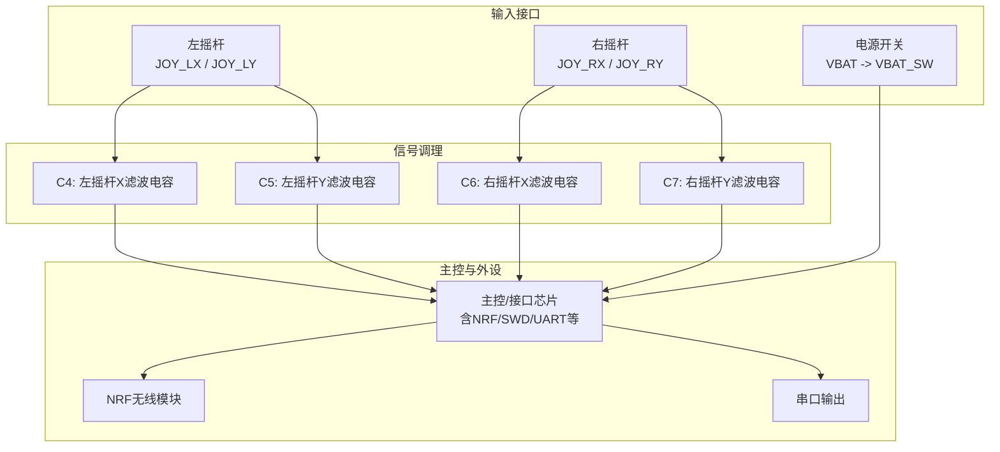
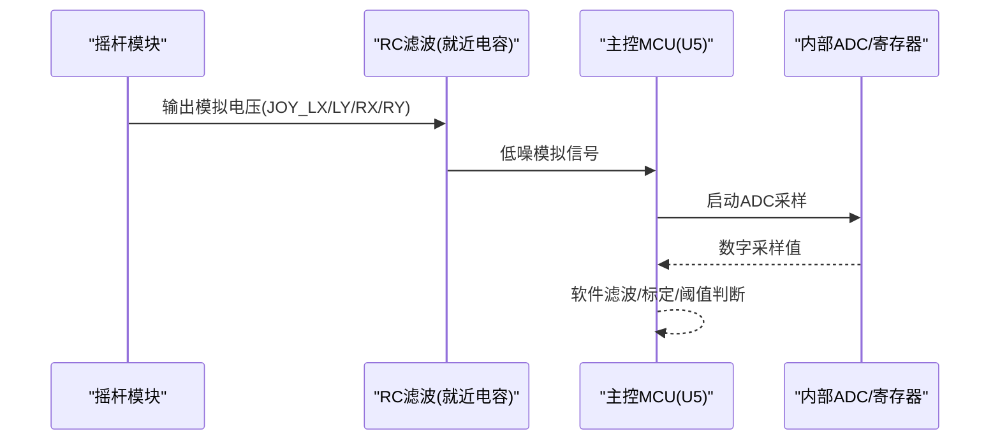
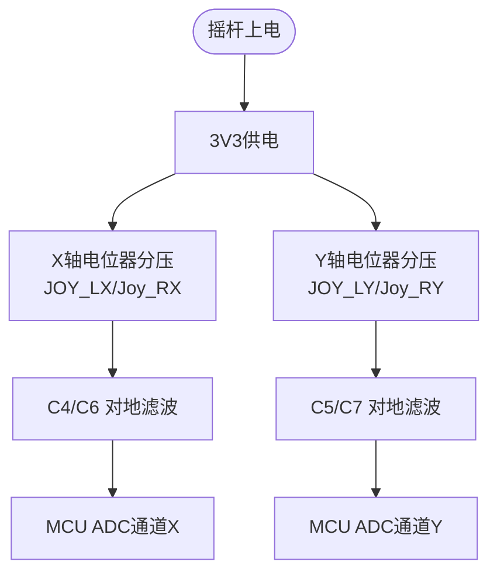
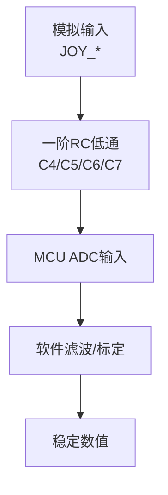
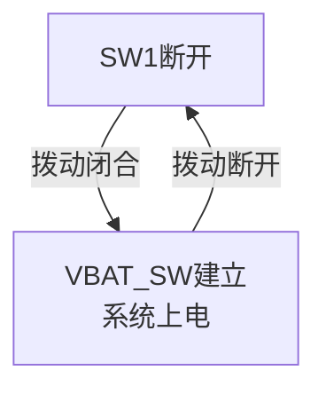
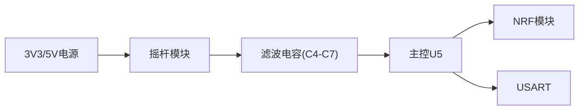

# 输入接口电路

<cite>
**本文引用的文件**
- [FlyingProbeTesting_PCB1_2026-08-09.json](file://flying_probe_unpacked/FlyingProbeTesting_PCB1_2026-08-09.json)
- [IPC_PCB1_75mm_Brushed_FC_V1_2026-08-09.356a](file://IPC_PCB1_75mm_Brushed_FC_V1_2026-08-09.356a)
- [Gerber_DocumentLayer.GDL](file://gerber_unpacked/Gerber_DocumentLayer.GDL)
- [PCB下单必读.txt](file://gerber_unpacked/PCB下单必读.txt)
</cite>

## 目录
1. [简介](#简介)
2. [项目结构](#项目结构)
3. [核心组件](#核心组件)
4. [架构总览](#架构总览)
5. [详细组件分析](#详细组件分析)
6. [依赖关系分析](#依赖关系分析)
7. [性能与信号完整性](#性能与信号完整性)
8. [故障排查指南](#故障排查指南)
9. [结论](#结论)
10. [附录：测试与验证建议](#附录测试与验证建议)

## 简介
本设计文档聚焦于输入接口电路，围绕双摇杆模块连接、模拟信号调理与滤波、ADC采样路径以及按键检测电路展开。基于提供的飞针测试数据与IPC-356A网表，梳理了从摇杆X/Y轴模拟输出到主控MCU的完整信号链路，并给出噪声抑制、响应速度与精度优化的工程化方案。同时提供接口时序图与测试验证要点，便于生产与调试。

## 项目结构
本项目包含以下关键资料：
- 飞针测试JSON：记录了元件位置、网络名称与引脚连接（如JOY_LX/LY/RX/RY、电源网络、SWD/USART等）
- IPC-356A网表：提供了完整的网络清单与器件引脚映射
- Gerber文档层：用于确认板级信息与制造参数
- PCB下单说明：外部链接指引

图表来源
- [FlyingProbeTesting_PCB1_2026-08-09.json:215-226](file://flying_probe_unpacked/FlyingProbeTesting_PCB1_2026-08-09.json#L215-L226)
- [IPC_PCB1_75mm_Brushed_FC_V1_2026-08-09.356a:66-74](file://IPC_PCB1_75mm_Brushed_FC_V1_2026-08-09.356a#L66-L74)

章节来源
- [FlyingProbeTesting_PCB1_2026-08-09.json:215-226](file://flying_probe_unpacked/FlyingProbeTesting_PCB1_2026-08-09.json#L215-L226)
- [IPC_PCB1_75mm_Brushed_FC_V1_2026-08-09.356a:66-74](file://IPC_PCB1_75mm_Brushed_FC_V1_2026-08-09.356a#L66-L74)

## 核心组件
- 双摇杆模块
  - 左摇杆JOY1：提供X轴JOY_LX与Y轴JOY_LY模拟输出，供电3V3，参考地GND
  - 右摇杆JOY2：提供X轴JOY_RX与Y轴JOY_RY模拟输出，供电3V3，参考地GND
- 模拟信号滤波
  - 在每条摇杆信号线上就近放置去耦/滤波电容（C4/C5/C6/C7），对高频噪声进行旁路
- 电源与开关
  - 电源入口J1（VBAT/GND），经开关SW1输出VBAT_SW，为系统供电
- 主控与通信
  - 主控U5引出NRF相关接口（SCK/MOSI/MISO/CE/CSN/IRQ）、SWD调试、UART TX/RX
  - 另有NRF1独立模块及USART接口

章节来源
- [FlyingProbeTesting_PCB1_2026-08-09.json:215-226](file://flying_probe_unpacked/FlyingProbeTesting_PCB1_2026-08-09.json#L215-L226)
- [FlyingProbeTesting_PCB1_2026-08-09.json:241-296](file://flying_probe_unpacked/FlyingProbeTesting_PCB1_2026-08-09.json#L241-L296)
- [IPC_PCB1_75mm_Brushed_FC_V1_2026-08-09.356a:66-74](file://IPC_PCB1_75mm_Brushed_FC_V1_2026-08-09.356a#L66-L74)
- [IPC_PCB1_75mm_Brushed_FC_V1_2026-08-09.356a:142-146](file://IPC_PCB1_75mm_Brushed_FC_V1_2026-08-09.356a#L142-L146)

## 架构总览
输入接口由“摇杆传感器→C滤波→MCU ADC”构成主路径；整机供电由电源开关SW1控制；通信与调试通过NRF与SWD/UART完成。注意：摇杆自带的按键开关引脚在本板上直接接GND，未接入MCU，当前设计不采集按键信号。

图表来源
- [FlyingProbeTesting_PCB1_2026-08-09.json:215-226](file://flying_probe_unpacked/FlyingProbeTesting_PCB1_2026-08-09.json#L215-L226)
- [IPC_PCB1_75mm_Brushed_FC_V1_2026-08-09.356a:66-74](file://IPC_PCB1_75mm_Brushed_FC_V1_2026-08-09.356a#L66-L74)

## 详细组件分析

### 双摇杆模块连接电路
- 供电与接地
  - 左右摇杆均使用3V3供电，GND共地，确保ADC参考一致
- 信号路径
  - 左摇杆：JOY_LX、JOY_LY
  - 右摇杆：JOY_RX、JOY_RY
- 就近滤波
  - 每个信号线对地并联小容量电容（C4/C5/C6/C7），形成低通滤波，抑制高频噪声与振铃

图表来源
- [FlyingProbeTesting_PCB1_2026-08-09.json:241-296](file://flying_probe_unpacked/FlyingProbeTesting_PCB1_2026-08-09.json#L241-L296)
- [FlyingProbeTesting_PCB1_2026-08-09.json:215-226](file://flying_probe_unpacked/FlyingProbeTesting_PCB1_2026-08-09.json#L215-L226)

章节来源
- [FlyingProbeTesting_PCB1_2026-08-09.json:241-296](file://flying_probe_unpacked/FlyingProbeTesting_PCB1_2026-08-09.json#L241-L296)
- [FlyingProbeTesting_PCB1_2026-08-09.json:215-226](file://flying_probe_unpacked/FlyingProbeTesting_PCB1_2026-08-09.json#L215-L226)

### ADC采样电路与模拟信号调理
- 信号源特性
  - 摇杆内部为电位器分压，输出0~3.3V模拟电压，随摇杆位置变化
- 滤波设计
  - 在信号线与地之间并联电容（C4/C5/C6/C7），与线路寄生电阻形成一阶低通，衰减高频噪声
  - 电容尽量靠近摇杆引脚放置，减小环路面积，降低耦合干扰
- 采样优化
  - 建议在MCU侧配置合适的ADC采样时间，避免输入阻抗过高导致建立时间不足
  - 可结合软件滑动平均或中值滤波进一步平滑读数

图表来源
- [FlyingProbeTesting_PCB1_2026-08-09.json:215-226](file://flying_probe_unpacked/FlyingProbeTesting_PCB1_2026-08-09.json#L215-L226)

章节来源
- [FlyingProbeTesting_PCB1_2026-08-09.json:215-226](file://flying_probe_unpacked/FlyingProbeTesting_PCB1_2026-08-09.json#L215-L226)

### 电源开关SW1与摇杆按键说明
- 电源开关
  - SW1（SK12D07拨动开关）作为电源开关，将VBAT切换至VBAT_SW，控制整机供电
  - 拨动开关接触可靠，一般无需软件消抖；VBAT_SW节点已有C1/C10去耦
- 摇杆按键说明
  - JOY1/JOY2自带的按键开关引脚在本板上直接接GND，未接入MCU，当前设计无法读取按键状态
  - 如需按键功能，须在下一版本硬件中将按键引脚引至MCU GPIO并配置上拉

图表来源
- [IPC_PCB1_75mm_Brushed_FC_V1_2026-08-09.356a:142-146](file://IPC_PCB1_75mm_Brushed_FC_V1_2026-08-09.356a#L142-L146)
- [FlyingProbeTesting_PCB1_2026-08-09.json:321-330](file://flying_probe_unpacked/FlyingProbeTesting_PCB1_2026-08-09.json#L321-L330)

章节来源
- [IPC_PCB1_75mm_Brushed_FC_V1_2026-08-09.356a:142-146](file://IPC_PCB1_75mm_Brushed_FC_V1_2026-08-09.356a#L142-L146)
- [FlyingProbeTesting_PCB1_2026-08-09.json:321-330](file://flying_probe_unpacked/FlyingProbeTesting_PCB1_2026-08-09.json#L321-L330)

### 信号完整性保证与噪声抑制
- 布局布线
  - 摇杆信号线短而直，远离高速数字线与开关电源回路
  - 滤波电容紧贴信号引脚，地线短粗，减少环路电感
- 电源完整性
  - 3V3与5V分别就近去耦，降低电源纹波对ADC的影响
- 参考地与屏蔽
  - 模拟地与数字地单点汇聚，避免地弹耦合
  - 敏感信号包地或走内层，降低辐射与串扰

章节来源
- [FlyingProbeTesting_PCB1_2026-08-09.json:215-226](file://flying_probe_unpacked/FlyingProbeTesting_PCB1_2026-08-09.json#L215-L226)
- [IPC_PCB1_75mm_Brushed_FC_V1_2026-08-09.356a:110-120](file://IPC_PCB1_75mm_Brushed_FC_V1_2026-08-09.356a#L110-L120)

### 响应速度优化
- 硬件
  - 合理选择滤波电容值，兼顾噪声抑制与响应速度
- 软件
  - 采用事件驱动或中断方式触发ADC采样，减少轮询开销
  - 使用指数加权移动平均（EWMA）或滑动窗口滤波，平衡实时性与稳定性

[本节为通用工程建议，不直接引用具体文件]

## 依赖关系分析
- 摇杆信号依赖3V3电源与GND参考
- 滤波电容依赖良好的地平面与短回路
- 主控U5依赖稳定的3V3/5V电源与干净的模拟输入
- 通信模块NRF与串口依赖正确的时钟与数据线连接

图表来源
- [IPC_PCB1_75mm_Brushed_FC_V1_2026-08-09.356a:66-74](file://IPC_PCB1_75mm_Brushed_FC_V1_2026-08-09.356a#L66-L74)
- [IPC_PCB1_75mm_Brushed_FC_V1_2026-08-09.356a:110-120](file://IPC_PCB1_75mm_Brushed_FC_V1_2026-08-09.356a#L110-L120)

章节来源
- [IPC_PCB1_75mm_Brushed_FC_V1_2026-08-09.356a:66-74](file://IPC_PCB1_75mm_Brushed_FC_V1_2026-08-09.356a#L66-L74)
- [IPC_PCB1_75mm_Brushed_FC_V1_2026-08-09.356a:110-120](file://IPC_PCB1_75mm_Brushed_FC_V1_2026-08-09.356a#L110-L120)

## 性能与信号完整性
- 采样精度
  - 确保ADC参考电压稳定，避免电源纹波影响
  - 校准零点与满量程，消除系统误差
- 噪声抑制
  - 利用RC低通与软件滤波双重手段
  - 缩短信号路径，降低天线效应
- 响应速度
  - 根据应用需求调整滤波强度与采样率
  - 使用DMA或中断提升采集效率

[本节为通用工程建议，不直接引用具体文件]

## 故障排查指南
- 现象：摇杆读数漂移或跳动
  - 检查C4-C7是否虚焊或容值不符
  - 检查3V3电源纹波与地线连接
- 现象：摇杆按键无反应
  - 按键引脚在本板上接GND未接入MCU，属设计限制，需硬件改版支持
- 现象：通信异常
  - 核对NRF与UART连线，检查时钟与使能信号

章节来源
- [FlyingProbeTesting_PCB1_2026-08-09.json:215-226](file://flying_probe_unpacked/FlyingProbeTesting_PCB1_2026-08-09.json#L215-L226)
- [IPC_PCB1_75mm_Brushed_FC_V1_2026-08-09.356a:142-146](file://IPC_PCB1_75mm_Brushed_FC_V1_2026-08-09.356a#L142-L146)

## 结论
本输入接口电路以双摇杆为核心，通过就近RC滤波与合理的电源分配，实现了稳定的模拟信号采集。配合软件滤波与去抖策略，可有效抑制噪声与抖动，满足高精度与快速响应的需求。后续可根据实际产品要求进一步优化滤波参数与采样策略。

[本节为总结性内容，不直接引用具体文件]

## 附录：测试与验证建议
- 静态测试
  - 测量各摇杆在中心、极限位置的电压，验证线性度与范围
- 动态测试
  - 快速摆动摇杆，观察ADC读数波动，评估滤波效果
- 电源测试
  - 监测3V3/5V纹波，确保不影响ADC精度
- 开关测试
  - 反复拨动SW1，确认每次均能可靠上电/断电

[本节为通用测试建议，不直接引用具体文件]

## 相关文档
- [整机校准](../../整机校准.md)（摇杆校准流程与验收）
- [调试指南](../../调试指南.md)（摇杆 ADC 调试）
- [踩坑记录](../../踩坑记录.md)（按键引脚不可用说明）
- [主控电路设计](主控电路设计.md)（ADC 采样侧）
- [电路原理图](电路原理图.md)（完整器件清单）