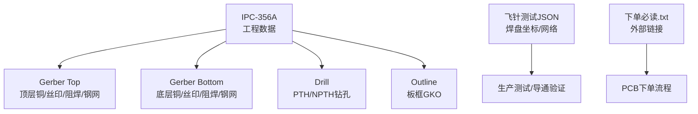
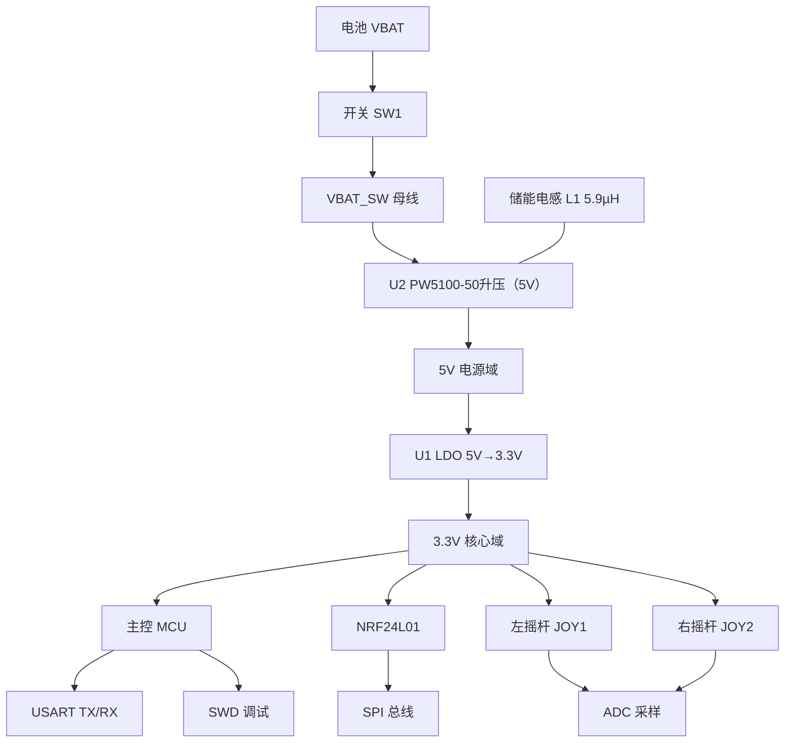
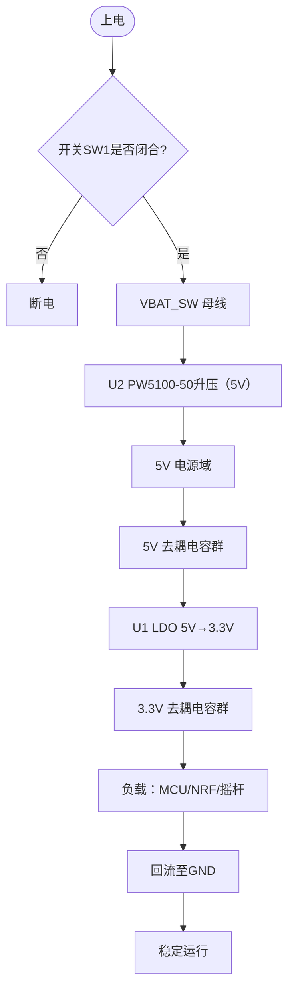
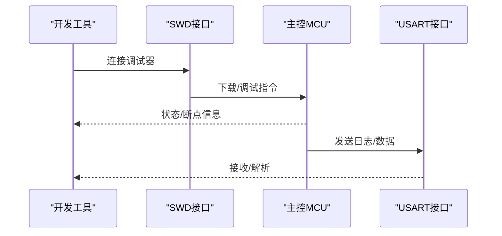
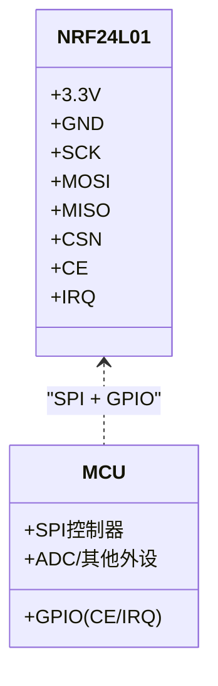
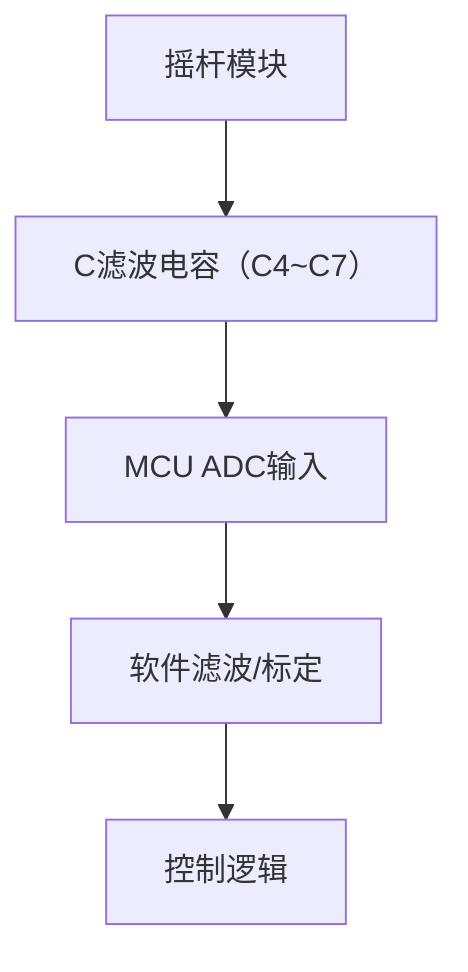
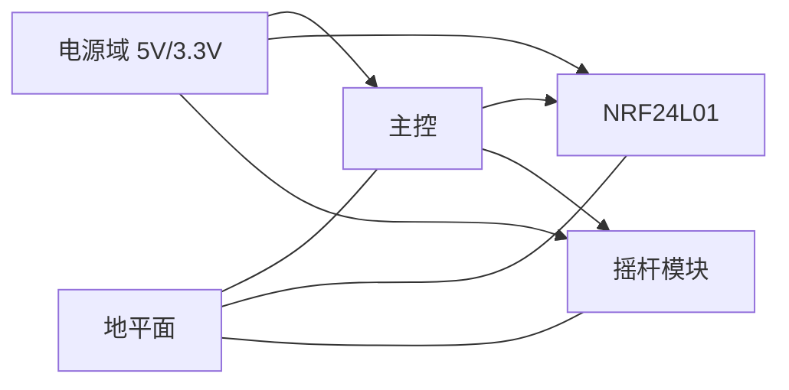

# 硬件设计

<cite>
**本文引用的文件**
- [IPC_PCB1_75mm_Brushed_FC_V1_2026-08-09.356a](file://IPC_PCB1_75mm_Brushed_FC_V1_2026-08-09.356a)
- [Gerber_BoardOutlineLayer.GKO](file://gerber_unpacked/Gerber_BoardOutlineLayer.GKO)
- [Gerber_TopLayer.GTL](file://gerber_unpacked/Gerber_TopLayer.GTL)
- [Gerber_BottomLayer.GBL](file://gerber_unpacked/Gerber_BottomLayer.GBL)
- [FlyingProbeTesting_PCB1_2026-08-09.json](file://flying_probe_unpacked/FlyingProbeTesting_PCB1_2026-08-09.json)
- [PCB下单必读.txt](file://gerber_unpacked/PCB下单必读.txt)
</cite>

## 目录
1. [简介](#简介)
2. [项目结构](#项目结构)
3. [核心组件](#核心组件)
4. [架构总览](#架构总览)
5. [详细组件分析](#详细组件分析)
6. [依赖关系分析](#依赖关系分析)
7. [性能与可靠性考虑](#性能与可靠性考虑)
8. [故障排查指南](#故障排查指南)
9. [结论](#结论)
10. [附录：制造与Gerber使用指南](#附录制造与gerber使用指南)

## 简介
本文件为“75mm 双摇杆无线控制板”的硬件设计文档，基于提供的IPC-356A网表、飞针测试数据与Gerber输出，系统性地说明电路原理与PCB实现要点。内容覆盖电源管理（电压转换与电池供电）、主控外围（ARM SWD/USART等）、无线通信（NRF24L01）与输入接口（双摇杆模块），并给出层叠结构、信号完整性、电源完整性与EMC设计要点，以及元件布局原则、走线规则、制造公差与Gerber使用指南。

## 项目结构
本项目包含以下关键交付物：
- IPC-356A工程数据：描述层叠、网络、器件引脚与拓扑
- Gerber文件集：顶层铜、底层铜、丝印、阻焊、钢网、钻孔与外形
- 飞针测试JSON：用于生产测试的焊盘坐标与网络映射
- 下单指引：外部链接的生产下单参考

图表来源
- [IPC_PCB1_75mm_Brushed_FC_V1_2026-08-09.356a:6-8](file://IPC_PCB1_75mm_Brushed_FC_V1_2026-08-09.356a#L6-L8)
- [Gerber_BoardOutlineLayer.GKO:1-10](file://gerber_unpacked/Gerber_BoardOutlineLayer.GKO#L1-L10)

章节来源
- [IPC_PCB1_75mm_Brushed_FC_V1_2026-08-09.356a:1-17](file://IPC_PCB1_75mm_Brushed_FC_V1_2026-08-09.356a#L1-L17)
- [Gerber_BoardOutlineLayer.GKO:1-10](file://gerber_unpacked/Gerber_BoardOutlineLayer.GKO#L1-L10)
- [PCB下单必读.txt:1-4](file://gerber_unpacked/PCB下单必读.txt#L1-L4)

## 核心组件
根据IPC-356A与飞针测试数据，本板主要功能块如下：
- 电源路径与转换
  - 电池输入VBAT经开关SW1导通后得到VBAT_SW母线
  - U2为PW5100-50同步升压转换器，将VBAT_SW升压至5V；储能电感L1（5.9µH）接于VBAT_SW与U2第5脚SW（$1N192）之间
  - U1为3.3V LDO线性稳压器，将5V稳压至3.3V（3V3网络），其使能端经R2由VBAT_SW控制
  - 大量去耦电容（C1~C14）分布于各电源入口与IC附近
- 主控与调试接口
  - ARM MCU通过SWDIO/SWCLK进行调试与烧录
  - USART_TX/RX对外串口输出
- 无线通信
  - NRF24L01模块（NRF1）通过SPI（SCK/MOSI/MISO/CSN/CE）与IRQ连接至MCU
- 输入接口
  - 双摇杆JOY1/JOY2（RKJXV1224005，各10引脚），提供X/Y轴模拟量，经C4~C7滤波电容对地滤波后接入MCU ADC
  - 摇杆自带按键开关引脚在本板上直接接GND，未接入MCU（当前设计不读取按键）
- 连接器与扩展
  - J1为电池输入端子
  - SWD与USART为外部调试/通信接口

章节来源
- [IPC_PCB1_75mm_Brushed_FC_V1_2026-08-09.356a:22-103](file://IPC_PCB1_75mm_Brushed_FC_V1_2026-08-09.356a#L22-L103)
- [FlyingProbeTesting_PCB1_2026-08-09.json:209-586](file://flying_probe_unpacked/FlyingProbeTesting_PCB1_2026-08-09.json#L209-L586)

## 架构总览
下图展示从电池到各功能块的供电路径与信号流向，体现电源分配、信号隔离与地平面策略。

图表来源
- [IPC_PCB1_75mm_Brushed_FC_V1_2026-08-09.356a:22-103](file://IPC_PCB1_75mm_Brushed_FC_V1_2026-08-09.356a#L22-L103)
- [FlyingProbeTesting_PCB1_2026-08-09.json:209-586](file://flying_probe_unpacked/FlyingProbeTesting_PCB1_2026-08-09.json#L209-L586)

## 详细组件分析

### 电源电路设计（电压转换与电池管理）
- 输入与控制
  - 电池通过J1进入，经SW1机械开关控制上电，输出VBAT_SW母线
  - C1/C10在VBAT_SW母线就近去耦，R2为U1的使能上拉电阻（接VBAT_SW）
- 电压生成
  - 5V域由U2（PW5100-50同步升压）产生：储能电感L1（5.9µH）接于VBAT_SW与U2第5脚SW（$1N192）之间，C9/C13/C14进行输出储能与瞬态响应
  - 3.3V域由LDO U1从5V降压生成，C2/C3/C8/C11/C12等就近去耦，降低高频噪声
- 电源完整性
  - 大电流路径（VBAT→SW1→VBAT_SW→U2→5V→U1→3.3V）采用宽走线与短回路
  - $1N192（VBAT_SW↔L1↔U2第5脚SW）为开关节点，走线尽量短小，靠近U2布置
  - 每路电源在IC近端放置小容量陶瓷电容，远端放置大容量电容
  - 3.3V与5V地返回路径尽量靠近各自电源，减少地环路面积
- EMC要点
  - 电源转换器件（U1/U2）与电感附近注意环路面积控制，降低噪声耦合
  - 电源入口对地放置共模扼流或磁珠（若存在）以抑制传导干扰
  - 大面积铺地，分割数字地与模拟地单点汇接于电源入口附近

图表来源
- [IPC_PCB1_75mm_Brushed_FC_V1_2026-08-09.356a:60-103](file://IPC_PCB1_75mm_Brushed_FC_V1_2026-08-09.356a#L60-L103)
- [FlyingProbeTesting_PCB1_2026-08-09.json:209-236](file://flying_probe_unpacked/FlyingProbeTesting_PCB1_2026-08-09.json#L209-L236)

章节来源
- [IPC_PCB1_75mm_Brushed_FC_V1_2026-08-09.356a:60-103](file://IPC_PCB1_75mm_Brushed_FC_V1_2026-08-09.356a#L60-L103)
- [FlyingProbeTesting_PCB1_2026-08-09.json:209-236](file://flying_probe_unpacked/FlyingProbeTesting_PCB1_2026-08-09.json#L209-L236)

### 主控电路设计（ARM微控制器外围）
- 调试与编程
  - SWDIO/SWCLK引出至SWD排针，便于在线调试与固件烧录
- 通信接口
  - USART_TX/RX引出至USART排针，用于上位机通信或日志打印
- 电源与地
  - MCU的3.3V与GND就近去耦，保证供电质量
- 信号完整性
  - SWD与UART走线尽量短且远离噪声源
  - 必要时对高速边沿做串阻匹配（视MCU能力与布线长度而定）

图表来源
- [IPC_PCB1_75mm_Brushed_FC_V1_2026-08-09.356a:81-102](file://IPC_PCB1_75mm_Brushed_FC_V1_2026-08-09.356a#L81-L102)
- [FlyingProbeTesting_PCB1_2026-08-09.json:331-338](file://flying_probe_unpacked/FlyingProbeTesting_PCB1_2026-08-09.json#L331-L338)

章节来源
- [IPC_PCB1_75mm_Brushed_FC_V1_2026-08-09.356a:81-102](file://IPC_PCB1_75mm_Brushed_FC_V1_2026-08-09.356a#L81-L102)
- [FlyingProbeTesting_PCB1_2026-08-09.json:331-338](file://flying_probe_unpacked/FlyingProbeTesting_PCB1_2026-08-09.json#L331-L338)

### 无线通信电路（NRF24L01集成）
- 接口定义
  - SPI：SCK/MOSI/MISO/CSN/CE；中断：IRQ
  - 电源：3.3V与GND
- PCB实现要点
  - 射频段走线短而直，避免过孔与拐角锐角
  - 参考地完整，避免跨分割走线
  - 天线区域保持干净，无金属遮挡
- 时序与信号完整性
  - SPI时钟与数据对地回路短，阻抗连续
  - IRQ信号独立走线，远离噪声源

图表来源
- [IPC_PCB1_75mm_Brushed_FC_V1_2026-08-09.356a:22-29](file://IPC_PCB1_75mm_Brushed_FC_V1_2026-08-09.356a#L22-L29)
- [FlyingProbeTesting_PCB1_2026-08-09.json:301-316](file://flying_probe_unpacked/FlyingProbeTesting_PCB1_2026-08-09.json#L301-L316)

章节来源
- [IPC_PCB1_75mm_Brushed_FC_V1_2026-08-09.356a:22-29](file://IPC_PCB1_75mm_Brushed_FC_V1_2026-08-09.356a#L22-L29)
- [FlyingProbeTesting_PCB1_2026-08-09.json:301-316](file://flying_probe_unpacked/FlyingProbeTesting_PCB1_2026-08-09.json#L301-L316)

### 输入接口电路（双摇杆模块连接）
- 信号定义
  - 左摇杆JOY1（RKJXV1224005，10引脚）：X轴（JOY_LX）、Y轴（JOY_LY）、3.3V供电（3/4脚）与GND
  - 右摇杆JOY2（RKJXV1224005，10引脚）：X轴（JOY_RX）、Y轴（JOY_RY）、3.3V供电（3/4脚）与GND
  - 两摇杆的自带按键开关引脚均直接接GND，当前设计不采集按键信号
- 滤波与保护
  - 每个模拟通道并联100nF滤波电容（C4~C7）对地滤波，抑制高频噪声
  - 3.3V供电就近去耦，确保ADC采样稳定
- 布局建议
  - 摇杆靠近MCU以减少走线长度
  - 模拟地与数字地单点汇接，避免地环路

图表来源
- [IPC_PCB1_75mm_Brushed_FC_V1_2026-08-09.356a:32-59](file://IPC_PCB1_75mm_Brushed_FC_V1_2026-08-09.356a#L32-L59)
- [FlyingProbeTesting_PCB1_2026-08-09.json:241-288](file://flying_probe_unpacked/FlyingProbeTesting_PCB1_2026-08-09.json#L241-L288)

章节来源
- [IPC_PCB1_75mm_Brushed_FC_V1_2026-08-09.356a:32-59](file://IPC_PCB1_75mm_Brushed_FC_V1_2026-08-09.356a#L32-L59)
- [FlyingProbeTesting_PCB1_2026-08-09.json:241-288](file://flying_probe_unpacked/FlyingProbeTesting_PCB1_2026-08-09.json#L241-L288)

## 依赖关系分析
- 电源依赖
  - 5V域为部分外设供电，3.3V域为核心与射频供电
  - 各IC的3.3V与GND就近去耦，形成局部低阻抗回路
- 信号依赖
  - NRF24L01依赖稳定的3.3V与干净的参考地
  - 摇杆模拟信号依赖低噪声的3.3V与良好的RC滤波
- 层间依赖
  - 关键信号通过过孔在Top/Bottom之间切换，需保证过孔数量最小化与回流通路完整

图表来源
- [IPC_PCB1_75mm_Brushed_FC_V1_2026-08-09.356a:22-103](file://IPC_PCB1_75mm_Brushed_FC_V1_2026-08-09.356a#L22-L103)
- [FlyingProbeTesting_PCB1_2026-08-09.json:209-586](file://flying_probe_unpacked/FlyingProbeTesting_PCB1_2026-08-09.json#L209-L586)

章节来源
- [IPC_PCB1_75mm_Brushed_FC_V1_2026-08-09.356a:22-103](file://IPC_PCB1_75mm_Brushed_FC_V1_2026-08-09.356a#L22-L103)
- [FlyingProbeTesting_PCB1_2026-08-09.json:209-586](file://flying_probe_unpacked/FlyingProbeTesting_PCB1_2026-08-09.json#L209-L586)

## 性能与可靠性考虑
- 层叠结构
  - 双层板：Top与Bottom两层铜，适合低成本与小尺寸应用
  - 建议Top作为信号层，Bottom作为电源与地平面，关键信号优先Top
- 信号完整性
  - 高频信号（SPI、UART）走线短、直，避免跨越分割
  - 对长距离信号增加终端匹配或串阻（视MCU驱动能力）
  - 过孔数量最小化，减少寄生电感与反射
- 电源完整性
  - 电源入口放置大容量电容，IC近端放置小容量陶瓷电容
  - 大电流路径加宽走线，降低IR压降与温升
  - 地平面尽量完整，避免信号跨分割
- EMC设计要点
  - 电源稳压器件（U1/U2）与电感区域控制环路面积，降低噪声耦合
  - 天线区域保持净空，避免金属遮挡
  - 外壳与屏蔽罩（可选）提升抗扰度
- 制造公差要求
  - 最小线宽/线距：依据Gerber ADD参数，典型0.2mm/0.2mm
  - 孔径与环宽：PTH孔径≥0.3mm，环宽≥0.15mm
  - 板厚与铜厚：常规1.6mm±10%，1oz铜厚
  - 外形公差：±0.2mm，倒角半径≥0.5mm

章节来源
- [Gerber_TopLayer.GTL:13-39](file://gerber_unpacked/Gerber_TopLayer.GTL#L13-L39)
- [Gerber_BottomLayer.GBL:13-31](file://gerber_unpacked/Gerber_BottomLayer.GBL#L13-L31)
- [Gerber_BoardOutlineLayer.GKO:1-10](file://gerber_unpacked/Gerber_BoardOutlineLayer.GKO#L1-L10)

## 故障排查指南
- 无法上电
  - 检查SW1焊接与通断，确认VBAT_SW母线有电压
  - 检查L1（储能电感，无极性）焊接是否虚焊
  - 测量VBAT_SW、5V与3.3V是否正常（U2升压输出5V，U1降压输出3.3V）
- 无线通信不稳定
  - 检查NRF24L01的3.3V去耦与SPI走线
  - 确认天线区域无遮挡，IRQ信号未受干扰
- 摇杆读数漂移
  - 检查RC滤波电容与走线长度
  - 确认3.3V噪声与地回路良好
- 调试失败
  - 检查SWDIO/SWCLK连接与复位电路
  - 确认MCU供电正常，晶振起振

章节来源
- [IPC_PCB1_75mm_Brushed_FC_V1_2026-08-09.356a:22-103](file://IPC_PCB1_75mm_Brushed_FC_V1_2026-08-09.356a#L22-L103)
- [FlyingProbeTesting_PCB1_2026-08-09.json:301-338](file://flying_probe_unpacked/FlyingProbeTesting_PCB1_2026-08-09.json#L301-L338)

## 结论
本设计以双层板实现电池供电、多路稳压、ARM主控、NRF24L01无线通信与双摇杆输入，满足小型遥控设备的核心需求。通过合理的电源分配、信号完整性与EMC设计，结合严格的制造公差与Gerber规范，可保障量产一致性与可靠性。建议在后续迭代中优化射频布局与电源噪声抑制，进一步提升系统稳定性。

## 附录：制造与Gerber使用指南
- 文件清单
  - 顶层铜：Gerber_TopLayer.GTL
  - 底层铜：Gerber_BottomLayer.GBL
  - 丝印：Top/Bottom Silkscreen（如有）
  - 阻焊：Top/Bottom Solder Mask（如有）
  - 钢网：Top Paste Mask（如有）
  - 钻孔：PTH/NPTH Drill
  - 外形：Gerber_BoardOutlineLayer.GKO
- 使用方法
  - 导入Gerber到CAM软件，核对层序与原点
  - 检查ADD定义与尺寸单位（毫米）
  - 导出钻孔文件并设置NC钻程序
  - 进行DFM/DFA检查，确认最小线宽/线距与孔径环宽
- 下单参考
  - 按供应商要求打包Gerber与钻孔文件
  - 参考外部链接了解下单流程与工艺选项

章节来源
- [Gerber_BoardOutlineLayer.GKO:1-10](file://gerber_unpacked/Gerber_BoardOutlineLayer.GKO#L1-L10)
- [Gerber_TopLayer.GTL:1-20](file://gerber_unpacked/Gerber_TopLayer.GTL#L1-L20)
- [Gerber_BottomLayer.GBL:1-20](file://gerber_unpacked/Gerber_BottomLayer.GBL#L1-L20)
- [PCB下单必读.txt:1-4](file://gerber_unpacked/PCB下单必读.txt#L1-L4)

## 相关文档
- [电路原理图](电路原理图/电路原理图.md)（完整电路与器件清单）
- [PCB布局设计](PCB布局设计.md)（布局与走线规则）
- [项目概述](../项目概述.md)（项目背景）
- [资料总览](../资料总览.md)（入口索引）