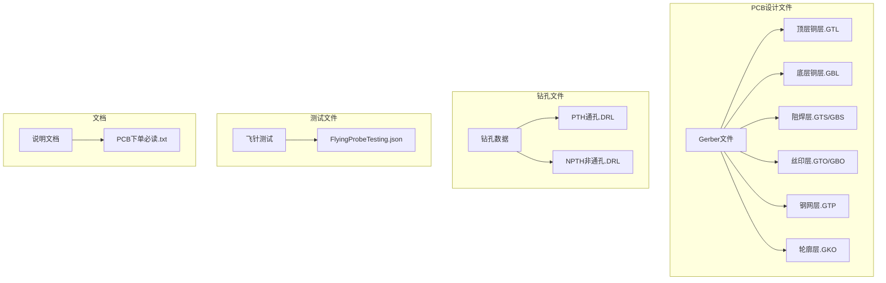
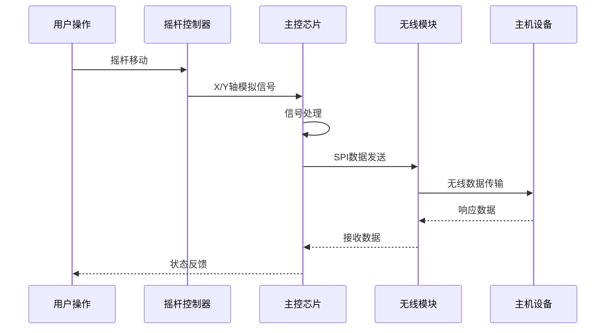

# 装配指南

<cite>
**本文档引用的文件**   
- [PCB下单必读.txt](file://gerber_unpacked/PCB下单必读.txt)
- [FlyingProbeTesting_PCB1_2026-08-09.json](file://flying_probe_unpacked/FlyingProbeTesting_PCB1_2026-08-09.json)
- [Gerber_BoardOutlineLayer.GKO](file://gerber_unpacked/Gerber_BoardOutlineLayer.GKO)
- [Gerber_TopLayer.GTL](file://gerber_unpacked/Gerber_TopLayer.GTL)
- [Gerber_BottomLayer.GBL](file://gerber_unpacked/Gerber_BottomLayer.GBL)
- [Gerber_TopSolderMaskLayer.GTS](file://gerber_unpacked/Gerber_TopSolderMaskLayer.GTS)
- [Gerber_BottomSolderMaskLayer.GBS](file://gerber_unpacked/Gerber_BottomSolderMaskLayer.GBS)
- [Gerber_TopPasteMaskLayer.GTP](file://gerber_unpacked/Gerber_TopPasteMaskLayer.GTP)
- [Drill_NPTH_Through.DRL](file://gerber_unpacked/Drill_NPTH_Through.DRL)
- [Drill_PTH_Through.DRL](file://gerber_unpacked/Drill_PTH_Through.DRL)
</cite>

## 目录
1. [项目概述](#项目概述)
2. [项目结构](#项目结构)
3. [核心组件分析](#核心组件分析)
4. [系统架构概览](#系统架构概览)
5. [详细组件分析](#详细组件分析)
6. [依赖关系分析](#依赖关系分析)
7. [性能考虑](#性能考虑)
8. [故障排除指南](#故障排除指南)
9. [结论](#结论)
10. [附录](#附录)

## 项目概述

本装配指南基于提供的PCB设计文件，为IPC_PCB1_75mm_Brushed_FC_V1版本提供完整的组装和焊接指导。该电路板是一个包含无线通信、电源管理和控制功能的电子装置，主要特点包括：

- **无线通信模块**：集成NRF24L01无线收发器
- **电源管理系统**：多路电压转换和稳压电路
- **控制接口**：SWD调试接口和USART通信端口
- **输入输出**：双摇杆控制器接口和扩展连接器

## 项目结构

项目包含完整的PCB制造和组装所需的所有文件：



**图表来源**
- [Gerber_BoardOutlineLayer.GKO:1-100](file://gerber_unpacked/Gerber_BoardOutlineLayer.GKO#L1-L100)
- [Gerber_TopLayer.GTL:1-100](file://gerber_unpacked/Gerber_TopLayer.GTL#L1-L100)

**章节来源**
- [PCB下单必读.txt:1-4](file://gerber_unpacked/PCB下单必读.txt#L1-L4)

## 核心组件分析

根据飞针测试数据，该PCB包含以下主要组件：

### 集成电路芯片
- **U1**: 3.3V LDO 线性稳压器（SOT-23-5，5V→3.3V）
- **U2**: PW5100-50 同步升压转换器（SOT-23-5，VBAT_SW→5V）  
- **U5**: 主控MCU模块（Arduino Nano兼容双列直插模块）

### 无线通信模块
- **NRF1**: NRF24L01无线收发模块（2×4排针直插插座）

### 被动元件
- **C1-C14**: 电容（1206贴片，C1/C2/C3/C14为10µF，其余为100nF）
- **R1-R2**: 电阻（1206贴片，10kΩ）
- **L1**: 储能电感（直插，5.9µH，接于VBAT_SW与U2第5脚之间）

### 连接器和接口
- **J1**: 电源输入接口
- **SW1**: 电源开关
- **SWD**: SWD调试接口
- **USART**: UART通信接口
- **JOY1, JOY2**: 摇杆控制器接口

**章节来源**
- [FlyingProbeTesting_PCB1_2026-08-09.json:1-200](file://flying_probe_unpacked/FlyingProbeTesting_PCB1_2026-08-09.json#L1-L200)

## 系统架构概览

该PCB采用模块化设计，主要功能区域划分如下：

```mermaid
graph TD
subgraph "电源管理区域"
PWR[电池输入VBAT] --> SW[电源开关SW1]
SW --> REG2[U2 PW5100-50升压(5V)<br/>储能电感L1]
REG2 --> V5V[5V电源轨]
V5V --> REG1[U1 LDO(3.3V)]
REG1 --> V3V3[3.3V电源轨]
end
subgraph "无线通信区域"
NRF[NRF24L01模块] --> SPI[SPI接口]
SPI --> MCU[主控芯片]
end
subgraph "控制接口区域"
JOY1[左摇杆] --> ADC[ADC输入]
JOY2[右摇杆] --> ADC
ADC --> MCU
end
subgraph "调试和通信"
SWD[SWD接口] --> DEBUG[调试器]
USART[UART接口] --> HOST[主机设备]
end
V3V3 --> NRF
V3V3 --> MCU
V3V3 --> JOY1
V3V3 --> JOY2
V5V --> MCU
```

**图表来源**
- [FlyingProbeTesting_PCB1_2026-08-09.json:200-400](file://flying_probe_unpacked/FlyingProbeTesting_PCB1_2026-08-09.json#L200-L400)

## 详细组件分析

### 电源管理子系统

#### U1 - 3.3V LDO 线性稳压器（5V→3.3V）
- **封装类型**: SOT-23-5表面贴装
- **引脚配置**: 5引脚
- **功能**: 将5V稳压为3.3V（3V3网络），为主控、NRF与摇杆供电
- **关键引脚**: 
  - 1脚: 5V输入
  - 2脚: GND接地
  - 3脚: 使能端（经R2上拉至VBAT_SW）
  - 5脚: 3.3V输出

#### U2 - PW5100-50 同步升压转换器（VBAT_SW→5V）  
- **封装类型**: SOT-23-5表面贴装
- **引脚配置**: 5引脚
- **功能**: 将VBAT_SW母线电压（单节锂电，约3.0~4.2V）升压至固定5V；输入不得超过5V
- **关键引脚**（按网表并经设计方确认）:
  - 1脚: EN使能端，接VBAT_SW（高电平阈值≥0.4×VOUT≈2V，SW1接通后恒为使能；PW5100无独立VIN脚，输入功率经L1由SW脚进入）
  - 2脚: 5V输出（VOUT）
  - 3脚: NC，不连接
  - 4脚: GND接地
  - 5脚: SW开关节点，接储能电感L1一端（网络$1N192，L1另一端接VBAT_SW）

#### 无源元件
- **C1-C14**: 滤波和去耦电容，分布在各个电源轨附近
- **R1-R2**: R1为U5.B3上拉电阻（10kΩ接3V3），R2为U1使能上拉电阻（10kΩ接VBAT_SW）
- **L1**: U2升压电路的储能电感（5.9µH，无极性）

**章节来源**
- [FlyingProbeTesting_PCB1_2026-08-09.json:130-150](file://flying_probe_unpacked/FlyingProbeTesting_PCB1_2026-08-09.json#L130-L150)
- [FlyingProbeTesting_PCB1_2026-08-09.json:339-348](file://flying_probe_unpacked/FlyingProbeTesting_PCB1_2026-08-09.json#L339-L348)

### 无线通信子系统

#### NRF24L01无线模块
- **封装类型**: 2×4排针直插模块（板上为NRF1插座）
- **引脚定义（本板插座，已按网表核实）**:
  - Pin 1: 3.3V电源
  - Pin 2: GND接地
  - Pin 3: CE使能（Chip Enable）
  - Pin 4: CSN片选
  - Pin 5: SCK时钟
  - Pin 6: MOSI主出从入
  - Pin 7: MISO主入从出
  - Pin 8: IRQ中断

> ⚠️ **重要警告**：市面上常见的NRF24L01成品模块排针定义为 **Pin1=GND、Pin2=VCC**，与本板插座的电源顺序**正好相反**。装配时务必确认所用模块与插座定义一致，否则将造成电源反接烧毁模块。建议装配前用万用表核对模块Pin1/Pin2的网络归属。
>
> 📌 **两块板对照（2026-08-15 实测）**：飞控板（MiniFC）NRF 插座与市售主流一致（Pin1=GND/Pin2=VCC，可直插）；仅**本遥控板**为自定义序（Pin1=3.3V/Pin2=GND），需杜邦线交叉（板座 1↔模块 2、板座 2↔模块 1，3~8 直连）或选购反序模块。详见[踩坑记录](踩坑记录.md)坑 1。

- **工作频率**: 2.4GHz ISM频段
- **通信协议**: SPI接口
- **供电要求**: 3.3V，低功耗模式

**章节来源**
- [FlyingProbeTesting_PCB1_2026-08-09.json:301-316](file://flying_probe_unpacked/FlyingProbeTesting_PCB1_2026-08-09.json#L301-L316)

### 用户接口子系统

#### 摇杆控制器接口
- **JOY1**: 左摇杆控制器（RKJXV1224005）
  - 10个引脚，支持X/Y轴模拟输入（JOY_LX/JOY_LY）
  - 3.3V供电（3/4脚），自带按键开关引脚接GND（本板不采集按键）
  
- **JOY2**: 右摇杆控制器（RKJXV1224005）  
  - 10个引脚，支持X/Y轴模拟输入（JOY_RX/JOY_RY）
  - 3.3V供电（3/4脚），自带按键开关引脚接GND（本板不采集按键）

#### 调试和编程接口
- **SWD**: ARM标准调试接口
  - 4引脚排针，排列顺序：1=3V3、2=GND、3=SWDIO、4=SWCLK
  - 用于程序烧录和调试（详见[主控电路设计](硬件设计/电路原理图/主控电路设计.md)）

- **USART**: UART串口通信
  - 4引脚排针，排列顺序：1=3V3、2=GND、3=TX、4=RX
  - 用于数据传输和调试

**章节来源**
- [FlyingProbeTesting_PCB1_2026-08-09.json:241-296](file://flying_probe_unpacked/FlyingProbeTesting_PCB1_2026-08-09.json#L241-L296)
- [FlyingProbeTesting_PCB1_2026-08-09.json:331-338](file://flying_probe_unpacked/FlyingProbeTesting_PCB1_2026-08-09.json#L331-L338)
- [FlyingProbeTesting_PCB1_2026-08-09.json:409-416](file://flying_probe_unpacked/FlyingProbeTesting_PCB1_2026-08-09.json#L409-L416)

## 依赖关系分析

### 电源依赖关系
```mermaid
flowchart TD
BAT[电池输入VBAT] --> SWITCH[电源开关SW1]
SWITCH --> VBSW[VBAT_SW母线]
VBSW --> U2[U2 PW5100-50升压(5V)<br/>储能电感L1 5.9µH]
U2 --> V5V[5V电源轨]
V5V --> U1[U1 LDO(3.3V)<br/>使能经R2]
U1 --> V3V3[3.3V电源轨]
V3V3 --> NRF[NRF24L01]
V3V3 --> MCU[主控芯片]
V3V3 --> JOY[摇杆控制器]
V5V --> MCU
```

**图表来源**
- [FlyingProbeTesting_PCB1_2026-08-09.json:321-338](file://flying_probe_unpacked/FlyingProbeTesting_PCB1_2026-08-09.json#L321-L338)

### 信号流向


**图表来源**
- [FlyingProbeTesting_PCB1_2026-08-09.json:351-392](file://flying_probe_unpacked/FlyingProbeTesting_PCB1_2026-08-09.json#L351-L392)

## 性能考虑

### 电源完整性
- **去耦电容布局**: 每个IC电源引脚附近放置0.1μF去耦电容
- **电源平面分割**: 模拟和数字电源分开布线
- **地线优化**: 单点接地策略减少噪声耦合

### 信号完整性  
- **SPI总线**: NRF24L01的SPI线路长度控制在合理范围内
- **阻抗匹配**: 高速信号线进行阻抗控制
- **屏蔽措施**: 无线模块周围保持净空区

### 热管理
- **散热设计**: 功率器件预留足够的散热面积
- **通风考虑**: 外壳设计确保良好散热
- **温度监控**: 关键位置设置温度检测点

## 故障排除指南

### 常见问题诊断

#### 电源问题
- **现象**: 板子不工作或工作不稳定
- **检查步骤**:
  1. 测量各电源轨电压是否正常
  2. 检查电容是否有鼓包或漏液
  3. 验证电源芯片输入输出端

#### 无线通信问题
- **现象**: 无法建立无线连接
- **检查步骤**:
  1. 确认NRF24L01供电正常（3.3V）
  2. 检查SPI通信线路连通性
  3. 验证天线连接和方向

#### 摇杆输入异常
- **现象**: 摇杆读数不准确或无响应
- **检查步骤**:
  1. 测量摇杆输出引脚电压范围
  2. 检查ADC输入通道是否正确
  3. 验证上拉/下拉电阻配置

### 测试方法
- **静态测试**: 断电状态下检查短路和开路
- **动态测试**: 通电后测量各节点电压
- **功能测试**: 使用示波器观察关键信号波形

**章节来源**
- [FlyingProbeTesting_PCB1_2026-08-09.json:1-100](file://flying_probe_unpacked/FlyingProbeTesting_PCB1_2026-08-09.json#L1-L100)

## 结论

本PCB设计采用了成熟的元器件和合理的布局布线方案，具有良好的电气性能和可靠性。通过遵循本装配指南中的焊接工艺和质量检验标准，可以确保生产出高质量的PCBA产品。

主要优势：
- 模块化设计便于维护和升级
- 完善的电源管理和保护电路
- 标准的调试和通信接口
- 良好的EMC设计和信号完整性

建议在生产过程中重点关注电源完整性、信号完整性和热管理方面的质量控制。

## 附录

### PCB下单和生产流程

#### 文件准备清单
1. **Gerber文件**: 所有必要的制造文件
2. **钻孔文件**: PTH和NPTH钻孔数据
3. **BOM表**: 物料清单
4. **坐标文件**: 贴装坐标
5. **装配图**: 组装指导书

#### 生产流程


#### 质量检验标准
- **外观检查**: 无虚焊、短路、元件偏移
- **电气测试**: 电源完整性、信号完整性
- **功能测试**: 所有接口和功能验证
- **环境测试**: 高低温循环测试

**章节来源**
- [PCB下单必读.txt:1-4](file://gerber_unpacked/PCB下单必读.txt#L1-L4)

## 相关文档
- [调试指南](调试指南.md)（装配完成后的调试流程）
- [踩坑记录](踩坑记录.md)（NRF引脚等装配陷阱）
- [测试与质量保证](测试与质量保证.md)（生产测试流程）
- [无线通信电路](硬件设计/电路原理图/无线通信电路.md)（NRF引脚定义依据）
- [资料总览](资料总览.md)（入口索引）