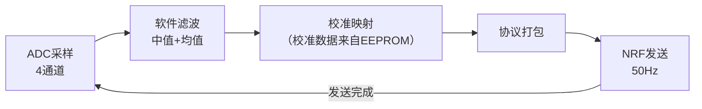

# 固件设计规范

> **文档性质**：这是固件的**设计规范**，定义固件"应该怎么做"。实际实现见第 9 节[实现状态](#9-实现状态)，代码位于本目录 `Transmitter/` 与 `Receiver/`，烧录说明见 [README](README.md)。
> **硬件平台**：发射端 U5（Arduino Nano ESP32，ABX00092，ESP32-S3）+ NRF24L01（SPI）+ 双摇杆（4 路 ADC）；**接收端即飞控本身**：STM32F103C8T6 直连 NRF24L01（SPI），通道数据直接供飞控使用，无独立 NRF转PWM 接收板；飞控 TIM PWM 为电机输出，非遥控输入
> **开发环境**：Arduino IDE 2.x + RF24 库（发射端选 Arduino Nano ESP32，接收端选 STM32duino 核心的 BluePill F103C8）

## 1. 固件总体架构

- **主循环周期**：20ms（帧率 50Hz），一个周期内完成"采样→滤波→打包→发送"
- **设计原则**：发送路径尽量简单可靠，不做复杂任务调度；调试信息经 USART 输出（见[调试指南](../调试指南.md)）

## 2. ADC 采样与滤波

| 项目 | 规范 |
|---|---|
| 通道 | JOY_LX、JOY_LY、JOY_RX、JOY_RY 共 4 路 |
| 分辨率 | 10bit（0~1023），参考电压 3V3 |
| 硬件滤波 | C4~C7（100nF 对地），见[输入接口电路](../硬件设计/电路原理图/输入接口电路.md) |
| 软件滤波 | 每周期连续采样 8 次，去掉最大最小后取平均；再加滑动窗口（深度 4）平滑 |
| 死区 | 中点 ±2% 范围钳位到中点，消除静息抖动 |

## 3. 通道数据定义

通道值统一使用 **1000~2000 微秒约定**，帧内通道序为 **AETR**（与飞控 rc.c 的 roll/pitch/throttle/yaw 一一对应，飞控侧无需重排）：

| 通道 | 帧内索引 | 来源 | 中点 | 说明 |
|---|---|---|---|---|
| CH0 (Roll) | 0 | JOY_RX | 1500 | 右摇杆 X → roll（横滚） |
| CH1 (Pitch) | 1 | JOY_RY | 1500 | 右摇杆 Y → pitch（俯仰） |
| CH2 (Throttle) | 2 | JOY_LY | 1500 | 左摇杆 Y → throttle（油门） |
| CH3 (Yaw) | 3 | JOY_LX | 1500 | 左摇杆 X → yaw（偏航） |

> 注：帧内通道顺序为 Roll→Pitch→Throttle→Yaw（AETR），与 §4.1 帧格式字节布局一致。此顺序由飞控 rc.c 直接映射，发射端 `buildFrame()` 按此顺序打包，接收端按此顺序解析。

- ADC 原始值 → 通道值的映射参数（min/mid/max）来自**摇杆校准**，流程见[整机校准](../整机校准.md)
- ⚠️ 摇杆按键引脚硬件上接 GND 未接入 MCU，固件**不要**为按键写采集代码，见[踩坑记录](../踩坑记录.md)
- 发射端侧协议常量集中在 [rc_protocol.h](rc_protocol.h)（发射端/参考接收端引用）；飞控工程内有同协议副本 `Core/Inc/rc_protocol.h`，两处必须同步维护

## 4. 通信协议定义（收发两端共同遵守）

### 4.1 帧格式（每帧 13 字节，与飞控 `rc_protocol.h` 逐字节对齐）

| 字节 | 内容 | 说明 |
|---|---|---|
| 0 | 帧头 `0xAA` | 1 字节，接收端粗筛 |
| 1~2 | Roll（低字节在前） | 右摇杆 X，1000~2000 |
| 3~4 | Pitch | 右摇杆 Y，1000~2000 |
| 5~6 | Throttle | 左摇杆 Y，**已安全重映射**：中位及以下=1000，上半行程 1500~2000 拉伸为 1000~2000 |
| 7~8 | Yaw | 左摇杆 X，1000~2000 |
| 9~10 | AUX1 | 解锁开关：>1500=armed（发射端杆量手势产生） |
| 11~12 | AUX2 | 预留，固定 1500 |

> 注：协议无校验和，抗错靠 NRF24L01 硬件 CRC（两端必须一致，当前均为 **2 字节 CRC**）+ 帧头粗筛。通道序 AETR+AUX，飞控 `rc.c` 直接映射到 roll/pitch/yaw/throttle/armed。自回中油门杆的安全映射在发射端完成（松手=1000 零油门），飞控按 (us−1000)/1000 映射为 0~1。

### 4.2 射频参数

| 项目 | 规范 |
|---|---|
| 数据率 | 1Mbps（距离优先时 250kbps） |
| 信道 | 默认信道 100（避开 WiFi 常用信道），见[射频专项设计](../硬件设计/射频专项设计.md) |
| 发射功率 | 0dBm |
| CRC | NRF24L01 硬件 CRC **2 字节**（发射端 `setCRCLength(RF24_CRC_16)`，接收端 CONFIG 寄存器 CRCO=1；两端不一致会静默丢包） |
| 地址 | 5 字节固定地址 `E7 E7 E7 E7 E7`（收发两端代码中写死，后续可加绑定配对流程） |

## 5. 失控保护（Failsafe）

失控保护逻辑在**接收端**实现，但发射端协议需为其提供依据：

1. 接收端连续 **500ms（25 帧）** 未收到合法帧，判定失联
2. 失联后接收端输出预设安全值（如全部通道回中点 1500，油门通道输出最低值）
3. 恢复收帧后立即切回实时数据
4. ⚠️ 发射端无按键、无反馈通道，无法实现"发射端告警"；如需发射端状态提示，下版硬件增加 LED 或蜂鸣器

## 6. 低功耗策略

- 当前版本：主循环持续发送（50Hz），整机功耗以 NRF 发射电流为主
- 可选优化：静止检测——4 通道在中点死区内持续 10 秒，帧率降至 10Hz，NRF 保持发射（接收端失联判据按帧率适配）
- 关机依赖 SW1 物理断电，固件无需实现软关机

## 7. 已知硬件限制（固件无法弥补，改版解决）

| 限制 | 影响 | 改版方向 |
|---|---|---|
| 摇杆按键接 GND | 无按键功能 | 按键引脚引至 GPIO |
| 无电池电压采样 | 固件无法低压报警 | 增加 VBAT 分压至 ADC |
| 无 LED/蜂鸣器 | 无状态指示 | 增加指示器件 |

## 8. 版本规划

- **v0.1**：采样 + 滤波 + 固定信道发送（最小可用）
- **v0.2**：接入校准数据（EEPROM 读写）、USART 调试输出
- **v0.3**：失联策略联调、静止降帧率
- **v1.0**：联调通过 + 拉距离测试达标后定版

## 9. 实现状态

已交付代码（2026-08-11，发射端 v0.2 + 失控保护；接收端 v0.3 重构）：

| 文件 | 说明 |
|---|---|
| `Transmitter/Transmitter.ino` | 发射端固件（Arduino Nano ESP32），v0.2 |
| `Receiver/Receiver.ino` | 接收参考实现 v0.3（Arduino/RF24 风格）⚠️ 飞控实际运行的是其 HAL 工程内的 bsp_nrf24l01.c + rc.c，本文件仅供移植/比对；协议与发射端对齐（13 字节帧，6 通道，无校验） |
| `rc_protocol.h` | 发射端侧共享协议头（发射端/参考接收端引用）；飞控工程内有同协议副本 `Core/Inc/rc_protocol.h`，两份需同步维护 |
| `README.md` | 环境搭建、烧录、接线、校准命令与射频参数速查 |

与本规范的关键决策与差异：

1. **引脚映射**（已对照 EasyEDA 原理图核实）：JOY_LX/LY/RX/RY→A1/A2/A3/A4，NRF CE/CSN→D9/D10，SPI 走 D13/D11/D12 硬件默认；网表中的 A8~A15、B3~B15 为模块物理脚编号，非 Arduino 逻辑引脚。
2. **调试输出**：发射端改用 USB-C 虚拟串口（ESP32-S3 CDC），未使用板上 USART 排针（其 TX/RX 接 D6/D7，需重映射，暂不启用）。
3. **校准触发**：串口发 `C` 进入校准模式，`M` 采中点、`E` 逐方向合并 min/max、`S` 存 EEPROM 重启（ESP32 的 EEPROM 为 Flash 模拟，用法不变）。
4. **射频补充**：发射功率 0dBm 对应 `RF24_PA_MAX`（裸模块）；单向广播关闭 AutoAck 与重试，50Hz 发送不阻塞。
5. **失控保护**：接收端上电即填充安全值，500ms 无合法帧切保护，与本规范第 5 节一致；油门通道为 CH_THROTTLE（帧内索引 2，左摇杆 Y）。
6. ⚠️ **勘误**：ESP32-S3 无 SWD 外设（仅 USB-JTAG），板上"SWD"排针（B7/B8→D4/D5）实为普通 GPIO，[调试指南](../调试指南.md)中 SWD 断点调试的描述不适用，发射端调试用 USB 串口。
7. **未实现**：v0.3 静止检测降帧率（发射端）。
8. **代码质量改进（2026-08-11）**：发射端周期发送改为固定步进 `lastFrameMs += 20` 并重同步守卫（落后超 4 周期即重新同步，避免校准模式退出后爆发补发）；`serialPoll()` 每次循环最多处理 8 个字符防串口洪泛。注：millis() 回绕本身由无符号减法天然安全，非修复目标。
9. **文档勘误（2026-08-11）**：§3 通道表补充帧内索引列，明确帧内序为 Roll→Pitch→Throttle→Yaw，与 §4.1 字节布局一致（发射端 buildFrame 一直是此顺序，本次仅表格描述对齐，无代码变更）。

## 相关文档

- [整机校准](../整机校准.md)（校准流程与验收）
- [README](README.md)（固件烧录与校准操作说明）
- [射频专项设计](../硬件设计/射频专项设计.md)（信道与抗干扰）
- [主控电路设计](../硬件设计/电路原理图/主控电路设计.md)（U5 与接口硬件）
- [无线通信电路](../硬件设计/电路原理图/无线通信电路.md)（SPI 引脚定义）
- [调试指南](../调试指南.md)（固件调试步骤）
