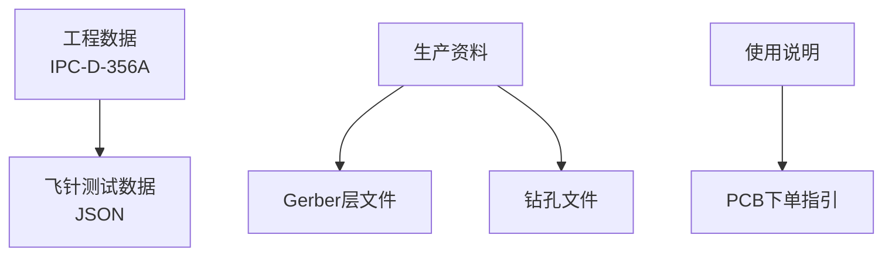
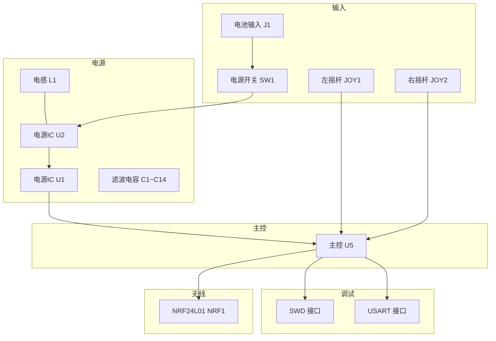
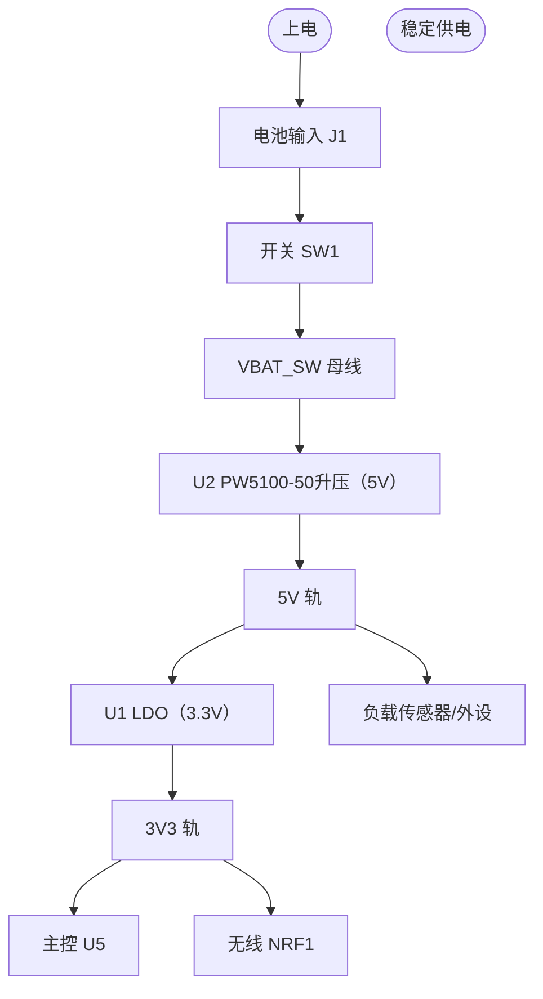
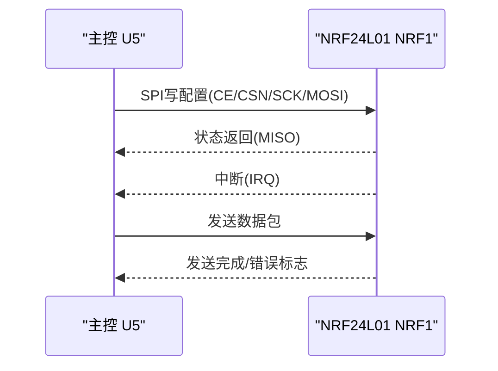
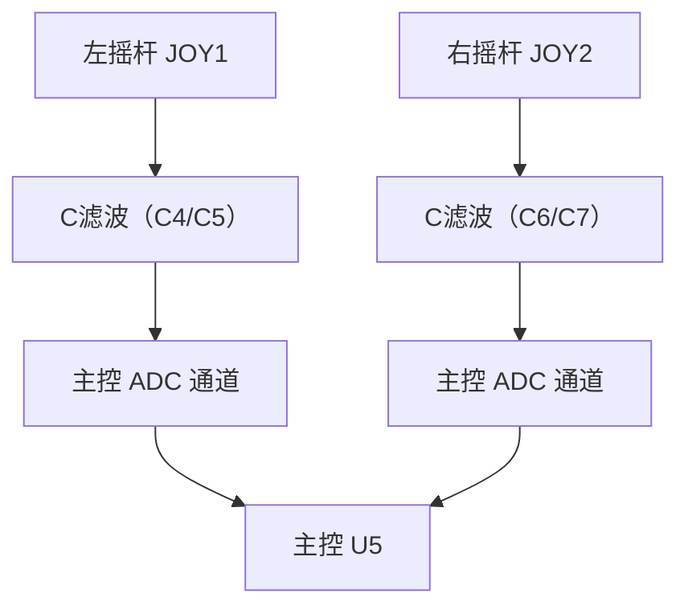
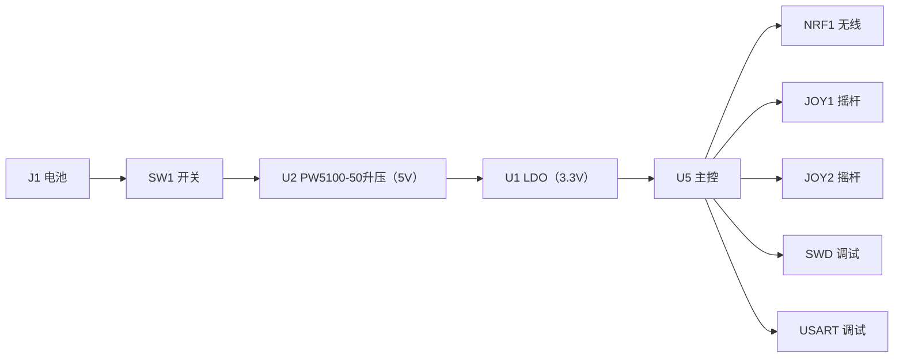

# 项目概述

<cite>
**本文档引用的文件**
- [IPC_PCB1_75mm_Brushed_FC_V1_2026-08-09.356a](file://IPC_PCB1_75mm_Brushed_FC_V1_2026-08-09.356a)
- [FlyingProbeTesting_PCB1_2026-08-09.json](file://flying_probe_unpacked/FlyingProbeTesting_PCB1_2026-08-09.json)
- [PCB下单必读.txt](file://gerber_unpacked/PCB下单必读.txt)
</cite>

## 目录
1. [简介](#简介)
2. [项目结构](#项目结构)
3. [核心组件](#核心组件)
4. [架构总览](#架构总览)
5. [详细组件分析](#详细组件分析)
6. [依赖关系分析](#依赖关系分析)
7. [性能与规格](#性能与规格)
8. [故障排查指南](#故障排查指南)
9. [结论](#结论)
10. [附录](#附录)

## 简介
本项目为一款75mm尺寸的无线控制器PCB，采用双摇杆输入、NRF24L01无线通信模块、完善的电源管理与调试接口设计。板载提供SWD与USART调试端口，便于固件开发与问题定位；电源路径包含单节锂电输入（约3.0~4.2V）、开关控制、PW5100-50升压（→5V）与LDO降压（→3.3V），满足低功耗与稳定供电需求。本项目的工程数据以EasyEDA Pro生成，并输出符合IPC-D-356A标准的测试数据，同时提供Gerber与钻孔文件用于生产。

## 项目结构
仓库包含三类关键产出：
- IPC-D-356A测试数据（飞针测试）：用于制造前电气连通性验证
- Gerber与钻孔文件：用于PCB加工
- 工程元数据与说明：包括订单指引等

图表来源
- [IPC_PCB1_75mm_Brushed_FC_V1_2026-08-09.356a:1-20](file://IPC_PCB1_75mm_Brushed_FC_V1_2026-08-09.356a#L1-L20)
- [PCB下单必读.txt:1-4](file://gerber_unpacked/PCB下单必读.txt#L1-L4)

章节来源
- [IPC_PCB1_75mm_Brushed_FC_V1_2026-08-09.356a:1-20](file://IPC_PCB1_75mm_Brushed_FC_V1_2026-08-09.356a#L1-L20)
- [PCB下单必读.txt:1-4](file://gerber_unpacked/PCB下单必读.txt#L1-L4)

## 核心组件
基于IPC-D-356A与飞针测试数据，可识别出以下关键功能区域与器件：
- 主控芯片U5：提供MCU引脚、UART、SWD、NRF控制信号等
- 无线模块NRF1：NRF24L01封装，含CE、CSN、SCK、MOSI、MISO、IRQ
- 电源管理：
  - 电池输入J1（VBAT/GND）
  - 电源开关SW1（VBAT至VBAT_SW）
  - U2（PW5100-50同步升压）升压至5V、U1（LDO）降压至3V3，L1为U2升压储能电感（5.9µH）
  - 多路稳压与去耦（3V3、5V、GND）
- 输入系统：
  - JOY1、JOY2：双摇杆，提供X/Y轴模拟量（按键引脚接GND，不接入主控）
- 调试接口：
  - SWD（SWDIO/SWCLK）
  - USART（TX/RX）

章节来源
- [IPC_PCB1_75mm_Brushed_FC_V1_2026-08-09.356a:22-102](file://IPC_PCB1_75mm_Brushed_FC_V1_2026-08-09.356a#L22-L102)
- [FlyingProbeTesting_PCB1_2026-08-09.json:20-33](file://flying_probe_unpacked/FlyingProbeTesting_PCB1_2026-08-09.json#L20-L33)
- [FlyingProbeTesting_PCB1_2026-08-09.json:237-240](file://flying_probe_unpacked/FlyingProbeTesting_PCB1_2026-08-09.json#L237-L240)
- [FlyingProbeTesting_PCB1_2026-08-09.json:301-316](file://flying_probe_unpacked/FlyingProbeTesting_PCB1_2026-08-09.json#L301-L316)
- [FlyingProbeTesting_PCB1_2026-08-09.json:331-338](file://flying_probe_unpacked/FlyingProbeTesting_PCB1_2026-08-09.json#L331-L338)
- [FlyingProbeTesting_PCB1_2026-08-09.json:409-416](file://flying_probe_unpacked/FlyingProbeTesting_PCB1_2026-08-09.json#L409-L416)

## 架构总览
系统由“输入—主控—无线—电源—调试”五大部分构成。用户通过双摇杆产生控制信号，主控读取并处理，再通过NRF24L01进行无线发送；电源模块将电池电压转换为稳定的3V3/5V供各模块使用；SWD与USART用于烧录与调试。

图表来源
- [IPC_PCB1_75mm_Brushed_FC_V1_2026-08-09.356a:22-102](file://IPC_PCB1_75mm_Brushed_FC_V1_2026-08-09.356a#L22-L102)
- [IPC_PCB1_75mm_Brushed_FC_V1_2026-08-09.356a:103-146](file://IPC_PCB1_75mm_Brushed_FC_V1_2026-08-09.356a#L103-L146)

## 详细组件分析

### 电源管理系统
- 输入与控制：
  - 电池输入J1（VBAT/GND）经开关SW1进入VBAT_SW母线
  - 当前设计中无独立防反接/保险元件，反接保护依赖电池接口极性与装配核对
- 稳压与滤波：
  - U2为PW5100-50同步升压转换器，将VBAT_SW升压至5V；储能电感L1（5.9µH）接于VBAT_SW与U2第5脚SW（$1N192）之间
  - U1为3.3V LDO线性稳压器，将5V降压至3V3，其使能端经R2由VBAT_SW控制
  - C1~C14分布于各电源轨就近去耦与储能，降低纹波
- 关键点：
  - VBAT_SW节点作为主供电分配点
  - 5V轨供给U1输入与部分外设，3V3供给主控、无线模块与摇杆
  - 大量去耦电容靠近负载放置，提升稳定性

图表来源
- [IPC_PCB1_75mm_Brushed_FC_V1_2026-08-09.356a:103-146](file://IPC_PCB1_75mm_Brushed_FC_V1_2026-08-09.356a#L103-L146)
- [IPC_PCB1_75mm_Brushed_FC_V1_2026-08-09.356a:22-31](file://IPC_PCB1_75mm_Brushed_FC_V1_2026-08-09.356a#L22-L31)

章节来源
- [IPC_PCB1_75mm_Brushed_FC_V1_2026-08-09.356a:103-146](file://IPC_PCB1_75mm_Brushed_FC_V1_2026-08-09.356a#L103-L146)
- [IPC_PCB1_75mm_Brushed_FC_V1_2026-08-09.356a:22-31](file://IPC_PCB1_75mm_Brushed_FC_V1_2026-08-09.356a#L22-L31)

### 无线通信子系统（NRF24L01）
- 接口信号：
  - CE、CSN、SCK、MOSI、MISO、IRQ
  - 电源3V3与地GND
- 主控连接：
  - 通过SPI总线与U5通信
  - IRQ用于中断触发
- 布局要点：
  - 天线附近保持净空
  - 高频信号走线短且阻抗匹配

图表来源
- [IPC_PCB1_75mm_Brushed_FC_V1_2026-08-09.356a:22-29](file://IPC_PCB1_75mm_Brushed_FC_V1_2026-08-09.356a#L22-L29)
- [IPC_PCB1_75mm_Brushed_FC_V1_2026-08-09.356a:74-89](file://IPC_PCB1_75mm_Brushed_FC_V1_2026-08-09.356a#L74-L89)

章节来源
- [IPC_PCB1_75mm_Brushed_FC_V1_2026-08-09.356a:22-29](file://IPC_PCB1_75mm_Brushed_FC_V1_2026-08-09.356a#L22-L29)
- [IPC_PCB1_75mm_Brushed_FC_V1_2026-08-09.356a:74-89](file://IPC_PCB1_75mm_Brushed_FC_V1_2026-08-09.356a#L74-L89)

### 输入控制系统（双摇杆）
- 通道定义：
  - JOY1：X轴（JOY_LX）、Y轴（JOY_LY）、3V3供电（3/4脚）与地
  - JOY2：X轴（JOY_RX）、Y轴（JOY_RY）、3V3供电（3/4脚）与地
  - 摇杆自带按键开关引脚在本板上直接接GND，当前设计不采集按键信号
- 信号调理：
  - 模拟轴信号经滤波电容（C4~C7，100nF对地）后接入主控ADC
- 布局建议：
  - 模拟信号远离数字噪声源
  - 地回路尽量短

图表来源
- [IPC_PCB1_75mm_Brushed_FC_V1_2026-08-09.356a:32-59](file://IPC_PCB1_75mm_Brushed_FC_V1_2026-08-09.356a#L32-L59)
- [IPC_PCB1_75mm_Brushed_FC_V1_2026-08-09.356a:114-121](file://IPC_PCB1_75mm_Brushed_FC_V1_2026-08-09.356a#L114-L121)

章节来源
- [IPC_PCB1_75mm_Brushed_FC_V1_2026-08-09.356a:32-59](file://IPC_PCB1_75mm_Brushed_FC_V1_2026-08-09.356a#L32-L59)
- [IPC_PCB1_75mm_Brushed_FC_V1_2026-08-09.356a:114-121](file://IPC_PCB1_75mm_Brushed_FC_V1_2026-08-09.356a#L114-L121)

### 调试接口
- SWD：
  - 提供SWDIO与SWCLK，用于程序下载与调试
- USART：
  - 提供TX/RX，用于串口打印与上位机通信
- 注意事项：
  - 确保电平一致（通常为3.3V）
  - 避免与无线模块共用同一时钟源造成干扰

章节来源
- [IPC_PCB1_75mm_Brushed_FC_V1_2026-08-09.356a:81-84](file://IPC_PCB1_75mm_Brushed_FC_V1_2026-08-09.356a#L81-L84)
- [IPC_PCB1_75mm_Brushed_FC_V1_2026-08-09.356a:95-102](file://IPC_PCB1_75mm_Brushed_FC_V1_2026-08-09.356a#L95-L102)

## 依赖关系分析
- 主控U5依赖：
  - 电源轨3V3（来自U1 LDO，5V由U2 PW5100-50升压产生）
  - 无线NRF1（SPI总线）
  - 输入JOY1/JOY2（ADC通道）
  - 调试接口SWD/USART
- 电源依赖：
  - 电池输入J1与开关SW1
  - 储能电感L1与滤波电容C1~C14
- 无线依赖：
  - 稳定的3V3供电与时钟质量
  - 良好的接地与天线净空

图表来源
- [IPC_PCB1_75mm_Brushed_FC_V1_2026-08-09.356a:22-102](file://IPC_PCB1_75mm_Brushed_FC_V1_2026-08-09.356a#L22-L102)
- [IPC_PCB1_75mm_Brushed_FC_V1_2026-08-09.356a:103-146](file://IPC_PCB1_75mm_Brushed_FC_V1_2026-08-09.356a#L103-L146)

章节来源
- [IPC_PCB1_75mm_Brushed_FC_V1_2026-08-09.356a:22-146](file://IPC_PCB1_75mm_Brushed_FC_V1_2026-08-09.356a#L22-L146)

## 性能与规格
- 尺寸与层数：
  - 板型名称Board1，双层（Top/Bottom）
- 电源轨：
  - 支持VBAT输入、VBAT_SW开关输出、3V3与5V稳压轨
- 无线通信：
  - 采用NRF24L01，具备SPI接口与中断能力
- 输入通道：
  - 双摇杆，每杆提供X/Y轴模拟量（自带按键引脚接GND，未接入主控）
- 调试能力：
  - SWD与USART接口齐全，便于开发调试
- 标准与工具：
  - 工程数据遵循IPC-D-356A格式
  - 使用EasyEDA Pro进行设计与数据导出

## 已知设计限制

当前版本 V1.0 存在以下已知设计限制，硬件不可弥补，需改版解决：

| 限制 | 影响 | 改版方向 |
|---|---|---|
| 摇杆按键接 GND | 无法读取摇杆按键 | 按键引脚引至 MCU GPIO，配上拉 |
| 无防反接保护 | 电池接反可能烧毁电路 | 增加 P-MOS 防反接电路 |
| 无电池电压采样 | 固件无法实现低压报警 | 增加 VBAT 分压至 MCU ADC |

详见 [踩坑记录](踩坑记录.md) 和 [版本与变更记录](版本与变更记录.md)。

章节来源
- [IPC_PCB1_75mm_Brushed_FC_V1_2026-08-09.356a:1-18](file://IPC_PCB1_75mm_Brushed_FC_V1_2026-08-09.356a#L1-L18)
- [IPC_PCB1_75mm_Brushed_FC_V1_2026-08-09.356a:22-102](file://IPC_PCB1_75mm_Brushed_FC_V1_2026-08-09.356a#L22-L102)

## 故障排查指南
- 无法上电：
  - 检查J1与SW1通路，确认VBAT到VBAT_SW连通
  - 测量3V3/5V轨是否正常
- 无线不工作：
  - 检查NRF1的3V3供电与接地
  - 核对SPI信号（CE/CSN/SCK/MOSI/MISO/IRQ）是否连至U5对应引脚
  - 观察天线周围是否有金属遮挡
- 摇杆无响应：
  - 检查JOY1/JOY2的3V3与GND
  - 用万用表或示波器查看X/Y轴电压变化
  - 确认主控ADC通道配置正确
- 调试失败：
  - 确认SWDIO/SWCLK连线与电平
  - 检查USART TX/RX交叉连接与波特率

章节来源
- [IPC_PCB1_75mm_Brushed_FC_V1_2026-08-09.356a:22-102](file://IPC_PCB1_75mm_Brushed_FC_V1_2026-08-09.356a#L22-L102)
- [IPC_PCB1_75mm_Brushed_FC_V1_2026-08-09.356a:103-146](file://IPC_PCB1_75mm_Brushed_FC_V1_2026-08-09.356a#L103-L146)

## 结论
该75mm无线控制器PCB在设计上兼顾了便携性与功能性，采用成熟的双摇杆输入与NRF24L01无线方案，配合完善的电源管理与调试接口，适合快速原型开发与产品化迭代。工程数据遵循IPC-D-356A标准，便于制造与测试；Gerber与钻孔文件齐全，可直接下单生产。建议在后续版本中进一步优化射频布局与功耗策略，以提升整体性能与续航。

## 附录
- 生产指引：
  - PCB下单请参考官方文档链接（见PCB下单必读.txt）
- 数据来源：
  - IPC-D-356A测试数据与Gerber文件已随工程打包，可用于DFM/DFA校验与飞针测试

章节来源
- [PCB下单必读.txt:1-4](file://gerber_unpacked/PCB下单必读.txt#L1-L4)

## 相关文档
- [硬件设计](硬件设计/硬件设计.md)（总体设计详解）
- [装配指南](装配指南.md)（装配与警告）
- [版本与变更记录](版本与变更记录.md)（硬件版本与已知限制）
- [资料总览](资料总览.md)（入口索引）